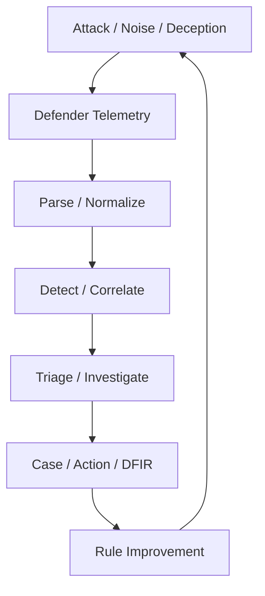

# Intelligent Security Operations Lab

[日本語](README_ja.md)

A personal home lab for researching how security operations can combine
deterministic detection, AI-assisted analysis, and evidence-driven improvement.

The project connects controlled attack simulation with telemetry collection,
detection, correlation, triage, investigation, response, DFIR, and detection-rule
improvement. It is designed for hands-on experimentation rather than production
deployment.

For a visual introduction, see the
[Japanese portfolio overview (PDF, 9 pages)](docs/portfolio/Intelligent_SecOps_Lab_Portfolio_Overview_JA.pdf).

## Key Capabilities

- Normalize Linux auditd and Windows Sysmon / Security events into shared event
  formats
- Apply deterministic detection, deduplication, and correlation rules to build
  Incident candidates
- Pass Incidents through rule-based or AI-assisted Triage and evidence-aware
  Investigation
- Connect Case, Action, approval, and post-action DFIR workflows
- Retrieve selected Windows alerts from Wazuh through a read-only integration
  and process them through the shared pipeline
- Compare detection-rule improvement proposals in an offline review workflow
  before deployment decisions

## Architecture

The lab treats security operations as a repeatable improvement loop.



Attacker-side records are used for run alignment and gap analysis. They do not
become defender evidence or create an Incident by themselves.

## Public Portfolio Snapshot

This repository contains selected implementation code, JSON Schemas, synthetic
fixtures, and tests that support the capabilities described above.

It does not include environment-specific configuration, credentials, raw lab
telemetry, generated runtime evidence, or every private-lab integration and
development utility.

This is a research prototype. It does not claim production readiness, continuous
autonomous operation, complete telemetry coverage, or complete detection
coverage. Detailed implementation status and remaining work are maintained in
the [Roadmap](docs/roadmap/roadmap.md).

## Quick Review

If you have only a few minutes:

1. Read the
   [portfolio overview](docs/portfolio/Intelligent_SecOps_Lab_Portfolio_Overview_JA.pdf)
   and the
   [defender processing flow](docs/architecture/defender-event-processing-flow.md).
2. Follow a Windows event through the
   [Sysmon parser](scripts/windows/sysmon_event1/parse_sysmon_event1_source.py),
   [Wazuh adapter](scripts/windows/sysmon_event1/adapt_wazuh_sysmon_event1_hit.py),
   and [shared defender pipeline](common/defender_pipeline.py).
3. Review the
   [Windows Security detection rule](detection/dsl/windows_security_auth_failure_observed.yaml)
   and its
   [common-pipeline test](tests/windows/security_auth/test_windows_security_auth_common_entry.py).
4. Compare the
   [normalized event schema](schemas/endpoint_events.schema.json) with a
   [sanitized 4625 fixture](tests/fixtures/windows/security_auth/source/windows-security-4625-network-logon-failure-001.json).

The portfolio PDF is a 2026-08-06 snapshot. The Roadmap is the current source
for detailed implementation status.

## Run the Tests

Requirements:

- Python 3.12 or later
- [uv](https://docs.astral.sh/uv/)

```bash
git clone https://github.com/jpsuper/intelligent-soc-lab-portfolio.git
cd intelligent-soc-lab-portfolio
uv sync --dev
uv run pytest tests -q
```

The committed tests use synthetic or sanitized fixtures and do not require
access to the private lab.

## Repository Guide

| Path | Purpose |
|---|---|
| `agents/` | Attacker, Triage, and Investigation agent implementations |
| `common/` | Shared defender pipeline and cross-platform composition |
| `config/` | Sanitized source registries and public configuration examples |
| `detection/` | Detection DSL, compiler, correlation, and evaluation logic |
| `scripts/` | Parsers, adapters, runners, and integration utilities |
| `schemas/` | JSON Schemas for events and workflow artifacts |
| `tests/` | Regression tests and synthetic or sanitized fixtures |
| `docs/` | Architecture, design records, roadmaps, and runbooks |

## Documentation

- [Portfolio Overview](docs/portfolio/Intelligent_SecOps_Lab_Portfolio_Overview_JA.pdf)
- [Defender Event Processing Flow](docs/architecture/defender-event-processing-flow.md)
- [Master Guide](docs/AI_SOC_Lab_Master_Guide.md)
- [Roadmap](docs/roadmap/roadmap.md)

## Safety and Publication Notes

- Run attack simulations only in an isolated environment that you own or are
  explicitly authorized to test.
- Private lab addresses are replaced with documentation addresses from
  `192.0.2.0/24`. Replace them with addresses appropriate for your own lab.
- Secrets and environment-specific values must be supplied at runtime and must
  not be committed.
- See the [Security Policy](SECURITY.md) and [Copyright Notice](NOTICE.md).
