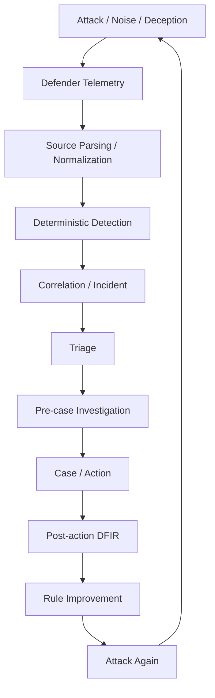

# Intelligent Security Operations Lab

> [!NOTE] \
> This public portfolio snapshot replaces private lab addresses with
> documentation-only addresses from `192.0.2.0/24`.
> Replace these placeholders with addresses appropriate for your own
> isolated lab environment before executing the runbooks.

[日本語](README_ja.md)

A personal home lab for hands-on research into the future of security
operations.

This project explores how AI may reshape attack simulation, detection,
correlation, triage, investigation, response, DFIR, and continuous improvement.
The goal is not only to test what can be automated, but also to understand what
still requires human judgment and what new operating methods may emerge.

## Public Snapshot Scope

This repository is a curated public portfolio snapshot. It includes selected
implementation code, JSON Schemas, synthetic fixtures, and focused tests for:

- Linux auditd parsing and normalization through deterministic detection,
  Incident construction, Rule Triage, and evidence-bounded Investigation
- Windows Sysmon Event ID 1 Fixture A/B/C parsing, normalization, deterministic
  detection, and the shared Detection-to-Investigation pipeline
- common deduplication, correlation, and trust boundaries
- an offline Rule Improvement path for prompt-input export, schema validation,
  untrusted model-output import, comparison, and promotion recommendations

Environment-specific configuration, generated artifacts, raw lab telemetry,
some integrations, and development-only utilities are not included. Active
development continues in a private repository.

The implementation status described below reflects the broader private lab.
In this public snapshot, a claim is directly reproducible only when its
implementation, schema, synthetic fixture, and focused test are present here.
Other retained documents describe architecture, design history, or private-lab
work and should not be read as proof that the corresponding runtime integration
is included in this repository.

[Copyright notice](NOTICE.md) · [Security policy](SECURITY.md)

## 5–10 Minute Review Path

1. **Architecture:** read the
   [defender event processing flow](docs/architecture/defender-event-processing-flow.md).
2. **Representative path:** follow the Windows
   [source parser](scripts/windows/sysmon_event1/parse_sysmon_event1_source.py),
   [normalized mapper](scripts/windows/sysmon_event1/map_sysmon_event1_to_endpoint_event.py),
   and [common defender pipeline](common/defender_pipeline.py).
3. **Schema:** inspect the
   [normalized endpoint-event contract](schemas/endpoint_events.schema.json).
4. **Fixture:** inspect
   [Sysmon Fixture B](tests/fixtures/windows/sysmon_event1/source/sysmon-event1-encoded-flag-001.json).
5. **Test:** trace the expected output in the
   [Windows detection test](tests/windows/sysmon_event1/test_sysmon_event1_expected_detection.py)
   and the shared
   [Detection-to-Investigation composition test](tests/test_common_detection_to_investigation_composition.py).

## Overview

The lab treats security operations as an evidence-driven improvement loop
rather than a collection of isolated tools.

Attacker-side execution records and observed effects are used for run alignment
and gap analysis. They are not defender telemetry, detection evidence, or
alerts, and they cannot create an incident by themselves.

## Objectives

- Build a hands-on environment for security operations research
- Explore how AI changes SOC workflows in practice
- Evaluate how much of detection, triage, investigation, and response can be
  automated safely
- Experiment with adversary simulation and detection engineering in a
  repeatable loop
- Validate evidence boundaries across attacker, defender, case, action, and
  DFIR artifacts
- Study realistic SOC conditions by mixing attacks with normal activity and
  incomplete evidence
- Understand where human judgment remains essential
- Turn validated findings into reviewable detection and workflow improvements

## Focus Areas

- Deterministic detection engineering
- Adversary simulation
- Correlation-first incident construction
- SOC triage and comparison
- Evidence-aware investigation
- Case, action, approval, and execution boundaries
- DFIR collection workflows
- Rule Improvement
- Deception and background activity
- Human and AI collaboration in security analysis

## Design Principles

- Detection is deterministic; AI does not replace the detection boundary
- AI acts as an analyst, not a blind decision-maker
- Conclusions about attack success or impact must remain limited to what can be
  verified from defender-side evidence
- Source parsing, normalization, detection, triage, investigation, and response
  are separate responsibilities
- Runtime evidence and repository fixtures are labeled separately
- Automation should improve repeatability, evidence linkage, and feedback loops
- Rule changes remain proposal- and review-driven before apply, deploy, or
  promotion
- Confirmed deception hits can be high-confidence signals, but they do not
  bypass evidence, approval, containment, or Rule Improvement review boundaries
- External tools such as Wazuh may be used as rule deployment targets, alert
  and search platforms, or evidence sources. The repository remains the source
  of truth for detection-rule meaning, evaluation criteria, and DSL definitions

## Current Status

The broader private lab provides a bounded, reproducible foundation across
Phase 0 through Phase 7.

### Implemented foundation

- Phase 0 through Phase 5 bounded MVPs are complete.
- Phase 6 extended MVP is complete. It includes deterministic detection,
  correlation-first Incident entry, Triage / Investigation / Action stages and
  comparison harnesses, Action-to-DFIR request handoff, post-action DFIR result
  handling, and review-oriented Rule Improvement candidate export.
- Phase 7 has an artifact-only Deception foundation. Scenario YAML, a safe
  runner, and canonical detection-output integration remain deferred.
- Linux `scenario_004` through `scenario_006` provide repeatable regression
  coverage. `scenario_009_suspicious_archive_staging` has a bounded,
  fixture-backed Incident-to-Action path; canonical live Wazuh source
  integration remains deferred.

### Current active workstream

The active workstream is Windows cross-platform expansion toward full Common
Pipeline v0. Windows Fixture A/B/C currently validate source parsing,
normalization, deterministic detection, shared correlation and Incident
construction, deterministic Rule Triage, and pre-case Investigation through
bounded, fixture-backed paths.

This evidence does not establish continuous runtime automation, live Windows
parity, a live Windows Detection-to-Investigation path, or AI-model quality.
Common Pipeline v0 remains incomplete until full cross-platform execution
validation is complete.

### Major incomplete work

- full cross-platform execution validation, Windows Slice 2, and Common
  Pipeline v1 entry work
- live Windows validation, Wazuh retrieval and conversion, additional Windows
  telemetry, and AD / domain-controller coverage
- Windows Triage / Investigation quality and AI-model validation
- Linux Scenario 009 canonical-source and live-integration work
- Rule Improvement apply, deployment, runtime-update, and promotion workflows

For authoritative current status, priorities, incomplete work, sequencing, and
Done Criteria, see the [Main Roadmap](docs/roadmap/roadmap.md). For
cross-platform processing responsibilities and trust boundaries, see the
[Defender Event Processing Flow](docs/architecture/defender-event-processing-flow.md).
## Architecture Boundaries

- Collectors, source parsers, normalized mappers, and platform/domain-specific
  rule content remain source-specific
- Mapped Linux and Windows endpoint telemetry converges on
  `endpoint_events.v1`
- Existing source-family artifacts may remain in place until intentionally
  migrated
- Rule selection, detector invocation, deterministic execution, output
  validation, and canonical detection-result handoff use a common execution
  contract
- Dedupe, correlation, Incident, Triage, pre-case Investigation, Case, and
  Action use shared downstream contracts
- Triage is a processing contract rather than a required model choice;
  deterministic and AI-assisted implementations can be evaluated through the
  same evidence and comparison boundaries
- Common downstream logic depends on canonical artifacts and features rather
  than native auditd/Sysmon shapes or hard-coded scenario IDs
- Pre-case `investigation_result.json` remains separate from post-action
  `post_action_dfir_investigation_result.json`

## Phase Summary

The detailed tasks, evidence, dependencies, and Done Criteria live in the
[Roadmap](docs/roadmap/roadmap.md).

| Phase | Scope | Status |
|---|---|---|
| Phase 0 | Lab stabilization | Completed |
| Phase 1 | Detection engine, correlation, and Incident | Completed |
| Phase 2 | Triage, Action planning, and execution boundary | Completed |
| Phase 3 | Adversary simulation and evaluation | Completed |
| Phase 4 | Case workflow and integration preparation | Completed: MVP, TheHive, and DFIR request |
| Phase 5 | Endpoint telemetry and process-based detection | Completed: MVP and action/approval boundary |
| Phase 6 | Automated improvement loop and workflow contracts | Extended MVP completed |
| Phase 7 | Agentic deception layer | Artifact-only MVP foundation completed; scenario YAML and runner deferred |
| Phase 8 | Background activity and telemetry expansion | Later |

## Documentation

- [Master Guide](docs/AI_SOC_Lab_Master_Guide.md) — stable architecture,
  artifact boundaries, evidence rules, and operating policy
- [Roadmap](docs/roadmap/roadmap.md) — authoritative phase status, current
  priority, implementation sequence, and Done Criteria
- [Defender Event Processing Flow](docs/architecture/defender-event-processing-flow.md)
  — cross-platform processing stages, trust boundaries, and Common Pipeline
  v0/v1 architecture
- [Normalized Endpoint Event Contract](docs/design/defender/normalized_endpoint_event_contract.md)
  — canonical endpoint telemetry shape used across supported sources
- [Windows Telemetry Contract](docs/design/windows/windows_telemetry_contract.md)
  — Windows source, parsing, normalization, and runtime evidence boundaries
- [Atomic Detection DSL](docs/design/atomic_detection_dsl.md) — deterministic
  rule source of truth and canonical detection-output contract
- [Scenario Family Expansion Policy](docs/design/scenario_family_expansion_policy.md)
  — mapping, evidence, safety, and review requirements for new scenario families
- [Linux Scenario Family Candidates](docs/design/linux_scenario_family_candidates.md)
  — validated Linux scenario coverage and deferred live-integration work
- [Phase 7 Deception Roadmap](docs/roadmap/phase7.md) — implemented deception
  artifact chain, current status, safety boundaries, and next steps

## Non-Goals

This project is not intended to be:

- A production SOC platform
- A fully autonomous offensive security system
- A replacement for enterprise SIEM, EDR, case-management, or DFIR products
- A benchmark of a single vendor tool
- A system that treats AI output as sufficient evidence or response approval
- A purely theoretical study without hands-on validation

The lab is designed for learning, experimentation, and iterative validation.

## Philosophy

Learn by building.

Validate by attacking.

Improve by iterating.

## Name

**Formal name:** Intelligent Security Operations Lab

**Common name:** SOC Lab
