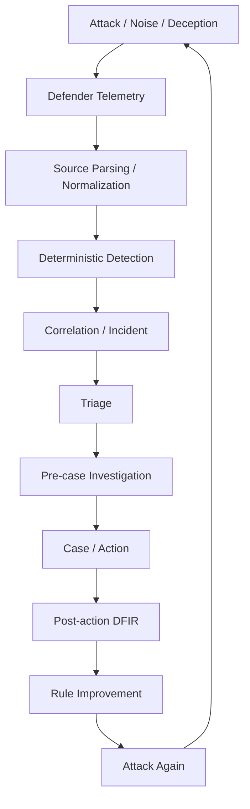
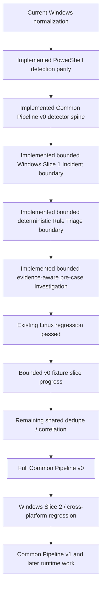

# Intelligent Security Operations Lab

> [!NOTE] \
> This public portfolio snapshot replaces private lab addresses with
> documentation-only addresses from `192.0.2.0/24`.
> Replace these placeholders with addresses appropriate for your own
> isolated lab environment before executing the runbooks.

[日本語](README_ja.md)

A personal home lab for hands-on research into the future of security
operations.

This project explores how AI may reshape attack simulation, detection,
correlation, triage, investigation, response, DFIR, and continuous improvement.
The goal is not only to test what can be automated, but also to understand what
still requires human judgment and what new operating methods may emerge.

## Overview

The lab treats security operations as an evidence-driven improvement loop
rather than a collection of isolated tools.

Attacker-side execution records and observed effects are used for run alignment
and gap analysis. They are not defender telemetry, detection evidence, or
alerts, and they cannot create an incident by themselves.

## Objectives

- Build a hands-on environment for security operations research
- Explore how AI changes SOC workflows in practice
- Evaluate how much of detection, triage, investigation, and response can be
  automated safely
- Experiment with adversary simulation and detection engineering in a
  repeatable loop
- Validate evidence boundaries across attacker, defender, case, action, and
  DFIR artifacts
- Study realistic SOC conditions by mixing attacks with normal activity and
  incomplete evidence
- Understand where human judgment remains essential
- Turn validated findings into reviewable detection and workflow improvements

## Focus Areas

- Deterministic detection engineering
- Adversary simulation
- Correlation-first incident construction
- SOC triage and comparison
- Evidence-aware investigation
- Case, action, approval, and execution boundaries
- DFIR collection workflows
- Rule Improvement
- Deception and background activity
- Human and AI collaboration in security analysis

## Design Principles

- Detection is deterministic; AI does not replace the detection boundary
- AI acts as an analyst, not a blind decision-maker
- Conclusions about attack success or impact must remain limited to what can be
  verified from defender-side evidence
- Source parsing, normalization, detection, triage, investigation, and response
  are separate responsibilities
- Runtime evidence and repository fixtures are labeled separately
- Automation should improve repeatability, evidence linkage, and feedback loops
- Rule changes remain proposal- and review-driven before apply, deploy, or
  promotion
- Confirmed deception hits can be high-confidence signals, but they do not
  bypass evidence, approval, containment, or Rule Improvement review boundaries
- External tools such as Wazuh may be used as rule deployment targets, alert
  and search platforms, or evidence sources. The repository remains the source
  of truth for detection-rule meaning, evaluation criteria, and DSL definitions

## Current Status

### Implemented foundation

- Phase 0 through Phase 5 MVPs are complete
- Phase 6 extended MVP is complete, including:
  - deterministic atomic detection and correlation-first incident entry
  - deterministic and AI-assisted Triage variants
  - pre-case Investigation, Case, and Action stages
  - triage, investigation, and action comparison harnesses
  - Action to DFIR collection-request handoff
  - post-action DFIR result handling
  - Rule Improvement candidate export and validation
- Scenario Family Expansion Policy is defined
- Broader Linux family mapping and the bounded `scenario_009` path are
  implemented; remaining canonical-source and live-integration work is deferred

### Validated Linux scenario coverage

The primary repeatable Linux regression set exercises different attack and
evidence shapes across the shared pipeline:

| Scenario | Behavior under validation | Primary defender artifacts |
|---|---|---|
| `scenario_004` | SSH brute force followed by `authorized_keys` persistence installation | `ssh_failed_login`, `ssh_success_login`, `authorized_keys_modification` |
| `scenario_005` | SSH public-key persistence reuse | `ssh_key_login` |
| `scenario_006` | SSH public-key login followed by post-login command execution | `ssh_key_login`, `process_exec` |

These scenarios support batch regression across deterministic DSL detection,
correlation-first Incident entry, Triage/Investigation/Action comparison, and
attacker-observed-effect versus defender-artifact alignment.

The broader `scenario_009_suspicious_archive_staging` path is also validated
through a bounded incident-to-action chain that uses version-controlled test
fixtures rather than retrieving logs from the live environment at test time.
Its canonical live Wazuh source selection and live integration remain deferred
and are not claimed as completed runtime coverage.

### Deception research coverage

Deception remains one research area alongside detection, correlation,
investigation, DFIR, and Rule Improvement. Phase 7 has an implemented
artifact-only foundation covering deception inventory, local decoy asset
generation, deterministic defender-side deception hits, an Incident bridge,
fixtures, and smoke coverage. A bounded scenario YAML and safe runner remain
deferred.

An attacker-side record that reports a canary request does not establish a
deception hit until a defender-side trap observation confirms it. A confirmed
hit is a high-confidence signal, but it does not automatically authorize
containment or Rule Improvement apply/promotion.

### Current active workstream: Windows cross-platform expansion

The implemented Windows fixture-parity baseline currently includes:

- Sysmon Event ID 1 source fixture schema
- sanitized Fixture A/B/C
- source parser and parsed-event schema
- Fixture A/B/C `expected_parsed` parity
- native collector adapter, local parity validator, focused tests, and runbook
- bounded manual validation of two Event ID 1 records through source-shape and
  parser parity
- normalized mapper
- Fixture A/B/C static `expected_normalized` exact parity
- deterministic PowerShell process and encoded-command observation rules using
  the existing atomic detection DSL
- Fixture A/B/C static `expected_detection` exact parity
- platform-neutral Common Pipeline v0 detector invocation for validated
  `endpoint_events.v1`, with Linux Scenario 009 and Windows Fixture A/B/C
  fixture parity
- a platform-neutral canonical detection-to-Incident bridge, with bounded
  observation-level Incident validation for Windows Fixture A/B/C
- a platform-neutral Incident-to-deterministic-Rule-Triage boundary, with
  lossless Fixture A/B/C validation producing 1, 2, and 0 schema-valid Triage
  results
- a platform-neutral Incident-and-Triage-to-pre-case-Investigation boundary,
  with Fixture A/B/C producing 1, 2, and 0 schema-valid, identity-preserving
  Investigation results

Fixture A/B/C are deterministic parity fixtures, not three runtime pipeline
scenarios. The bounded manual observation does not establish continuous runtime
automation, live normalized parity, or a live Windows detection-to-Incident
path.

The implemented Common Pipeline v0 scope now includes the detector spine and a
bounded Windows Slice 1 bridge from canonical detections to the existing
observation-level Incident contract. Fixture A/B/C produce 1, 2, and 0
Incidents respectively. A platform-neutral list boundary then reuses the
existing deterministic Rule Triage implementation once per Incident and
produces 1, 2, and 0 schema-valid, identity-preserving Triage results. This is
fixture-backed execution validation, not Windows verdict-quality or AI-model
validation, and no Windows-specific Incident or Triage path was added.
The same identity-linked Incident/Triage pairs now pass through a
platform-neutral list boundary that reuses the existing evidence-aware
pre-case Investigation builder and produces 1, 2, and 0 schema-valid results.
This validates bounded boundary mechanics, not Windows Investigation quality,
AI/model behavior, or live coverage.
Common Pipeline v0 overall remains incomplete under the architecture Done
Criteria because shared dedupe/correlation and full cross-platform execution
validation remain incomplete.

The following remain planned or unverified:

- live Windows detection-to-Incident validation
- live normalized parity
- full Common Pipeline v0 shared dedupe/correlation and cross-platform
  execution validation
- Windows Triage and Investigation quality
- AI Triage batch/live-model validation
- AI Investigation/model validation
- live Windows detection-to-Investigation validation
- Wazuh Windows retrieval/conversion integration
- Windows Security Event 4624/4625 and Sysmon Event ID 3 support
- Active Directory and domain-controller coverage

The two PowerShell rules use the DSL-required lowest existing `severity`
metadata value. That metadata is neither a malicious verdict nor Incident
severity; the fixture oracle records only matched rule IDs and observed
behavior features.

## Architecture Boundaries

- Collectors, source parsers, normalized mappers, and platform/domain-specific
  rule content remain source-specific
- Mapped Linux and Windows endpoint telemetry converges on
  `endpoint_events.v1`
- Existing source-family artifacts may remain in place until intentionally
  migrated
- Rule selection, detector invocation, deterministic execution, output
  validation, and canonical detection-result handoff use a common execution
  contract
- Dedupe, correlation, Incident, Triage, pre-case Investigation, Case, and
  Action use shared downstream contracts
- Triage is a processing contract rather than a required model choice;
  deterministic and AI-assisted implementations can be evaluated through the
  same evidence and comparison boundaries
- Common downstream logic depends on canonical artifacts and features rather
  than native auditd/Sysmon shapes or hard-coded scenario IDs
- Pre-case `investigation_result.json` remains separate from post-action
  `post_action_dfir_investigation_result.json`

## Phase Summary

The detailed tasks, evidence, dependencies, and Done Criteria live in the
[Roadmap](docs/roadmap/roadmap.md).

| Phase | Scope | Status |
|---|---|---|
| Phase 0 | Lab stabilization | Completed |
| Phase 1 | Detection engine, correlation, and Incident | Completed |
| Phase 2 | Triage, Action planning, and execution boundary | Completed |
| Phase 3 | Adversary simulation and evaluation | Completed |
| Phase 4 | Case workflow and integration preparation | Completed: MVP, TheHive, and DFIR request |
| Phase 5 | Endpoint telemetry and process-based detection | Completed: MVP and action/approval boundary |
| Phase 6 | Automated improvement loop and workflow contracts | Extended MVP completed |
| Phase 7 | Agentic deception layer | Artifact-only MVP foundation completed; scenario YAML and runner deferred |
| Phase 8 | Background activity and telemetry expansion | Later |

## Documentation

- [Master Guide](docs/AI_SOC_Lab_Master_Guide.md) — consolidated project
  design, implementation status, and operating guidance
- [Roadmap](docs/roadmap/roadmap.md) — authoritative phase status, current
  priority, implementation sequence, and Done Criteria
- [Defender Event Processing Flow](docs/architecture/defender-event-processing-flow.md)
  — cross-platform processing stages, trust boundaries, and Common Pipeline
  v0/v1 architecture
- [Normalized Endpoint Event Contract](docs/design/defender/normalized_endpoint_event_contract.md)
  — canonical endpoint telemetry shape used across supported sources
- [Windows Telemetry Contract](docs/design/windows/windows_telemetry_contract.md)
  — Windows source, parsing, normalization, and runtime evidence boundaries
- [Atomic Detection DSL](docs/design/atomic_detection_dsl.md) — deterministic
  rule source of truth and canonical detection-output contract
- [Scenario Family Expansion Policy](docs/design/scenario_family_expansion_policy.md)
  — mapping, evidence, safety, and review requirements for new scenario families
- [Linux Scenario Family Candidates](docs/design/linux_scenario_family_candidates.md)
  — validated Linux scenario coverage and deferred live-integration work
- [Phase 7 Deception Roadmap](docs/roadmap/phase7.md) — implemented deception
  artifact chain, current status, safety boundaries, and next steps

## Non-Goals

This project is not intended to be:

- A production SOC platform
- A fully autonomous offensive security system
- A replacement for enterprise SIEM, EDR, case-management, or DFIR products
- A benchmark of a single vendor tool
- A system that treats AI output as sufficient evidence or response approval
- A purely theoretical study without hands-on validation

The lab is designed for learning, experimentation, and iterative validation.

## Philosophy

Learn by building.  
Validate by attacking.  
Improve by iterating.

## Name

**Formal name:** Intelligent Security Operations Lab  
**Common name:** SOC Lab
