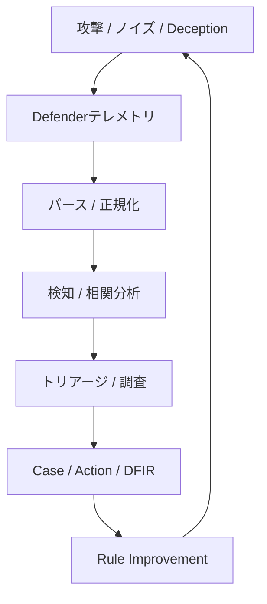

# Intelligent Security Operations Lab

[English](README.md)

> この文書は英語版`README.md`の参考訳です。英語版を正本とし、
> 内容に差異がある場合は英語版を優先してください。

セキュリティ運用の未来を実践的に研究するための、個人向けホームラボです。

このプロジェクトでは、AIが攻撃シミュレーション、検知、相関分析、
トリアージ、調査、対応、DFIR、継続的改善をどのように変え得るかを探ります。
自動化できる範囲を試すだけでなく、依然として人間の判断が必要な領域や、
今後生まれ得る新しい運用方法を明らかにすることも目的としています。

全体像は
[ポートフォリオ概要（PDF、9ページ）](docs/portfolio/Intelligent_SecOps_Lab_Portfolio_Overview_JA.pdf)
にまとめています。

## 主な機能

- Linux auditdおよびWindows Sysmon / Securityログを共通のイベント形式へ正規化
- 再現可能なルールによる検知、重複排除、相関分析からIncident候補を作成
- Rule-basedまたはAI-assisted Triageと、エビデンスを考慮したInvestigation
- Case、Action、承認、Action後DFIRのワークフロー連携
- Wazuhから対象のWindowsアラートをread-onlyで取得し、共通パイプラインで処理
- 検知ルール改善案を、適用判断の前にオフラインで比較・レビュー

## アーキテクチャ

このラボでは、セキュリティ運用を反復可能な改善ループとして捉えます。



攻撃者側の実行記録は、実行の対応付けとギャップ分析に使用します。
それ自体をDefender側のエビデンスとして扱ったり、
Incidentの作成根拠にしたりすることはありません。

## 公開ポートフォリオの範囲

このリポジトリには、上記の機能を確認するための代表的な実装、
JSON Schema、合成またはサニタイズ済みfixture、テストを収録しています。

環境固有の設定、credential、Labの生テレメトリ、生成されたruntime evidence、
Private Labのすべてのintegrationや開発用utilityは収録していません。

本リポジトリは研究用prototypeです。本番運用への対応、継続的な完全自律運用、
完全なテレメトリcoverage、完全な検知coverageを示すものではありません。
詳細な実装状況と今後の作業は
[Roadmap](docs/roadmap/roadmap_ja.md)を参照してください。

## 短時間で確認する場合

1. [ポートフォリオ概要](docs/portfolio/Intelligent_SecOps_Lab_Portfolio_Overview_JA.pdf)と
   [Defender処理フロー](docs/architecture/defender-event-processing-flow_ja.md)を確認する。
2. Windowsイベントが
   [Sysmon parser](scripts/windows/sysmon_event1/parse_sysmon_event1_source.py)、
   [Wazuh adapter](scripts/windows/sysmon_event1/adapt_wazuh_sysmon_event1_hit.py)、
   [共通Defender pipeline](common/defender_pipeline.py)へ渡る流れを追う。
3. [Windows Security検知ルール](detection/dsl/windows_security_auth_failure_observed.yaml)と
   [common-pipeline test](tests/windows/security_auth/test_windows_security_auth_common_entry.py)
   を確認する。
4. [正規化イベントSchema](schemas/endpoint_events.schema.json)と
   [サニタイズ済み4625 fixture](tests/fixtures/windows/security_auth/source/windows-security-4625-network-logon-failure-001.json)
   を比較する。

ポートフォリオPDFは2026-08-06時点のsnapshotです。
詳細な実装状況の正本はRoadmapです。

## テストの実行

必要なもの:

- Python 3.12以降
- [uv](https://docs.astral.sh/uv/)

```bash
git clone https://github.com/jpsuper/intelligent-soc-lab-portfolio.git
cd intelligent-soc-lab-portfolio
uv sync --dev
uv run pytest tests -q
```

リポジトリ内のテストは合成またはサニタイズ済みfixtureを使用し、
Private Labへの接続を必要としません。

## ディレクトリ構成

| Path | 内容 |
|---|---|
| `agents/` | Attacker、Triage、Investigation agentの実装 |
| `common/` | 共通Defender pipelineとcross-platform composition |
| `config/` | サニタイズ済みsource registryと公開用設定例 |
| `detection/` | Detection DSL、compiler、correlation、評価ロジック |
| `scripts/` | Parser、adapter、runner、integration utility |
| `schemas/` | Eventとworkflow artifactのJSON Schema |
| `tests/` | Regression testと合成またはサニタイズ済みfixture |
| `docs/` | Architecture、設計資料、Roadmap、Runbook |

## ドキュメント

- [ポートフォリオ概要](docs/portfolio/Intelligent_SecOps_Lab_Portfolio_Overview_JA.pdf)
- [Defender Event Processing Flow](docs/architecture/defender-event-processing-flow_ja.md)
- [Master Guide](docs/AI_SOC_Lab_Master_Guide_ja.md)
- [Roadmap](docs/roadmap/roadmap_ja.md)

## 安全上・公開上の注意

- 攻撃シミュレーションは、自身が所有するか明示的に許可された
  隔離環境内でのみ実行してください。
- Private LabのIPアドレスは文書用アドレス帯`192.0.2.0/24`へ置換しています。
  実行時は自身のLab環境に合わせて変更してください。
- Secretや環境固有値はruntimeで与え、リポジトリへcommitしないでください。
- [セキュリティポリシー](SECURITY.md)と[著作権表示](NOTICE.md)も参照してください。
