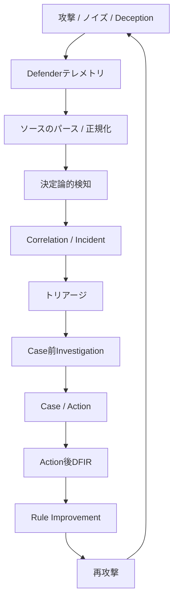

# Intelligent Security Operations Lab

> [!NOTE] \
> この公開ポートフォリオでは、プライベートラボのIPアドレスを
> 文書用アドレス帯 `192.0.2.0/24` に置き換えています。
> Runbookを実行する場合は、隔離された検証環境のIPアドレスへ
> 置き換えてください。

[English](README.md)

> [!NOTE]
> この文書は英語版`README.md`の参考翻訳です。
> 英語版を正本とし、内容に差異がある場合は英語版を優先してください。
>
> Canonical source: `README.md`
> Synchronization status: synchronized
> Last synchronization date: 2026-08-06

セキュリティ運用の未来を実践的に研究するための、個人向けホームラボです。

このプロジェクトでは、AIが攻撃シミュレーション、検知、相関分析、
トリアージ、調査、対応、DFIR、継続的改善をどのように変え得るかを探ります。
自動化できる範囲を試すだけでなく、依然として人間の判断が必要な領域や、
今後生まれ得る新しい運用方法を明らかにすることも目的としています。

## Public Snapshotの収録範囲

このリポジトリは、就職活動向けに選定した公開ポートフォリオsnapshotです。
次の範囲について、代表的な実装、JSON Schema、合成fixture、focused testsを
収録しています。

- Linux auditdのパースと正規化から、決定論的検知、Incident構築、
  Rule Triage、エビデンス境界を守るInvestigationまで
- Windows Sysmon Event ID 1 Fixture A/B/Cのパース、正規化、決定論的検知、
  共通Detection-to-Investigation pipeline
- 共通のdeduplication、correlation、trust boundary
- prompt input export、schema validation、信頼しないmodel outputのimport、
  compare、promotion recommendationまでのoffline Rule Improvement経路

環境固有設定、生成物、Labの生テレメトリ、一部integration、開発専用utilityは
収録していません。Active developmentはPrivateリポジトリで継続しています。

以下の実装状況は、より広いPrivate Lab全体について説明しています。この公開版で
直接再現できるのは、対応する実装、schema、合成fixture、focused testが本リポジトリに
存在する範囲です。それ以外の既存文書はarchitecture、設計履歴、Private Labでの作業を
説明するものであり、対応するruntime integrationが公開版に含まれることを示すものでは
ありません。

[著作権表示](NOTICE.md) · [セキュリティポリシー](SECURITY.md)

## 5～10分のReview Path

1. **Architecture:**
   [Defender event processing flow](docs/architecture/defender-event-processing-flow.md)を読む。
2. **代表的な縦断処理:** Windowsの
   [source parser](scripts/windows/sysmon_event1/parse_sysmon_event1_source.py)、
   [normalized mapper](scripts/windows/sysmon_event1/map_sysmon_event1_to_endpoint_event.py)、
   [common defender pipeline](common/defender_pipeline.py)を追う。
3. **Schema:**
   [normalized endpoint-event contract](schemas/endpoint_events.schema.json)を確認する。
4. **Fixture:**
   [Sysmon Fixture B](tests/fixtures/windows/sysmon_event1/source/sysmon-event1-encoded-flag-001.json)を確認する。
5. **Test:**
   [Windows detection test](tests/windows/sysmon_event1/test_sysmon_event1_expected_detection.py)と
   [Detection-to-Investigation composition test](tests/test_common_detection_to_investigation_composition.py)で
   期待値と共通境界を確認する。

## 概要

このラボでは、セキュリティ運用を個別ツールの集合ではなく、
エビデンスに基づく改善ループとして捉えます。

攻撃者側の実行記録と観測された影響は、実行の対応付けとギャップ分析に使用します。
これらはDefenderテレメトリ、検知エビデンス、アラートではなく、
それだけでIncidentを作成することはできません。

## 目的

- セキュリティ運用研究のための実践環境を構築する
- AIが実際のSOCワークフローをどのように変えるかを探る
- 検知、トリアージ、調査、対応をどこまで安全に自動化できるかを評価する
- 再現可能なループで攻撃シミュレーションとDetection Engineeringを試す
- 攻撃者、Defender、Case、Action、DFIRの各artifact間の
  エビデンス境界を検証する
- 攻撃に通常活動と不完全なエビデンスを混在させ、
  現実的なSOCの状況を研究する
- 人間の判断が不可欠な領域を明らかにする
- 検証済みの知見をレビュー可能な検知・ワークフロー改善につなげる

## 研究対象

- 決定論的Detection Engineering
- 攻撃シミュレーション
- Correlation-firstのIncident構築
- SOCトリアージと比較評価
- エビデンスを考慮した調査
- Case、Action、承認、実行の境界
- DFIR収集ワークフロー
- Rule Improvement
- Deceptionとバックグラウンド活動
- セキュリティ分析における人間とAIの協働

## 設計原則

- 検知は決定論的に行い、AIが検知境界を置き換えることはない
- AIは盲目的な意思決定者ではなく、アナリストとして機能する
- 攻撃の成立や影響について断定できるのは、
  防御側で観測されたエビデンスから確認できる範囲までとする
- ソースのパース、正規化、検知、トリアージ、調査、対応は
  それぞれ独立した責務とする
- ランタイムエビデンスとリポジトリ内fixtureを区別して表記する
- 自動化によって再現性、エビデンスの関連付け、フィードバックループを改善する
- ルール変更は、apply、deploy、promotionの前にproposalとレビューを必須とする
- 確認済みのDeception hitは高信頼度のシグナルとなり得るが、
  エビデンス、承認、封じ込め、Rule Improvementのレビュー境界を迂回しない
- Wazuhなどの外部ツールは、必要に応じてルールの配布先、
  アラート・検索基盤、エビデンス取得元として利用する。ただし、
  検知ルールの意味や判定基準、DSL定義の正本は本リポジトリで管理する

## 現在の状況

より広いPrivate Labは、Phase 0からPhase 7までの限定された再現可能な基盤を
提供します。

### 実装済みの基盤

- Phase 0からPhase 5までの限定されたMVPが完了しています。
- Phase 6 extended MVPが完了しています。決定論的検知、Correlation-firstの
  Incident entry、Triage / Investigation / Actionの各stageと比較harness、
  ActionからDFIR requestへのhandoff、Action後のDFIR result処理、
  reviewを前提とするRule Improvement candidate exportを含みます。
- Phase 7ではartifact-onlyのDeception基盤を実装済みです。Scenario YAML、
  安全なrunner、canonical detection-output integrationはdeferredです。
- Linuxの`scenario_004`から`scenario_006`は、再現可能なregression
  coverageを提供します。`scenario_009_suspicious_archive_staging`には、
  fixtureに基づく限定されたIncident-to-Action pathがあります。
  canonical live Wazuh source integrationはdeferredです。

### 現在の主要作業

現在の主要作業は、full Common Pipeline v0に向けたWindowsの
cross-platform expansionです。Windows Fixture A/B/Cでは、source parsing、
normalization、決定論的検知、shared correlationとIncident構築、
deterministic Rule Triage、pre-case Investigationを、限定されたfixture
pathで検証しています。

このevidenceは、継続的なruntime automation、live Windows parity、
live Windows Detection-to-Investigation path、AI modelの品質を
実証するものではありません。Common Pipeline v0は、full cross-platform
execution validationが完了するまで未完了です。

### 主な未完了作業

- full cross-platform execution validation、Windows Slice 2、
  Common Pipeline v1への移行作業
- live Windows validation、Wazuh retrieval / conversion、追加のWindows
  telemetry、AD / domain controller coverage
- Windows Triage / Investigationの品質とAI model validation
- Linux Scenario 009のcanonical sourceおよびlive integration
- Rule Improvementのapply、deployment、runtime update、promotion workflow

現在状況、優先順位、未完了作業、実装順序、Done Criteriaの正本は
[Main Roadmap](docs/roadmap/roadmap.md)です。cross-platform processingの
責務とtrust boundaryは、
[Defender Event Processing Flow（日本語参考訳）](docs/architecture/defender-event-processing-flow_ja.md)
を参照してください。
## アーキテクチャ境界

- Collector、source parser、normalized mapper、platform/domain固有の
  rule contentはsource固有のままとする
- mapping済みのLinuxとWindowsのendpoint telemetryは
  `endpoint_events.v1`に収束する
- 既存のsource-family artifactは、意図的にmigrationするまで維持できる
- rule selection、detector invocation、決定論的execution、output validation、
  canonical detection-result handoffには共通のexecution contractを使用する
- Dedupe、Correlation、Incident、トリアージ、Case前Investigation、
  Case、Actionには共有downstream contractを使用する
- トリアージはprocessing contractであり、特定のmodelを必須としない。
  決定論的実装とAI-assisted実装を同じエビデンス境界と比較境界で評価できる
- 共通downstream logicは、nativeのauditd/Sysmon shapeや
  hard-coded scenario IDではなく、canonical artifactとfeatureに依存する
- Case前の`investigation_result.json`は、Action後の
  `post_action_dfir_investigation_result.json`と分離したままにする

## Phase概要

詳細なtask、evidence、dependency、Done Criteriaは
[Roadmap（日本語参考訳）](docs/roadmap/roadmap_ja.md)に記載しています。

| Phase | 範囲 | 状況 |
|---|---|---|
| Phase 0 | ラボの安定化 | 完了 |
| Phase 1 | Detection engine、Correlation、Incident | 完了 |
| Phase 2 | トリアージ、Action plan、execution boundary | 完了 |
| Phase 3 | 攻撃シミュレーションと評価 | 完了 |
| Phase 4 | Case workflowとintegration準備 | 完了: MVP、TheHive、DFIR request |
| Phase 5 | Endpoint telemetryとprocess-based detection | 完了: MVP、action/approval boundary |
| Phase 6 | 自動改善ループとworkflow contract | Extended MVP完了 |
| Phase 7 | Agentic deception layer | Artifact-only MVP基盤完了。scenario YAMLとrunnerはdeferred |
| Phase 8 | バックグラウンド活動とtelemetry拡張 | 後続 |

## ドキュメント

- [Master Guide（日本語参考訳）](docs/AI_SOC_Lab_Master_Guide_ja.md) — 安定したarchitecture、
  artifact boundary、evidence rule、operating policy
- [Roadmap（日本語参考訳）](docs/roadmap/roadmap_ja.md) — Phaseの正式な状況、現在の優先事項、
  実装順序、Done Criteria
- [Defender Event Processing Flow（日本語参考訳）](docs/architecture/defender-event-processing-flow_ja.md)
  — クロスプラットフォームの処理stage、trust boundary、
  Common Pipeline v0/v1 architecture
- [Normalized Endpoint Event Contract](docs/design/defender/normalized_endpoint_event_contract.md)
  — 対応source間で使用するcanonical endpoint telemetry shape
- [Windows Telemetry Contract](docs/design/windows/windows_telemetry_contract.md)
  — Windowsのsource、parsing、normalization、runtime evidence boundary
- [Atomic Detection DSL](docs/design/atomic_detection_dsl.md) —
  決定論的ruleのsource of truthとcanonical detection-output contract
- [Scenario Family Expansion Policy](docs/design/scenario_family_expansion_policy.md)
  — 新しいscenario familyに対するmapping、evidence、safety、reviewの要件
- [Linux Scenario Family Candidates](docs/design/linux_scenario_family_candidates.md)
  — 検証済みLinux scenario coverageとdeferredのlive-integration作業
- [Phase 7 Deception Roadmap](docs/roadmap/phase7.md) —
  実装済みDeception artifact chain、現在の状況、安全境界、次のstep

## 対象外

このプロジェクトは、以下を目的としていません。

- 本番環境向けSOC platform
- 完全自律型のoffensive security system
- enterprise SIEM、EDR、case management、DFIR製品の代替
- 単一vendor toolのbenchmark
- AI出力を十分なevidenceまたはresponse approvalとして扱うsystem
- 実践的な検証を伴わない純粋な理論研究

このラボは、学習、実験、反復的な検証を目的として設計しています。

## Philosophy

構築して学ぶ。

攻撃して検証する。

反復して改善する。

## 名称

**正式名称:** Intelligent Security Operations Lab

**通称:** SOC Lab
