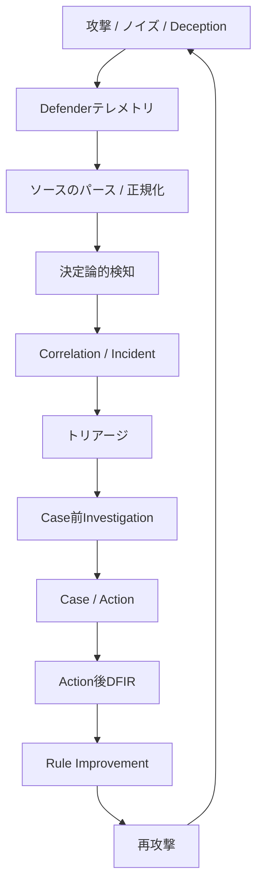
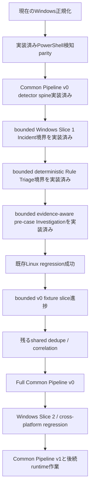

# Intelligent Security Operations Lab

> [!NOTE] \
> この公開ポートフォリオでは、プライベートラボのIPアドレスを
> 文書用アドレス帯 `192.0.2.0/24` に置き換えています。
> Runbookを実行する場合は、隔離された検証環境のIPアドレスへ
> 置き換えてください。

[English](README.md)

セキュリティ運用の未来を実践的に研究するための、個人向けホームラボです。

このプロジェクトでは、AIが攻撃シミュレーション、検知、相関分析、
トリアージ、調査、対応、DFIR、継続的改善をどのように変え得るかを探ります。
自動化できる範囲を試すだけでなく、依然として人間の判断が必要な領域や、
今後生まれ得る新しい運用方法を明らかにすることも目的としています。

## 概要

このラボでは、セキュリティ運用を個別ツールの集合ではなく、
エビデンスに基づく改善ループとして捉えます。

攻撃者側の実行記録と観測された影響は、実行の対応付けとギャップ分析に使用します。
これらはDefenderテレメトリ、検知エビデンス、アラートではなく、
それだけでIncidentを作成することはできません。

## 目的

- セキュリティ運用研究のための実践環境を構築する
- AIが実際のSOCワークフローをどのように変えるかを探る
- 検知、トリアージ、調査、対応をどこまで安全に自動化できるかを評価する
- 再現可能なループで攻撃シミュレーションとDetection Engineeringを試す
- 攻撃者、Defender、Case、Action、DFIRの各artifact間の
  エビデンス境界を検証する
- 攻撃に通常活動と不完全なエビデンスを混在させ、
  現実的なSOCの状況を研究する
- 人間の判断が不可欠な領域を明らかにする
- 検証済みの知見をレビュー可能な検知・ワークフロー改善につなげる

## 研究対象

- 決定論的Detection Engineering
- 攻撃シミュレーション
- Correlation-firstのIncident構築
- SOCトリアージと比較評価
- エビデンスを考慮した調査
- Case、Action、承認、実行の境界
- DFIR収集ワークフロー
- Rule Improvement
- Deceptionとバックグラウンド活動
- セキュリティ分析における人間とAIの協働

## 設計原則

- 検知は決定論的に行い、AIが検知境界を置き換えることはない
- AIは盲目的な意思決定者ではなく、アナリストとして機能する
- 攻撃の成立や影響について断定できるのは、
  防御側で観測されたエビデンスから確認できる範囲までとする
- ソースのパース、正規化、検知、トリアージ、調査、対応は
  それぞれ独立した責務とする
- ランタイムエビデンスとリポジトリ内fixtureを区別して表記する
- 自動化によって再現性、エビデンスの関連付け、フィードバックループを改善する
- ルール変更は、apply、deploy、promotionの前にproposalとレビューを必須とする
- 確認済みのDeception hitは高信頼度のシグナルとなり得るが、
  エビデンス、承認、封じ込め、Rule Improvementのレビュー境界を迂回しない
- Wazuhなどの外部ツールは、必要に応じてルールの配布先、
  アラート・検索基盤、エビデンス取得元として利用する。ただし、
  検知ルールの意味や判定基準、DSL定義の正本は本リポジトリで管理する

## 現在の状況

### 実装済みの基盤

- Phase 0からPhase 5までのMVPが完了
- Phase 6 extended MVPが完了。以下を含む:
  - 決定論的atomic detectionとCorrelation-firstのIncident entry
  - 決定論的およびAI-assistedのトリアージ方式
  - Case前Investigation、Case、Actionの各stage
  - トリアージ、Investigation、Actionの比較harness
  - ActionからDFIR collection requestへのhandoff
  - Action後のDFIR result処理
  - Rule Improvement candidateのexportとvalidation
- Scenario Family Expansion Policyを策定済み
- Linux family mappingの拡張と限定された`scenario_009` pathを実装済み。
  残るcanonical sourceとlive integrationの作業はdeferred

### 検証済みのLinuxシナリオ

主要な再現可能Linux regression setでは、共有pipeline上で異なる攻撃形状と
エビデンス形状を検証します。

| シナリオ | 検証対象の挙動 | 主なDefender artifact |
|---|---|---|
| `scenario_004` | SSH brute force後の`authorized_keys` persistence設置 | `ssh_failed_login`, `ssh_success_login`, `authorized_keys_modification` |
| `scenario_005` | SSH public-key persistenceの再利用 | `ssh_key_login` |
| `scenario_006` | SSH public-key login後のコマンド実行 | `ssh_key_login`, `process_exec` |

これらのシナリオは、決定論的DSL検知、Correlation-firstのIncident entry、
トリアージ・Investigation・Actionの比較、および攻撃者側で観測された影響と
Defender artifactの対応付けを含むbatch regressionを支えます。

より広範な`scenario_009_suspicious_archive_staging` pathも、
テスト実行時に実環境からログを取得するのではなく、リポジトリ内に固定した
検証データ（fixture）を入力し、Incident作成からActionまでの限定的な
処理経路を検証済みです。
canonical live Wazuh sourceの選定とlive integrationは引き続きdeferredであり、
完了済みのruntime coverageとは位置付けません。

### Deceptionの研究範囲

Deceptionは、検知、Correlation、Investigation、DFIR、Rule Improvementと
同等に扱う研究領域の一つです。Phase 7では、Deception inventory、
local decoy asset生成、決定論的なDefender側Deception hit、Incident bridge、
fixture、smoke coverageを含むartifact-onlyの基盤を実装済みです。
限定されたscenario YAMLと安全なrunnerはdeferredです。

攻撃者側の記録にcanary requestの発生が示されていても、
Defender側のtrap observationで確認されるまではDeception hitではありません。
確認済みのhitは高信頼度のシグナルですが、封じ込めや
Rule Improvementのapply/promotionを自動的に承認するものではありません。

### 現在の主要作業: Windowsのクロスプラットフォーム展開

実装済みのWindows fixture parity baselineには、現在以下が含まれます。

- Sysmon Event ID 1 source fixture schema
- sanitize済みのFixture A/B/C
- source parserとparsed-event schema
- Fixture A/B/Cの`expected_parsed` parity
- native collector adapter、local parity validator、focused test、runbook
- 2件のEvent ID 1 recordに対する、source shapeとparser parityの限定的な手動検証
- normalized mapper
- Fixture A/B/Cの静的な`expected_normalized` exact parity
- 既存atomic detection DSLを使う決定論的なPowerShell processおよび
  encoded-command observation rule
- Fixture A/B/Cの静的な`expected_detection` exact parity
- 検証済み`endpoint_events.v1`を受け取るplatform-neutralなCommon Pipeline v0
  detector invocationと、Linux Scenario 009 / Windows Fixture A/B/Cの
  fixture parity
- platform-neutralなcanonical detection-to-Incident bridgeと、Windows
  Fixture A/B/Cのbounded observation-level Incident validation
- platform-neutralなIncident-to-deterministic-Rule-Triage境界と、Fixture
  A/B/Cで1件、2件、0件を欠落なく生成するschema-valid Triage validation
- platform-neutralなIncident/Triage-to-pre-case-Investigation境界と、Fixture
  A/B/Cで1件、2件、0件を生成するschema-validかつidentity-preservingな
  Investigation validation

Fixture A/B/Cは決定論的なparity fixtureであり、3つのruntime pipeline
scenarioではありません。限定的な手動観測は、継続的なruntime automationや
live normalized parity、live Windows detection-to-Incident pathを実証する
ものではありません。

実装済みCommon Pipeline v0の範囲には、detector spineと、canonical
detectionから既存observation-level Incident契約へ渡すbounded Windows
Slice 1 bridgeが含まれます。Fixture A/B/Cはそれぞれ1件、2件、0件の
Incidentを生成します。これはfixture-backed schema validationであり、live
Windows runtime pipelineではありません。Windows固有Incident pathは追加
していません。続くplatform-neutralなlist境界は、既存のdeterministic Rule
TriageをIncidentごとに1回再利用し、Fixture A/B/Cからそれぞれ1件、2件、0件の
schema-validかつidentity-preservingなTriage結果を生成します。これはWindows
verdict品質やAI modelのvalidationではなく、Windows固有Triage pathも追加
していません。
同じidentity-linked Incident/Triage組はplatform-neutralなlist境界から既存の
evidence-aware pre-case Investigation builderへ渡され、Fixture A/B/Cで
それぞれ1件、2件、0件のschema-validな結果を生成します。これはboundedな
boundary mechanicsのvalidationであり、Windows Investigation品質、AI/model
behavior、live coverageのvalidationではありません。
architecture Done Criteria上のCommon Pipeline v0全体は未完了です。shared
dedupe/correlationとfull cross-platform execution validationが残っています。

以下は引き続きplannedまたはunverifiedです。

- live Windows detection-to-Incident validation
- live normalized parity
- full Common Pipeline v0のshared dedupe/correlationとcross-platform
  execution validation
- WindowsのトリアージとInvestigationの品質
- AI Triageのbatch/live-model validation
- AI Investigation/model validation
- live Windows detection-to-Investigation validation
- Wazuh Windows retrieval/conversion integration
- Windows Security Event 4624/4625とSysmon Event ID 3のsupport
- Active Directoryとdomain controllerのcoverage

2つのPowerShell ruleは、DSLで必須のrule metadataとして既存の最低
`severity`値を使用します。このmetadataはmalicious verdictでもIncident
severityでもありません。fixture oracleが固定するのは、matchしたrule IDと
観測されたbehavior featureだけです。

## アーキテクチャ境界

- Collector、source parser、normalized mapper、platform/domain固有の
  rule contentはsource固有のままとする
- mapping済みのLinuxとWindowsのendpoint telemetryは
  `endpoint_events.v1`に収束する
- 既存のsource-family artifactは、意図的にmigrationするまで維持できる
- rule selection、detector invocation、決定論的execution、output validation、
  canonical detection-result handoffには共通のexecution contractを使用する
- Dedupe、Correlation、Incident、トリアージ、Case前Investigation、
  Case、Actionには共有downstream contractを使用する
- トリアージはprocessing contractであり、特定のmodelを必須としない。
  決定論的実装とAI-assisted実装を同じエビデンス境界と比較境界で評価できる
- 共通downstream logicは、nativeのauditd/Sysmon shapeや
  hard-coded scenario IDではなく、canonical artifactとfeatureに依存する
- Case前の`investigation_result.json`は、Action後の
  `post_action_dfir_investigation_result.json`と分離したままにする

## Phase概要

詳細なtask、evidence、dependency、Done Criteriaは
[Roadmap](docs/roadmap/roadmap.md)に記載しています。

| Phase | 範囲 | 状況 |
|---|---|---|
| Phase 0 | ラボの安定化 | 完了 |
| Phase 1 | Detection engine、Correlation、Incident | 完了 |
| Phase 2 | トリアージ、Action plan、execution boundary | 完了 |
| Phase 3 | 攻撃シミュレーションと評価 | 完了 |
| Phase 4 | Case workflowとintegration準備 | 完了: MVP、TheHive、DFIR request |
| Phase 5 | Endpoint telemetryとprocess-based detection | 完了: MVP、action/approval boundary |
| Phase 6 | 自動改善ループとworkflow contract | Extended MVP完了 |
| Phase 7 | Agentic deception layer | Artifact-only MVP基盤完了。scenario YAMLとrunnerはdeferred |
| Phase 8 | バックグラウンド活動とtelemetry拡張 | 後続 |

## ドキュメント

- [Master Guide](docs/AI_SOC_Lab_Master_Guide.md) — プロジェクト設計、
  実装状況、運用ガイダンスの統合文書
- [Roadmap](docs/roadmap/roadmap.md) — Phaseの正式な状況、現在の優先事項、
  実装順序、Done Criteria
- [Defender Event Processing Flow](docs/architecture/defender-event-processing-flow.md)
  — クロスプラットフォームの処理stage、trust boundary、
  Common Pipeline v0/v1 architecture
- [Normalized Endpoint Event Contract](docs/design/defender/normalized_endpoint_event_contract.md)
  — 対応source間で使用するcanonical endpoint telemetry shape
- [Windows Telemetry Contract](docs/design/windows/windows_telemetry_contract.md)
  — Windowsのsource、parsing、normalization、runtime evidence boundary
- [Atomic Detection DSL](docs/design/atomic_detection_dsl.md) —
  決定論的ruleのsource of truthとcanonical detection-output contract
- [Scenario Family Expansion Policy](docs/design/scenario_family_expansion_policy.md)
  — 新しいscenario familyに対するmapping、evidence、safety、reviewの要件
- [Linux Scenario Family Candidates](docs/design/linux_scenario_family_candidates.md)
  — 検証済みLinux scenario coverageとdeferredのlive-integration作業
- [Phase 7 Deception Roadmap](docs/roadmap/phase7.md) —
  実装済みDeception artifact chain、現在の状況、安全境界、次のstep

## 対象外

このプロジェクトは、以下を目的としていません。

- 本番環境向けSOC platform
- 完全自律型のoffensive security system
- enterprise SIEM、EDR、case management、DFIR製品の代替
- 単一vendor toolのbenchmark
- AI出力を十分なevidenceまたはresponse approvalとして扱うsystem
- 実践的な検証を伴わない純粋な理論研究

このラボは、学習、実験、反復的な検証を目的として設計しています。

## Philosophy

構築して学ぶ。  
攻撃して検証する。  
反復して改善する。

## 名称

**正式名称:** Intelligent Security Operations Lab  
**通称:** SOC Lab
