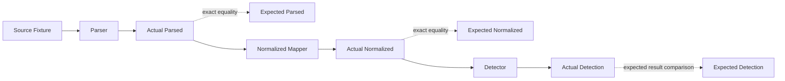
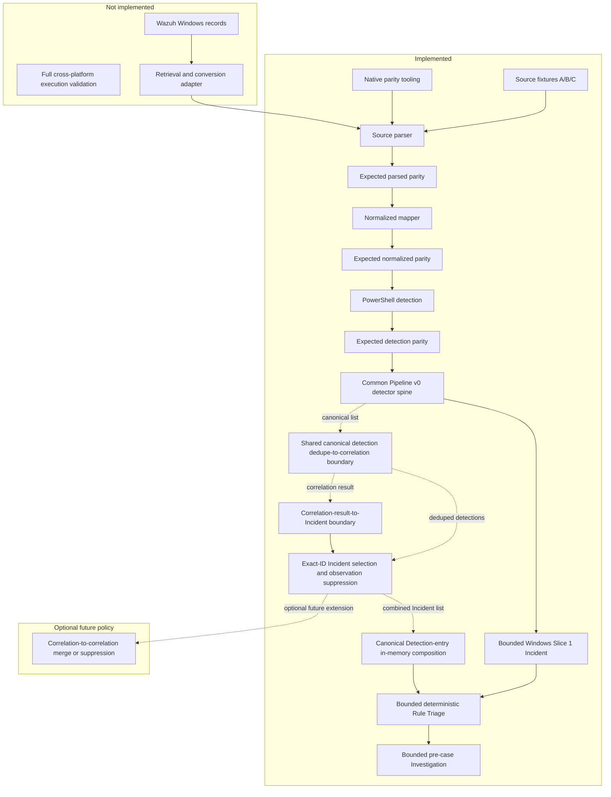
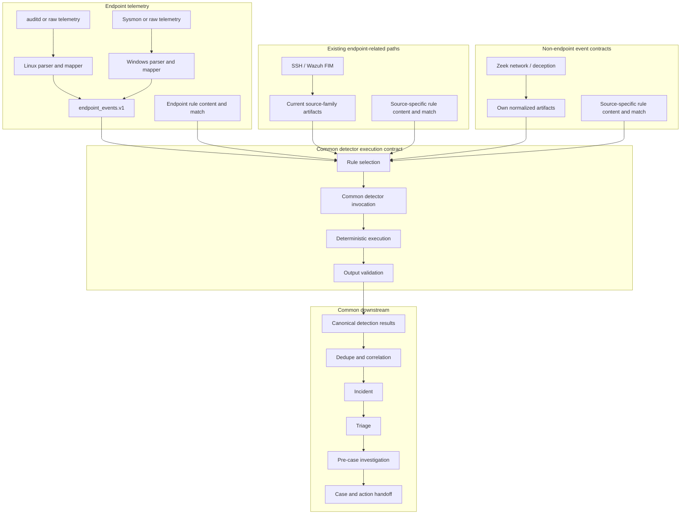
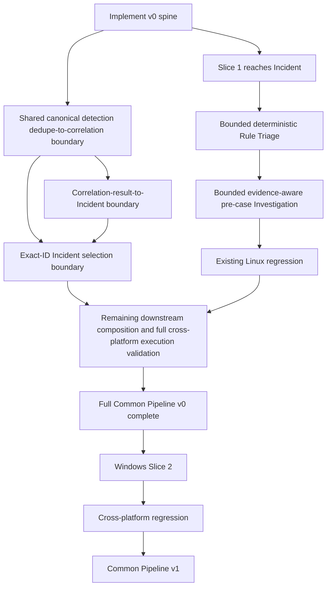
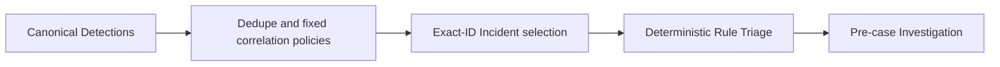

# Defender Event Processing Flow

## Purpose

This document explains how defender-side telemetry moves from source-specific
observation to deterministic detection and evidence-aware analysis.

It defines the responsibility, output, and trust boundary of each processing
stage so that collection, parsing, normalization, detection, triage, and
investigation do not collapse into one ambiguous step.

This is a cross-platform architecture view. Source-specific contracts such as
Sysmon Event ID 1 remain under `docs/design/`.

## Runtime Processing Flow

```mermaid
flowchart LR
    A[Raw / Live Telemetry]
    B[Source-Shaped Event]
    C[Source Parser]
    D[Source-Specific Parsed Event]
    E[Normalized Mapper]
    F[Normalized Endpoint Event]
    G[Deterministic Detector]
    H[Detection Result]
    I[Correlation / Incident Builder]
    J[Incident]
    K[Triage]
    L[Investigation]

    A --> B
    B --> C
    C --> D
    D --> E
    E --> F
    F --> G
    G --> H
    H --> I
    I --> J
    J --> K
    J --> L
    K --> L
```



## Stage Responsibilities

| Stage | Input | Responsibility | Output | Must not claim |
|---|---|---|---|---|
| Raw / live telemetry | Runtime endpoint or platform activity | Preserve the actual defender-side observation | Raw log, event record, XML, EVTX, or provider output | That a repository fixture or later pipeline stage is implemented |
| Source-shaped event | Raw or adapted source event | Preserve source vocabulary and source relationships in a structured form | Provider-shaped structured event | Canonical field meaning, maliciousness, or incident state |
| Source parser | Source-shaped event | Validate the source contract, convert types, normalize source timestamps, and expose source-specific parsed fields | Source-specific parsed event | Detection, verdict, severity, incident, or response state |
| Normalized mapper | Source-specific parsed event | Project source-specific fields into the lab-wide endpoint event contract while retaining selected provenance | Normalized endpoint event | Maliciousness, rule match, severity, incident, or response state |
| Deterministic detector | Normalized event | Evaluate explicit deterministic conditions | Detection result or rule hit | Attack intent, full incident truth, or response approval |
| Correlation / incident builder | Detection results and supporting observations | Relate events across time, host, user, process, or scenario context and construct an analysis unit | Incident candidate or incident artifact | That every correlated event is malicious or that evidence is complete |
| Triage | Incident, timeline, rule hits, and available evidence | Assess priority, summarize the current story, identify uncertainty, and select the next analysis path | Triage result | Unverified facts, final attribution, or unsupported conclusions |
| Investigation | Incident plus additional evidence sources | Test hypotheses, collect additional evidence, confirm or reject explanations, and identify remaining gaps | Investigation result and evidence set | Conclusions not supported by collected evidence |

## Runtime Evidence And Fixtures

A raw or live event and a repository source fixture are different artifacts.

```text
raw / live event
  = actual defender-side runtime evidence

source fixture
  = a sanitized, deterministic test representation of the source-shaped event
```

A source fixture may preserve the semantic relationships needed for a test, but
it must not be presented as byte-for-byte runtime evidence. Runtime hostnames,
users, identifiers, timestamps, command lines, and other environment-private
values remain outside committed fixtures unless explicitly sanitized and
reviewed.

## Parser And Normalized Mapper Boundary

The parser and normalized mapper are separate because they solve different
problems.

### Source parser

The source parser keeps source-specific meaning while making the event safe and
consistent for programmatic use.

Typical responsibilities:

- validate the source-specific schema;
- reject incorrect provider routing;
- convert string process IDs to integers;
- normalize source timestamp representations;
- split source-specific composite fields such as Sysmon hash strings; and
- omit unsupported or absent optional fields rather than inventing values.

### Normalized mapper

The normalized mapper translates a validated source-specific parsed event into
the common endpoint event vocabulary used by downstream detection.

Typical mappings include:

```text
computer          -> host
utc_time          -> timestamp
process_id        -> pid
parent_process_id -> ppid
image             -> exe
basename(image)   -> process_name
parent_image      -> parent_exe
```

Source-specific provenance that remains useful downstream is retained under a
bounded provenance field such as `source_fields` or `raw_ref` rather than being
copied wholesale into canonical top-level fields.

Normalization is telemetry shaping only. It does not establish:

- maliciousness;
- detection success;
- verdict or severity;
- incident status;
- containment approval; or
- response authorization.

## Detection, Triage, And Investigation Boundary

Detection is deterministic rule evaluation against normalized observations.
Triage and investigation interpret the resulting incident context, but they
must remain evidence-aware.

```text
normalized event
  -> deterministic rule evaluation
  -> detection result
  -> correlation / incident construction
  -> triage
  -> investigation
```

A detection result states that a rule condition matched. It does not by itself
prove an attacker objective, successful compromise, or the need for
containment.

Triage prioritizes and explains the current evidence. Investigation gathers or
examines additional evidence to test the triage hypotheses. Missing evidence
must remain visible instead of being converted into a confident conclusion.

## Expected Artifacts And Exact Parity

`expected_*` artifacts are static golden results used to verify that each
transformation produces the reviewed output.

They are not additional runtime processing stages.



Roles:

```text
expected_parsed
  = reviewed golden output for the source parser

expected_normalized
  = reviewed golden output for the normalized mapper

expected_detection
  = reviewed expected outcome for deterministic detection
```

JSON Schema and expected artifacts answer different questions:

```text
JSON Schema
  = Is the structure, type, and required-field contract valid?

expected_* artifact
  = Are the actual transformed values and field mappings exactly the reviewed result?
```

Tests must read expected artifacts as static inputs. They must not regenerate
or overwrite golden files during normal test execution.

## Sysmon Event ID 1 Example

```text
Sysmon provider-like source event
  system.provider_event_id = 1
  event_data.ProcessId = "4100"
  event_data.Image = "C:\\...\\powershell.exe"

        -> source parser

Sysmon source-specific parsed event
  provider_event_id = 1
  process_id = 4100
  image = "C:\\...\\powershell.exe"

        -> normalized mapper

Normalized endpoint event
  source = "sysmon"
  platform = "windows"
  event_type = "process_exec"
  pid = 4100
  process_name = "powershell.exe"
  exe = "C:\\...\\powershell.exe"

        -> deterministic detector

Detection result
  rule matched or did not match
```

The source event says that Sysmon observed process creation. The normalized
event expresses that observation in the lab-wide endpoint vocabulary. Only the
detector evaluates whether a defined condition matched, and later stages decide
how the detection should be interpreted using available evidence.

## Cross-Platform Current State

The Linux pipeline is the current runtime baseline. In particular, the existing
process pipeline supports the `scenario_004`, `scenario_005`, and
`scenario_006` family through source-specific Linux parsing and detection,
dedupe/correlation, incident construction, triage, pre-case investigation, and
later handoffs. This baseline must remain working while the common pipeline is
introduced.

Windows is currently a fixture-first, Sysmon Event ID 1 mapping and
deterministic detection slice. Its verified repository status is:

| Capability | Status | Evidence and boundary |
|---|---|---|
| Sysmon Event ID 1 source fixture/schema | Implemented | Sanitized Fixture A/B/C source JSON, source schema, and focused validation exist. These are test representations, not live evidence. |
| Source parser | Implemented | The Sysmon Event ID 1 parser validates provider routing and produces source-specific parsed events. |
| Parsed-event schema / expected parsed parity | Implemented | A parsed-event schema, static Fixture A/B/C `expected_parsed` artifacts, and exact parity tests exist. |
| Native collector/parity tooling | Implemented tooling; bounded native parity manually observed | A PowerShell collector adapter, local parity validator, tests, and runbook exist. A bounded 2-record source/parser parity run was observed without committing live artifacts. This is not continuous collection. |
| Normalized mapper | Implemented | The versioned Sysmon Event ID 1 mapper produces one schema-valid normalized event for each schema-valid parsed event. |
| `endpoint_events.v1` / expected normalized parity | Implemented for Fixture A/B/C | Static `expected_normalized` objects and exact parser/mapper parity exist. Live normalized parity has not been established. |
| Deterministic PowerShell observation/detection | Implemented through Fixture A/B/C parity | Two Windows/Sysmon-specific rules reuse the existing atomic DSL and evaluator. Static `expected_detection` artifacts fix the reviewed positive/negative outcomes; this is not live runtime evidence or a malicious verdict. |
| Common Pipeline v0 detector-invocation spine | Implemented for normalized endpoint fixtures | One platform-neutral entry point validates `endpoint_events.v1` and atomic rules, orders rules deterministically, reuses the existing evaluator, and validates the established canonical detection-list shape. Linux Scenario 009 and Windows Fixture A/B/C prove fixture connection and parity only. |
| Shared canonical-detection dedupe-to-correlation execution boundary | Implemented and fixture-validated | A platform-neutral in-memory entry point validates and deduplicates canonical detections, invokes the existing `auth → authorized_keys` and `key login → process execution` policies in fixed order, deterministically validates correlation results, and preserves non-correlating Linux Scenario 009 and Windows Fixture A/B/C parity. |
| Correlation-result-to-Incident execution boundary | Implemented and focused-test validated | A platform-neutral in-memory bridge revalidates deterministic dedupe output and correlation results, builds one schema-valid correlation-level Incident per result with correlation-derived identity, and preserves defender evidence and ordering. |
| Correlation/no-correlation Incident selection policy | Implemented and focused-test validated | Exact validated supporting-detection IDs take precedence: correlation-covered detections produce correlation-level Incidents only, while uncovered detections produce observation-level fallbacks. Correlation Incidents are not merged or suppressed. |
| Canonical Detection-to-Investigation composition | Implemented and focused-test validated | The platform-neutral, in-memory, run-local entry point reuses dedupe/correlation, exact-ID Incident selection, Rule Triage, and pre-case Investigation list boundaries. Linux Scenario 009 and Windows Fixture A/B/C provide focused connection coverage; full cross-platform execution validation remains incomplete. |
| Detection-to-Incident boundary | Implemented for bounded Windows fixtures | A platform-neutral list entry point validates canonical detections, orders them deterministically, reuses the existing observation-level Incident builder once per detection, and validates every result against `incident_schema.json`. Fixture A/B/C produce 1, 2, and 0 Incidents. This is not live runtime validation. |
| Windows Triage/Investigation | Bounded boundary mechanics implemented for Fixture A/B/C | Shared list boundaries produce identity-preserving 1, 2, and 0 Triage and pre-case Investigation results. Windows Investigation quality, AI/model validation, and live runtime validation remain unconfirmed. |
| Wazuh Windows integration | Not implemented | Wazuh remains a future retrieval/search path whose records require a retrieval/conversion adapter before the Windows parser. It is not the Windows semantic or detection source of truth. |

The following diagram intentionally separates implemented repository-fixture
parity, bounded boundary mechanics, and in-memory composition from full
cross-platform execution validation and runtime integration.



Fixture A/B/C are parser/mapper/detector parity fixtures. They are not three
pipeline scenarios, and their parity does not prove a live Windows pipeline.

## Source-Specific And Common Responsibilities

For endpoint telemetry, cross-platform reuse begins only after source semantics
have been interpreted and projected into `endpoint_events.v1`. This contract is
the common endpoint-telemetry boundary for Linux auditd, Windows Sysmon, and
future endpoint sources. It is not the normalization contract for every
defender source family.

The existing SSH and Wazuh FIM paths currently retain their source-family
artifacts because they have not migrated to `endpoint_events.v1`. They are not
classified as inherently non-endpoint sources. If their underlying endpoint
telemetry can later be mapped safely without losing source meaning or
provenance, they may migrate to the endpoint event contract.

Zeek network telemetry, deception, and other sources that do not use
`endpoint_events.v1` retain their own normalized artifacts. Both these paths
and the current, not-yet-migrated SSH/Wazuh FIM paths join the common downstream
at the canonical detection result boundary. The goal is not to make every
detection rule identical. The goal is to run platform/domain-specific rule
content and match conditions through a common execution contract and hand the
validated results to a common pipeline engine.

| Boundary | Responsibilities that remain source-specific | Responsibilities shared across platforms |
|---|---|---|
| Collection and adaptation | auditd, Sysmon, Windows Event Log, or future retrieval adapters; source routing and acquisition provenance | Run isolation, bounded artifact placement, and validation outcome handling |
| Parsing | auditd multi-record interpretation; Sysmon provider/Event ID interpretation; source-native timestamps and identifiers | Basic fail-closed behavior and explicit skip/error reporting |
| Parsed contract | Source-specific parsed schemas and source provenance | No common parsed schema is required |
| Normalization | One mapper per source/domain; source-to-canonical field policy; current SSH/Wazuh FIM paths retain not-yet-migrated source-family artifacts; Zeek and deception retain non-`endpoint_events.v1` artifacts | Validated `endpoint_events.v1` handoff for mapped endpoint telemetry; canonical detection result handoff across all source families |
| Detection | Platform/domain-specific rule content, match conditions, and feature logic | Rule selection, detector invocation, deterministic execution, output validation, and canonical detection result handoff |
| Incident entry | No parser- or mapper-owned incident conclusions | Dedupe, correlation engine, incident builder, and canonical incident handoff |
| Analysis and handoff | Platform-aware evidence interpretation where required | Triage, pre-case investigation/enrichment, initial case, and action handoff |
| Runtime control | Collector-specific configuration | Run isolation, run artifact management, schema validation, skip policy, and fail-closed defaults |

The common detector invocation contract must accept validated source-family
artifacts, select explicitly registered rules for the event platform/domain,
invoke them deterministically, and validate their output before emitting
canonical detection results or an explicit skip/failure. Rule content and match
conditions remain source/platform-specific. Endpoint detectors consume
`endpoint_events.v1`; the current SSH/Wazuh FIM paths consume their retained
source-family artifacts unless intentionally migrated; Zeek and deception
detectors consume their own normalized artifacts. Downstream of canonical
detection results, common code must not parse auditd, Sysmon, or another
source-native shape. Unsupported schemas, invalid artifacts, and invalid
detector outputs fail closed; absence of an optional input may be an explicit
skip, but must not be presented as successful detection.

## Target Runtime Architecture

Linux and Windows endpoint telemetry retain independent front ends and converge
at the implemented normalized endpoint event contract. Existing SSH/Wazuh FIM
paths remain separate until an intentional migration, while Zeek network
telemetry and deception keep their own contracts. All paths converge reliably
at canonical detection results.



The common spine owns artifact handoff and execution policy; it does not absorb
collector, parser, mapper, or rule semantics. A Linux auditd rule and a Windows
Sysmon rule may therefore differ while producing the same canonical detection
result shape for downstream processing.

Attacker-side artifacts remain outside this defender evidence path.
`attack_result.json`, `attack_execution_log.json`, and
`attack_observed_effects.json` may support run alignment and gap analysis, but
they are not defender telemetry, detection evidence, or alerts and cannot
create an incident by themselves.

The Investigation stage in this flow is the pre-case stage that writes
`investigation_result.json`. It remains separate from the post-action DFIR
workflow, which consumes an approved/executed collection path and writes
`post_action_dfir_investigation_result.json`. Post-action results must not be
fed back into or overwrite the pre-case artifact.

## Staged Common-Pipeline Introduction

Commonization is fixed in two evidence-driven stages. v0 is being introduced as
the shared spine that connects Windows Slice 1 through the Incident boundary
and bounded deterministic Rule Triage into evidence-aware pre-case
Investigation; it is not a refactor deferred until after a separate Windows
incident path exists.



### Common Pipeline v0

v0 is designed to connect the first Windows atomic detection to an
Incident. It is the smallest shared execution spine that can receive Linux and
Windows normalized endpoint events, accept canonical detection results from
other retained source-family paths, and invoke detection, dedupe/correlation,
incident, triage, and pre-case investigation stages.

The detector-invocation portion of this spine is now implemented for
`endpoint_events.v1`. It validates the existing normalized contract, validates
and deterministically orders existing atomic rules, calls the existing atomic
evaluator, and checks the established canonical detection-list structure. It
does not create a new persistent artifact or schema. Repository tests establish
exact fixture parity for Linux Scenario 009 and Windows Sysmon Event ID 1
Fixture A/B/C. They do not establish live Windows collection, live normalized
parity, or a live Windows Incident path.

The shared canonical-detection dedupe-to-correlation execution boundary is
also implemented as a platform-neutral in-memory entry point. It validates
canonical input before dedupe, rejects duplicate detection IDs and invalid
timestamps, preserves rule-distinct observations, and reuses the existing
deterministic dedupe helper. It then invokes the existing Linux/SSH domain
policies for `auth → authorized_keys` and `key login → process execution` in a
fixed order, validates the current correlation result shape fail closed, and
orders results, supporting detections, evidence references, and raw-event
references deterministically. Focused characterization tests preserve the
existing identity and inclusive-window semantics. Linux Scenario 009 and
Windows Fixture A/B/C retain their expected deduped detections and produce no
spurious correlation. This stage remains an in-memory boundary and is not wired
into the detector runtime.

The correlation-result-to-Incident execution boundary is now implemented as a
separate platform-neutral in-memory bridge. It revalidates that its canonical
detection input exactly matches deterministic dedupe output, reuses the current
correlation-result validator, orders correlations and supporting detections by
the shared policies, and creates one schema-valid Incident with
`inc-<correlation_id>` identity per result. It preserves correlation metadata,
evidence references, raw-event references, time windows, behavior features,
and supporting-detection linkage. Focused tests cover both current correlation
policies, input-order independence, fail-closed input/output validation, Linux
Scenario 009, and Windows Fixture A/B/C parity. It creates no observation-level
fallback Incident and is not connected to Triage or Investigation.

The correlation/no-correlation Incident selection boundary is also implemented
as a platform-neutral in-memory adapter. It reuses the validated deterministic
dedupe and correlation input contract, retains every correlation Incident, and
suppresses an observation-level Incident only when that exact canonical
detection ID appears in validated correlation support. Every uncovered
detection produces one observation fallback. The selected list fixes
correlation Incidents first and observation Incidents second, then revalidates
schema, identities, counts, coverage, suppression, and ordering. Shared
detections may remain in multiple correlation Incidents; correlation-to-
correlation merge or suppression is not implemented. It is an optional future
policy, not a gap in the current selection boundary and not a Common Pipeline
v0 completion requirement. Linux Scenario 009 and Windows Fixture A/B/C retain
all non-correlating detections as observation Incidents.

The bounded detection-to-Incident portion is also implemented for Fixture
A/B/C. It accepts only validated canonical detections, applies deterministic
ordering and IDs, builds one observation-level Incident per detection through
the existing generic builder, and validates the existing Incident schema.
Top-level and timeline `evidence_refs` use the shared string-array Incident
contract. The bounded Incident policy explicitly uses `low` severity for this
Windows slice; it does not infer maliciousness from atomic rule metadata. No
multi-hit grouping, Windows-specific Incident schema, or Sysmon-native
downstream parsing was added.

The bounded Incident-to-Triage portion is also implemented for Fixture A/B/C.
It validates and deterministically orders the canonical Incident list, reuses
the existing deterministic Rule Triage `build_output()` once per Incident,
validates each result against the shared Triage schema, and preserves exact
Incident-to-Triage identity. Fixture A/B/C produce 1, 2, and 0 Triage results.
This in-memory list execution adds no aggregate artifact or Windows-specific
schema. It validates boundary mechanics only: current Linux-oriented fallback
verdicts are not Windows quality approval, AI model validation, or a
benignness/maliciousness oracle.

The bounded Triage-to-pre-case-Investigation portion is also implemented for
Fixture A/B/C. It validates complete one-to-one Incident/Triage linkage before
execution, orders pairs by `incident_id`, reuses the existing evidence-aware
`build_investigation_result()` once per pair, and validates each result against
the existing Investigation schema. Fixture A/B/C produce 1, 2, and 0
identity-preserving Investigation results. It adds no aggregate artifact,
Windows-specific path, or Investigation policy. The result demonstrates
boundary mechanics only, not Windows Investigation quality, AI/model
validation, or live telemetry coverage.

This bounded slice does not complete Common Pipeline v0 under the full Done
Criteria below. The detector spine, shared canonical-detection
dedupe-to-correlation execution boundary, correlation-result-to-Incident
boundary, Windows Slice 1 Incident boundary, and bounded deterministic Rule
Triage and pre-case Investigation boundaries are implemented with repository
Linux regression. Exact-ID observation-vs-correlation duplicate suppression is
implemented. Selected-Incident-to-Triage-to-Investigation composition
is now implemented as a canonical-Detection-entry in-memory boundary and is
focused-test validated for Linux Scenario 009 and Windows Fixture A/B/C. Full
cross-platform execution validation remains incomplete.
Correlation-to-correlation merge or suppression remains an optional future
policy and is not required for Common Pipeline v0 completion. v0 explicitly
excludes platform-specific collectors, parsers, mappers, and rule content.

Repository status for this slice:

```text
Shared canonical-detection dedupe-to-correlation execution boundary:
implemented and fixture-validated

Correlation-result-to-Incident execution boundary:
implemented and focused-test validated

Correlation/no-correlation Incident selection policy:
implemented and focused-test validated

Observation-vs-correlation duplicate suppression:
implemented by exact validated supporting-detection ID precedence

Correlation-to-correlation merge or suppression:
not implemented

Canonical Detection → dedupe → correlation → selected Incident → Triage → Investigation composition:
implemented and focused-test validated

Full cross-platform execution validation:
not complete

Full Common Pipeline v0:
not complete
```



This composition is in-memory and run-local. It does not define stable identity
across reprocessing, changed selection results, or persistent storage. It calls
the existing detector-downstream list boundaries without adding Detection,
correlation, Incident, Triage, or Investigation policy. The detector spine that
produces canonical Detections from `endpoint_events.v1` remains a separate
existing boundary.
Correlation-to-correlation merge or suppression is an optional future policy
and is not required for Common Pipeline v0 completion.

Perfect abstraction, continuous live
collection, and live Wazuh integration are not completion requirements.

The target runtime diagram represents the steady-state execution contract,
not a requirement to migrate every existing source-family input during v0.
For v0, Windows `endpoint_events.v1` must pass through the common detector
invocation contract. Existing SSH, Wazuh FIM, Zeek, and deception paths may
continue using their current validated artifacts and either use the same
invocation contract or hand canonical detection results to the common
downstream boundary. Migrating those inputs into `endpoint_events.v1` is not
a v0 completion requirement.

### Common Pipeline v1

v1 is fixed only after a second Windows validation slice requiring correlation
across multiple events passes through the spine. At that point Linux and
Windows cross-platform regression must show that Incident and later stages do
not read auditd or Sysmon native shapes, and downstream processing must not
accumulate scenario-ID-specific branches.

v1 also distinguishes fixture evidence from runtime evidence and reuses a
common harness/run-artifact contract across both platforms.

### Done Criteria

| Criterion | Common Pipeline v0 | Common Pipeline v1 |
|---|---|---|
| Current status | **Not complete.** Implemented subset: detector spine, shared canonical-detection dedupe-to-correlation execution boundary, correlation-result-to-Incident bridge, exact-ID Incident selection/observation suppression, and canonical Detection-to-selected-Incident-to-Triage-to-pre-case-Investigation in-memory composition, focused-tested with Linux Scenario 009 and Windows Fixture A/B/C. Full cross-platform execution validation is not complete. Correlation-to-correlation merge/suppression is an optional future policy and is not required for v0 completion. | Not started |
| Completion evidence | Windows Slice 1 creates identity-linked Incident, deterministic Rule Triage, and evidence-aware pre-case Investigation results through v0; existing Linux `scenario_004`/`005`/`006` regression succeeds; and every shared-execution stage below is connected and validated | A second Windows multi-event correlation validation slice reaches Incident and downstream analysis, followed by cross-platform regression |
| Accepted input | Valid Linux and Windows `endpoint_events.v1` artifacts plus canonical detection results from retained source-family paths | Same boundaries with cross-platform regression coverage |
| Shared execution | Rule selection, detector invocation, deterministic execution, output validation, canonical result, dedupe/correlation, incident, triage, and pre-case investigation spine | v0 spine stabilized as the reusable common harness/runtime contract |
| Source isolation | Collectors, parsers, mappers, and rule content remain source/domain-specific | Incident and later stages have no direct auditd/Sysmon native-shape dependency |
| Compatibility | Existing Linux `scenario_004`/`005`/`006` behavior remains intact | Linux and Windows regressions pass without new downstream scenario-ID branches |
| Evidence labeling | Fixture-backed and runtime-backed inputs are identified | Fixture and runtime evidence remain distinguishable in reusable run artifacts |
| Failure behavior | Schema-invalid input/output fails closed; optional absence is an explicit skip | Cross-platform validation, skip, and fail-closed behavior is consistent |
| External integration | Live Wazuh integration is not required | Wazuh may remain optional; it is not the DSL or semantic source of truth |

## Recommended Windows Validation Slices

These slices are safe architecture examples and are not implementation-status
claims.

1. **Windows Slice 1 — atomic flow:** map one Sysmon Event ID 1 process
   observation into `endpoint_events.v1`, emit a deterministic
   PowerShell-compatible observable/detection, and cross the Incident boundary.
   A process observation alone does not claim maliciousness.
2. **Windows Slice 2 — correlation flow:** correlate multiple process-execution
   observations using PID/PPID and bounded time relationships to represent a
   process chain. Correlation belongs after canonical detection/observation
   output, not inside the Sysmon parser.
3. **Later slice — multiple telemetry sources:** correlate a future Security
   4624/4625 authentication mapping or Sysmon Event ID 3 network mapping with
   process telemetry. Each source requires its own parser/mapper contract before
   entering the common spine.

The examples use sanitized placeholders and bounded lab observations only.
They add no attack implementation, operational payload, containment action, or
host-changing behavior.

## Cross-Platform Non-Goals

This architecture does not require or authorize:

- one parser shared by Windows and Linux;
- promotion of every platform-specific field to a canonical top-level field;
- Wazuh as the detection DSL, canonical semantic contract, or detection source
  of truth;
- attacker-side observed effects as defender evidence;
- automatic containment, candidate application, or Rule Improvement promotion;
- simultaneous implementation of Windows, Linux, Active Directory, and every
  Windows Event ID;
- commonization of all platform/domain-specific deterministic rule logic;
- merging pre-case investigation with the post-action DFIR workflow; or
- treating Fixture A/B/C as three runtime pipeline scenarios.

## Relationship To Other Documents

- [SOC Lab System Diagram](soc-lab-system-diagram.md) provides the broader
  system, node, agent, and feedback-loop view.
- [Normalized Endpoint Event Contract](../design/defender/normalized_endpoint_event_contract.md)
  defines the common endpoint event contract.
- [Windows Telemetry MVP Contract](../design/windows/windows_telemetry_contract.md)
  defines the Windows telemetry boundary and current implementation status.
- [Sysmon Event ID 1 Fixture Contract](../design/windows/sysmon_event1_fixture_contract.md)
  defines the sanitized fixture and transformation boundaries.
- [Sysmon Event ID 1 Normalized Mapper Contract](../design/windows/sysmon_event1_normalized_mapper_contract.md)
  defines the implemented normalization policy.
