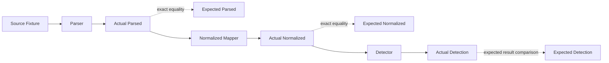
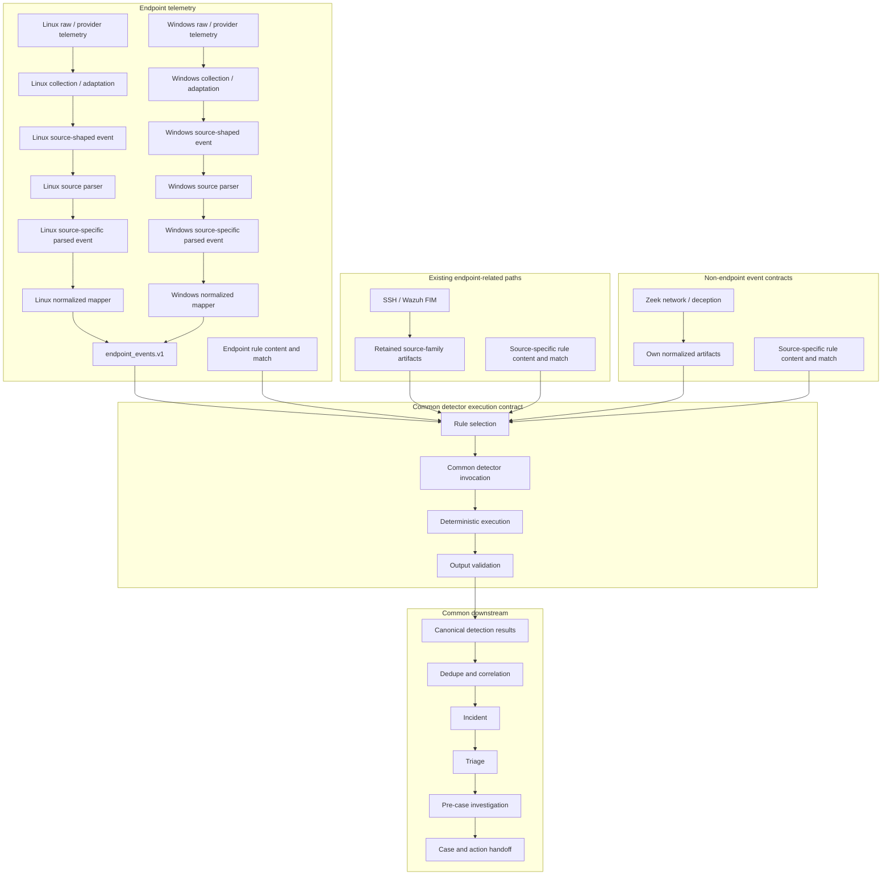
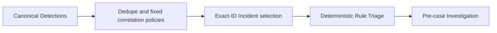

# Defender Event Processing Flow

[日本語](defender-event-processing-flow_ja.md)

## Purpose

This document explains how defender-side telemetry moves from source-specific
observation to deterministic detection and evidence-aware analysis.

It defines the responsibility, output, and trust boundary of each processing
stage so that collection, parsing, normalization, detection, triage, and
investigation do not collapse into one ambiguous step.

This is a cross-platform architecture view. Source-specific contracts such as
Sysmon Event ID 1 remain under `docs/design/`.

> Document responsibility:
> This document owns stable defender-side processing stages, handoff contracts,
> and trust boundaries. The [Main Roadmap](../roadmap/roadmap.md) owns current
> implementation status, priorities, validation depth, sequencing, and Done
> Criteria. A component or version described here must not be treated as
> implemented or runtime-validated without Roadmap evidence.

## Runtime Processing Flow

```mermaid
flowchart LR
    A[Raw / Live Telemetry]
    X[Collection / Adaptation]
    B[Source-Shaped Event]
    C[Source Parser]
    D[Source-Specific Parsed Event]
    E[Normalized Mapper]
    F[Normalized Endpoint Event]
    G[Deterministic Detector]
    H[Detection Result]
    I[Correlation / Incident Builder]
    J[Incident]
    K[Triage]
    L[Pre-case Investigation]

    A --> X
    X --> B
    B --> C
    C --> D
    D --> E
    E --> F
    F --> G
    G --> H
    H --> I
    I --> J
    J --> K
    J --> L
    K --> L
```



`Collection / Adaptation` is shown explicitly to make the raw-to-source-shaped
handoff visible. It is a responsibility boundary, not a requirement for a new
agent or a separately persisted artifact. If a collector already returns a
provider-shaped structured record, adaptation may be close to a pass-through.

## Stage Responsibilities

| Stage / boundary | Input | Responsibility | Output | Must not claim |
|---|---|---|---|---|
| Raw / live telemetry | Runtime endpoint or platform activity | Preserve the actual defender-side observation | Raw log, event record, XML, EVTX, or provider output | That a repository fixture or later pipeline stage is implemented |
| Collection / adaptation | Raw/live telemetry or provider output | Decode or represent the observation as a programmatically usable source-shaped event while preserving source vocabulary, source relationships, and acquisition provenance | Source-shaped event | Canonical field meaning, parsed source semantics, malicious/benign classification, or incident state |
| Source-shaped event | Collection/adaptation output | Preserve the provider/source vocabulary and relationships in a structured form suitable for the source parser | Provider-shaped structured event | Fully parsed source values, assigned cross-source semantics, or malicious/benign classification |
| Source parser | Source-shaped event | Validate the expected source/provider contract, interpret source-native fields, convert types, normalize source timestamps, and expose source-specific parsed fields | Source-specific parsed event | Cross-source canonical mapping, detection, verdict, severity, incident, or response state |
| Normalized mapper | Source-specific parsed event | Project source-specific fields into the lab-wide endpoint event contract while retaining selected provenance | Normalized endpoint event | Maliciousness, rule match, severity, incident, or response state |
| Deterministic detector | Normalized event | Evaluate explicit deterministic conditions | Detection result or rule hit | Attack intent, full incident truth, or response approval |
| Correlation / incident builder | Detection results and supporting observations | Relate events across time, host, user, process, or scenario context and construct an analysis unit | Incident candidate or incident artifact | That every correlated event is malicious or that evidence is complete |
| Triage | Incident, timeline, rule hits, and available evidence | Assess priority, summarize the current story, identify uncertainty, and select the next analysis path | Triage result | Unverified facts, final attribution, or unsupported conclusions |
| Pre-case Investigation | Incident, Triage, and available defender-side evidence | Test hypotheses, examine evidence, enrich context, and identify gaps and recommended pivots | `investigation_result.json` and evidence references | Collection execution, post-action DFIR conclusions, or conclusions unsupported by available evidence |

## Runtime Evidence And Fixtures

A raw or live event and a repository source fixture are different artifacts.

```text
raw / live event
  = actual defender-side runtime evidence

source fixture
  = a sanitized, deterministic test representation of the source-shaped event
```

A source fixture may preserve the semantic relationships needed for a test, but
it must not be presented as byte-for-byte runtime evidence. Runtime hostnames,
users, identifiers, timestamps, command lines, and other environment-private
values remain outside committed fixtures unless explicitly sanitized and
reviewed.

## Source-Shaped Event, Parser, And Normalized Mapper Boundaries

The adaptation, source parser, and normalized mapper responsibilities remain
separate because they answer different questions.

```text
raw / provider representation
        -> collection / adaptation
source-shaped event
        -> source parser
source-specific parsed event
        -> normalized mapper
normalized endpoint event
```

### Collection / adaptation and source-shaped event

Collection/adaptation converts the transport or provider representation into a
structured shape that the source parser can consume without replacing the
source's own vocabulary with lab-wide canonical semantics.

For example, an XML or provider record may be represented as an object with a
`system` section and an `event_data` section. Field names and relationships
remain provider-shaped. If the upstream collector already provides an
equivalent structured representation, this boundary may require little or no
additional transformation.

The source-shaped event is therefore a handoff artifact, not a claim that the
source has already been semantically parsed. At this boundary:

- provider/source field names and structural relationships are preserved;
- acquisition provenance may be retained;
- representation-level decoding may already have occurred;
- source-specific type interpretation and cross-source canonical mapping have
  not yet been established; and
- malicious/benign classification is not performed at this boundary.

### Source parser

The source parser answers: "Can this event be interpreted safely and
consistently according to this source's contract?"

It keeps source-specific meaning while making the event safe and consistent for
programmatic use.

Typical responsibilities:

- validate the expected provider, event family, and source-specific schema;
- reject incorrect provider routing;
- convert string process IDs to integers;
- normalize source timestamp representations;
- split source-specific composite fields such as Sysmon hash strings; and
- omit unsupported or absent optional fields rather than inventing values.

A parser may rename fields into implementation-friendly source-specific names
such as `ProcessId` -> `process_id`. That naming change does not make the field
canonical. The output still represents Sysmon, auditd, or another specific
source and remains governed by that source's parsed contract.

### Normalized mapper

The normalized mapper answers: "How is a validated source-specific observation
expressed in the common downstream vocabulary?"

It translates a validated source-specific parsed event into the common endpoint
event vocabulary used by downstream detection.

Typical mappings include:

```text
computer          -> host
utc_time          -> timestamp
process_id        -> pid
parent_process_id -> ppid
image             -> exe
basename(image)   -> process_name
parent_image      -> parent_exe
```

Source-specific provenance that remains useful downstream is retained under a
bounded provenance field such as `source_fields` or `raw_ref` rather than being
copied wholesale into canonical top-level fields.

Normalization is telemetry shaping only. It does not establish:

- maliciousness;
- detection success;
- verdict or severity;
- incident status;
- containment approval; or
- response authorization.

## Detection, Triage, And Pre-case Investigation Boundary

Detection is deterministic rule evaluation against normalized observations.
Triage and pre-case Investigation interpret the resulting incident context,
but they must remain evidence-aware.

```text
normalized event
  -> deterministic rule evaluation
  -> detection result
  -> correlation / incident construction
  -> triage
  -> pre-case investigation
```

A detection result states that a rule condition matched. It does not by itself
prove an attacker objective, successful compromise, or the need for
containment.

Triage prioritizes and explains the current evidence. Pre-case Investigation
examines available defender-side evidence to test the triage hypotheses and
records evidence gaps and recommended pivots. It does not execute a collection
request or consume `collection_result.json`. Missing evidence must remain
visible instead of being converted into a confident conclusion.

## Expected Artifacts And Exact Parity

`expected_*` artifacts are static golden results used to verify that each
transformation produces the reviewed output.

They are not additional runtime processing stages.



Roles:

```text
expected_parsed
  = reviewed golden output for the source parser

expected_normalized
  = reviewed golden output for the normalized mapper

expected_detection
  = reviewed expected outcome for deterministic detection
```

JSON Schema and expected artifacts answer different questions:

```text
JSON Schema
  = Is the structure, type, and required-field contract valid?

expected_* artifact
  = Are the actual transformed values and field mappings exactly the reviewed result?
```

Tests must read expected artifacts as static inputs. They must not regenerate
or overwrite golden files during normal test execution.

## Sysmon Event ID 1 Example

The full handoff is shown here so that the source-shaped and parsed boundaries
are not skipped.

```text
Raw / provider representation
  <Event>
    <System><EventID>1</EventID>...</System>
    <EventData>
      <Data Name="ProcessId">4100</Data>
      <Data Name="Image">C:\\...\\powershell.exe</Data>
    </EventData>
  </Event>

        -> collection / adaptation

Sysmon source-shaped event
  system.provider_event_id = "1"
  event_data.ProcessId = "4100"
  event_data.Image = "C:\\...\\powershell.exe"

        -> source parser

Sysmon source-specific parsed event
  provider_event_id = 1
  process_id = 4100
  image = "C:\\...\\powershell.exe"

        -> normalized mapper

Normalized endpoint event
  source = "sysmon"
  platform = "windows"
  event_type = "process_exec"
  pid = 4100
  process_name = "powershell.exe"
  exe = "C:\\...\\powershell.exe"

        -> deterministic detector

Detection result
  rule matched or did not match
```

The raw/provider representation is the observed provider data. The source-shaped
event preserves the Sysmon/Windows vocabulary in a structured handoff. The
source parser validates and interprets that source-specific shape, including
type conversion, without assigning the lab-wide endpoint vocabulary. The
normalized mapper performs that cross-source projection. Only the detector then
evaluates whether a defined condition matched, and later stages decide how the
detection should be interpreted using available evidence.

## Cross-Platform Status Reference

Current Linux, Windows, fixture, live, and cross-platform validation status is
maintained in the [Main Roadmap](../roadmap/roadmap.md). Evidence qualifiers
such as fixture-backed, bounded native observation, focused-test validated,
live, and runtime-validated must remain distinct.

The architecture below defines where source-specific processing converges and
which stages may be shared. It does not claim that every source family,
validation slice, or runtime integration has reached that target.

## Source-Specific And Common Responsibilities

For endpoint telemetry, cross-platform reuse begins only after source semantics
have been interpreted and projected into `endpoint_events.v1`. This contract is
the common endpoint-telemetry boundary for Linux auditd, Windows Sysmon, and
future endpoint sources. It is not the normalization contract for every
defender source family.

SSH and Wazuh FIM paths may retain source-family artifacts until an intentional
migration to `endpoint_events.v1` can preserve source meaning and provenance.
They are not classified as inherently non-endpoint sources merely because they
use a retained artifact contract.

Zeek network telemetry, deception, and other sources that do not use
`endpoint_events.v1` retain their own normalized artifacts. Both these paths
and retained SSH/Wazuh FIM paths join the common downstream
at the canonical detection result boundary. The goal is not to make every
detection rule identical. The goal is to run platform/domain-specific rule
content and match conditions through a common execution contract and hand the
validated results to a common pipeline engine.

| Boundary | Responsibilities that remain source-specific | Responsibilities shared across platforms |
|---|---|---|
| Collection and adaptation | Raw/provider representation -> source-shaped event; auditd, Sysmon, Windows Event Log, or future retrieval adapters; source routing and acquisition provenance | Run isolation, bounded artifact placement, and validation outcome handling |
| Parsing | Source-shaped event -> source-specific parsed event; auditd multi-record interpretation; Sysmon provider/Event ID interpretation; source-native timestamps and identifiers | Basic fail-closed behavior and explicit skip/error reporting |
| Parsed contract | Source-specific parsed schemas and source provenance; no canonical remapping yet | No common parsed schema is required |
| Normalization | Source-specific parsed event -> source/domain normalized artifact; one mapper per source/domain; source-to-canonical field policy; retained SSH/Wazuh FIM paths use source-family artifacts; Zeek and deception retain non-`endpoint_events.v1` artifacts | Validated `endpoint_events.v1` handoff for mapped endpoint telemetry; canonical detection result handoff across all source families |
| Detection | Platform/domain-specific rule content, match conditions, and feature logic | Rule selection, detector invocation, deterministic execution, output validation, and canonical detection result handoff |
| Incident entry | No parser- or mapper-owned incident conclusions | Dedupe, correlation engine, incident builder, and canonical incident handoff |
| Analysis and handoff | Platform-aware evidence interpretation where required | Triage, pre-case investigation/enrichment, initial case, and action handoff |
| Runtime control | Collector-specific configuration | Run isolation, run artifact management, schema validation, skip policy, and fail-closed defaults |

The common detector invocation contract must accept validated source-family
artifacts, select explicitly registered rules for the event platform/domain,
invoke them deterministically, and validate their output before emitting
canonical detection results or an explicit skip/failure. Rule content and match
conditions remain source/platform-specific. Endpoint detectors consume
`endpoint_events.v1`; retained SSH/Wazuh FIM paths consume their
source-family artifacts unless intentionally migrated; Zeek and deception
detectors consume their own normalized artifacts. Downstream of canonical
detection results, common code must not parse auditd, Sysmon, or another
source-native shape. Unsupported schemas, invalid artifacts, and invalid
detector outputs fail closed; absence of an optional input may be an explicit
skip, but must not be presented as successful detection.

## Target Runtime Architecture

Linux and Windows endpoint telemetry retain independent front ends and converge
at the normalized endpoint event contract. Existing SSH/Wazuh FIM
paths remain separate until an intentional migration, while Zeek network
telemetry and deception keep their own contracts. All paths converge reliably
at canonical detection results.



The common spine owns artifact handoff and execution policy; it does not absorb
collector, parser, mapper, or rule semantics. A Linux auditd rule and a Windows
Sysmon rule may therefore differ while producing the same canonical detection
result shape for downstream processing.

Attacker-side artifacts remain outside this defender evidence path.
`attack_result.json`, `attack_execution_log.json`, and
`attack_observed_effects.json` may support run alignment and gap analysis, but
they are not defender telemetry, detection evidence, or alerts and cannot
create an incident by themselves.

The Investigation stage in this flow is the pre-case stage that writes
`investigation_result.json`. It remains separate from the post-action DFIR
workflow, which consumes an approved/executed collection path and writes
`post_action_dfir_investigation_result.json`. Post-action results must not be
fed back into or overwrite the pre-case artifact.

## Common-Pipeline Version Boundaries

The v0 and v1 labels define architecture and validation boundaries, not current
implementation status. Consult the [Main Roadmap](../roadmap/roadmap.md) before
making an implementation or completion claim.

### Common Pipeline v0 Boundary

v0 is the smallest shared execution spine that can:

- receive validated Linux and Windows `endpoint_events.v1` artifacts;
- accept canonical detection results from retained source-family paths;
- invoke registered deterministic detection content;
- validate and deduplicate canonical detections;
- invoke fixed correlation policies;
- construct correlation and observation Incidents using exact supporting-ID
  selection;
- perform deterministic Triage and pre-case Investigation handoffs; and
- fail closed on invalid required input or output.

Collectors, source parsers, normalized mappers, and rule content remain
source/domain-specific. The composition is in-memory and run-local and does not
define persistent identity across reprocessing. Live Wazuh integration,
continuous collection, and correlation-to-correlation merge or suppression are
not required architectural properties of v0.



### Common Pipeline v1 Boundary

v1 extends the shared spine only after validation includes a second Windows
multi-event correlation slice and cross-platform regression. Incident and later
stages must not read auditd, Sysmon, or another source-native shape, and
downstream processing must not accumulate scenario-ID-specific branches.

Reusable run artifacts must preserve fixture-versus-runtime evidence labels and
consistent validation, skip, and fail-closed behavior across platforms.

### Validation Slice Examples

These examples illustrate safe validation progression and do not claim current
completion.

1. **Windows Slice 1 — atomic flow:** map one Sysmon Event ID 1 process
   observation into `endpoint_events.v1`, emit a deterministic observable or
   detection, and cross the Incident boundary. A process observation alone does
   not claim maliciousness.
2. **Windows Slice 2 — correlation flow:** correlate multiple process-execution
   observations using PID/PPID and bounded time relationships. Correlation
   belongs after canonical detection output, not inside the Sysmon parser.
3. **Later slice — multiple telemetry sources:** correlate a future Security
   4624/4625 authentication mapping or Sysmon Event ID 3 network mapping with
   process telemetry. Each source requires its own parser and mapper contract
   before entering the common spine.

The examples use sanitized placeholders and bounded lab observations only. They
add no attack implementation, operational payload, containment action, or
host-changing behavior.

## Cross-Platform Non-Goals

This architecture does not require or authorize:

- one parser shared by Windows and Linux;
- promotion of every platform-specific field to a canonical top-level field;
- Wazuh as the detection DSL, canonical semantic contract, or detection source
  of truth;
- attacker-side observed effects as defender evidence;
- automatic containment, candidate application, or Rule Improvement promotion;
- simultaneous implementation of Windows, Linux, Active Directory, and every
  Windows Event ID;
- commonization of all platform/domain-specific deterministic rule logic;
- merging pre-case investigation with the post-action DFIR workflow; or
- treating Fixture A/B/C as three runtime pipeline scenarios.

## Relationship To Other Documents

- [SOC Lab System Diagram](soc-lab-system-diagram.md) provides the broader
  system, node, agent, and feedback-loop view.
- [Normalized Endpoint Event Contract](../design/defender/normalized_endpoint_event_contract.md)
  defines the common endpoint event contract.
- [Windows Telemetry MVP Contract](../design/windows/windows_telemetry_contract.md)
  defines the Windows telemetry boundary.
- [Sysmon Event ID 1 Fixture Contract](../design/windows/sysmon_event1_fixture_contract.md)
  defines the sanitized fixture and transformation boundaries.
- [Sysmon Event ID 1 Normalized Mapper Contract](../design/windows/sysmon_event1_normalized_mapper_contract.md)
  defines the normalization and parity boundary.