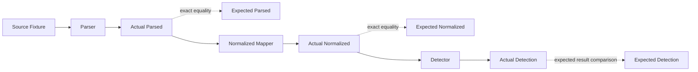
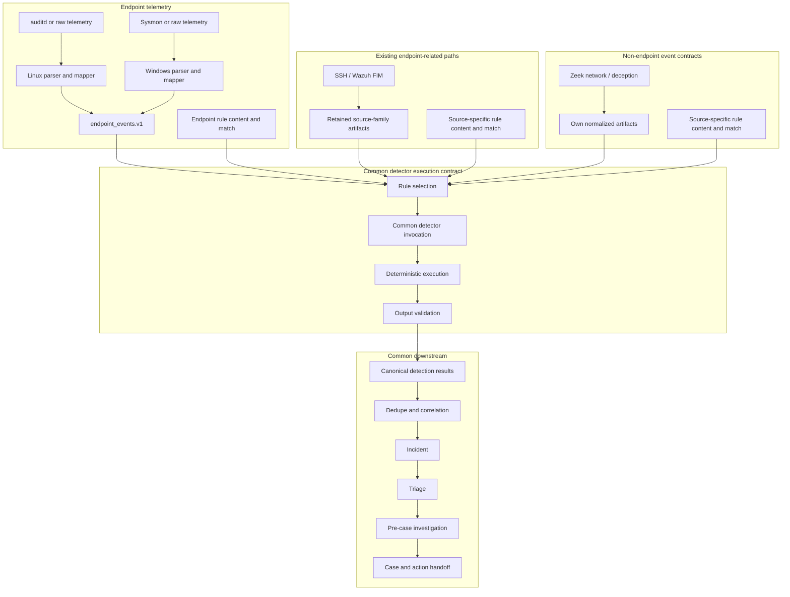
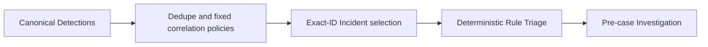

# Defender Event Processing Flow（日本語参考訳）

[English](defender-event-processing-flow.md)

> [!NOTE]
> この文書は英語版`docs/architecture/defender-event-processing-flow.md`の
> 参考翻訳です。英語版を正本とし、内容に差異がある場合は英語版を
> 優先してください。
>
> Canonical source: `docs/architecture/defender-event-processing-flow.md`
> Synchronization status: synchronized
> Last synchronization date: 2026-08-06

## 目的

この文書では、Defender側のtelemetryがsource固有の観測から、決定論的検知と
evidence-awareな分析へどのように流れるかを説明します。

collection、parsing、normalization、detection、triage、investigationが
曖昧な1つのstepへ統合されないように、各processing stageの責務、output、
trust boundaryを定義します。

これはcross-platform architectureの視点を示す文書です。Sysmon Event ID 1
などのsource固有contractは`docs/design/`配下に置きます。

> 文書の責務:
> この文書は、安定したDefender側processing stage、handoff contract、
> trust boundaryを管理します。現在のimplementation status、priority、
> validation depth、sequencing、Done Criteriaは
> [Main Roadmap](../roadmap/roadmap_ja.md)が管理します。この文書に記載された
> componentやversionは、Roadmap上のevidenceがない限り、実装済みまたは
> runtime-validatedとして扱ってはいけません。

## Runtime Processing Flow

```mermaid
flowchart LR
    A[Raw / Live Telemetry]
    B[Source-Shaped Event]
    C[Source Parser]
    D[Source-Specific Parsed Event]
    E[Normalized Mapper]
    F[Normalized Endpoint Event]
    G[Deterministic Detector]
    H[Detection Result]
    I[Correlation / Incident Builder]
    J[Incident]
    K[Triage]
    L[Pre-case Investigation]

    A --> B
    B --> C
    C --> D
    D --> E
    E --> F
    F --> G
    G --> H
    H --> I
    I --> J
    J --> K
    J --> L
    K --> L
```



## Stageごとの責務

| Stage | Input | 責務 | Output | 主張してはいけないこと |
|---|---|---|---|---|
| Raw / live telemetry | Runtime endpointまたはplatform activity | 実際にDefender側で観測された内容を保持する | Raw log、event record、XML、EVTX、またはprovider output | Repository fixtureや後続pipeline stageが実装済みであること |
| Source-shaped event | Rawまたはadapted source event | Source vocabularyとsource間の関係を構造化して保持する | Provider-shaped structured event | Canonical fieldの意味、悪性、またはincident state |
| Source parser | Source-shaped event | Source contractを検証し、typeを変換し、source timestampを正規化してsource固有のparsed fieldを公開する | Source-specific parsed event | Detection、verdict、severity、incident、またはresponse state |
| Normalized mapper | Source-specific parsed event | 選択したprovenanceを保持しながら、source固有fieldをlab全体のendpoint event contractへ投影する | Normalized endpoint event | 悪性、rule match、severity、incident、またはresponse state |
| Deterministic detector | Normalized event | 明示的な決定論的conditionを評価する | Detection resultまたはrule hit | 攻撃意図、incident全体の真実、またはresponse approval |
| Correlation / incident builder | Detection resultと補助的なobservation | 時間、host、user、process、scenario contextにまたがるeventを関連付け、分析単位を構築する | Incident candidateまたはincident artifact | 相関したすべてのeventが悪性であること、またはevidenceが完全であること |
| Triage | Incident、timeline、rule hit、利用可能なevidence | Priorityを評価し、現在の状況を要約し、不確実性を特定して次の分析pathを選択する | Triage result | 未検証の事実、最終的なattribution、または根拠のない結論 |
| Pre-case Investigation | Incident、Triage、利用可能なDefender側evidence | 仮説を検証し、evidenceを調査し、contextをenrichし、gapと推奨pivotを特定する | `investigation_result.json`とevidence reference | Collection実行、Action後DFIRの結論、または利用可能なevidenceで裏付けられない結論 |

## Runtime EvidenceとFixture

Rawまたはlive eventとrepository source fixtureは異なるartifactです。

```text
raw / live event
  = 実際にDefender側で観測されたruntime evidence

source fixture
  = source-shaped eventをsanitizedした決定論的なtest表現
```

Source fixtureはtestに必要なsemantic relationshipを保持できますが、
byte-for-byteのruntime evidenceとして提示してはいけません。Runtimeの
hostname、user、identifier、timestamp、command line、その他の
environment-privateな値は、明示的にsanitizedしてreviewしない限り、commitする
fixtureに含めません。

## ParserとNormalized Mapperの境界

Parserとnormalized mapperは異なる問題を解決するため、分離します。

### Source parser

Source parserは、eventをprogrammaticに安全かつ一貫して使用できるようにしつつ、
source固有の意味を保持します。

代表的な責務:

- source-specific schemaを検証する
- 誤ったprovider routingをrejectする
- 文字列のprocess IDをintegerへ変換する
- source timestamp表現を正規化する
- Sysmon hash stringなど、source固有の複合fieldを分割する
- 値を捏造せず、未対応または存在しないoptional fieldを省略する

### Normalized mapper

Normalized mapperは、検証済みのsource-specific parsed eventを、後続のdetectionで
使用する共通endpoint event vocabularyへ変換します。

代表的なmapping:

```text
computer          -> host
utc_time          -> timestamp
process_id        -> pid
parent_process_id -> ppid
image             -> exe
basename(image)   -> process_name
parent_image      -> parent_exe
```

後続でも有用なsource固有provenanceは、canonical top-level fieldへ一括copyせず、
`source_fields`や`raw_ref`などの範囲を限定したprovenance fieldに保持します。

Normalizationはtelemetry shapingに限定されます。次の事項は確定しません。

- 悪性
- detection成功
- verdictまたはseverity
- incident status
- containment approval
- response authorization

## Detection、Triage、Pre-case Investigationの境界

Detectionはnormalized observationに対する決定論的rule evaluationです。Triageと
pre-case Investigationは、結果として得られるincident contextを解釈しますが、
evidence-awareでなければなりません。

```text
normalized event
  -> deterministic rule evaluation
  -> detection result
  -> correlation / incident construction
  -> triage
  -> pre-case investigation
```

Detection resultは、rule conditionがmatchしたことを示します。それだけでは、
攻撃者の目的、侵害の成功、containmentの必要性を証明しません。

Triageは現在のevidenceにpriorityを付けて説明します。Pre-case Investigationは、
利用可能なDefender側evidenceを調べてtriage hypothesisを検証し、evidence gapと
推奨pivotを記録します。Collection requestを実行せず、
`collection_result.json`もconsumeしません。不足しているevidenceは、確信度の高い
結論へ変換せず、不足したまま明示しなければなりません。

## Expected ArtifactとExact Parity

`expected_*` artifactは、各transformationがreview済みoutputを生成することを
検証するためのstatic golden resultです。

追加のruntime processing stageではありません。



各artifactの役割:

```text
expected_parsed
  = source parser向けにreviewされたgolden output

expected_normalized
  = normalized mapper向けにreviewされたgolden output

expected_detection
  = deterministic detection向けにreviewされたexpected outcome
```

JSON Schemaとexpected artifactは、異なる問いに答えます。

```text
JSON Schema
  = structure、type、required-field contractはvalidか

expected_* artifact
  = 実際のtransformed valueとfield mappingがreview済みresultと完全に一致するか
```

Testはexpected artifactをstatic inputとして読み込まなければなりません。通常の
test実行中にgolden fileを再生成または上書きしてはいけません。

## Sysmon Event ID 1の例

```text
Sysmon provider-like source event
  system.provider_event_id = 1
  event_data.ProcessId = "4100"
  event_data.Image = "C:\\...\\powershell.exe"

        -> source parser

Sysmon source-specific parsed event
  provider_event_id = 1
  process_id = 4100
  image = "C:\\...\\powershell.exe"

        -> normalized mapper

Normalized endpoint event
  source = "sysmon"
  platform = "windows"
  event_type = "process_exec"
  pid = 4100
  process_name = "powershell.exe"
  exe = "C:\\...\\powershell.exe"

        -> deterministic detector

Detection result
  rule matched or did not match
```

Source eventは、Sysmonがprocess creationを観測したことを示します。Normalized
eventは、その観測をlab全体のendpoint vocabularyで表現します。定義された
conditionがmatchしたかを評価するのはdetectorだけです。後続stageは、利用可能な
evidenceを使用してdetectionをどのように解釈するかを判断します。

## Cross-Platform Statusの参照先

現在のLinux、Windows、fixture、live、cross-platform validation statusは
[Main Roadmap](../roadmap/roadmap_ja.md)で管理します。Fixture-backed、
bounded native observation、focused-test validated、live、runtime-validatedなどの
evidence qualifierは、明確に区別し続けなければなりません。

以下のarchitectureは、source固有processingが収束する場所と、共有可能なstageを
定義します。すべてのsource family、validation slice、runtime integrationが
targetへ到達済みであるとは主張しません。

## Source固有の責務と共通の責務

Endpoint telemetryでは、source semanticsを解釈して`endpoint_events.v1`へ
投影した後にのみ、cross-platformでの再利用を開始します。このcontractは、Linux
auditd、Windows Sysmon、将来のendpoint sourceに対する共通endpoint-telemetry
boundaryです。すべてのDefender source familyに対するnormalization contractでは
ありません。

SSHとWazuh FIMのpathは、sourceの意味とprovenanceを保持した状態で
`endpoint_events.v1`へ意図的にmigrationできるまで、source-family artifactを
維持できます。保持されたartifact contractを使用しているという理由だけで、
本質的にnon-endpoint sourceとして分類されるわけではありません。

Zeek network telemetry、deception、その他の`endpoint_events.v1`を使用しない
sourceは、それぞれ独自のnormalized artifactを維持します。これらのpathと、
保持されたSSH/Wazuh FIM pathは、canonical detection result boundaryで共通の
downstreamへ合流します。すべてのdetection ruleを同一にすることが目的では
ありません。Platform/domain固有のrule contentとmatch conditionを共通execution
contractで実行し、検証済みresultをcommon pipeline engineへ渡すことが目的です。

| Boundary | Source固有のまま維持する責務 | Platform間で共有する責務 |
|---|---|---|
| Collection and adaptation | auditd、Sysmon、Windows Event Log、将来のretrieval adapter、source routing、acquisition provenance | Run isolation、範囲を限定したartifact placement、validation outcome handling |
| Parsing | auditd multi-record interpretation、Sysmon provider/Event ID interpretation、source-native timestampとidentifier | 基本的なfail-closed behaviorと明示的なskip/error reporting |
| Parsed contract | Source固有のparsed schemaとsource provenance | 共通parsed schemaは不要 |
| Normalization | Source/domainごとに1つのmapper、source-to-canonical field policy、保持されたSSH/Wazuh FIM pathはsource-family artifactを使用し、Zeekとdeceptionはnon-`endpoint_events.v1` artifactを維持する | Mapping済みendpoint telemetryに対する検証済み`endpoint_events.v1` handoff、全source familyに対するcanonical detection result handoff |
| Detection | Platform/domain固有のrule content、match condition、feature logic | Rule selection、detector invocation、決定論的execution、output validation、canonical detection result handoff |
| Incident entry | Parserまたはmapperによるincident conclusionを持たない | Dedupe、correlation engine、incident builder、canonical incident handoff |
| Analysis and handoff | 必要に応じたplatform-awareなevidence interpretation | Triage、pre-case investigation/enrichment、initial case、action handoff |
| Runtime control | Collector固有configuration | Run isolation、run artifact management、schema validation、skip policy、fail-closed default |

Common detector invocation contractは、検証済みsource-family artifactを受け取り、
eventのplatform/domainに対して明示的に登録されたruleを選択し、決定論的にinvokeし、
canonical detection resultまたは明示的なskip/failureをemitする前にoutputを検証する
必要があります。Rule contentとmatch conditionはsource/platform固有のままです。
Endpoint detectorは`endpoint_events.v1`をconsumeします。保持されたSSH/Wazuh FIM
pathは、意図的にmigrationされない限りsource-family artifactをconsumeします。
Zeekとdeceptionのdetectorは、それぞれ独自のnormalized artifactをconsumeします。
Canonical detection resultより後段のcommon codeは、auditd、Sysmon、その他の
source-native shapeをparseしてはいけません。未対応schema、invalid artifact、
invalid detector outputはfail closedとします。Optional inputが存在しない場合は
明示的にskipできますが、detection成功として提示してはいけません。

## Target Runtime Architecture

LinuxとWindowsのendpoint telemetryは独立したfront endを維持し、normalized
endpoint event contractで収束します。既存のSSH/Wazuh FIM pathは、意図的に
migrationされるまで分離されたままとし、Zeek network telemetryとdeceptionは
独自のcontractを維持します。すべてのpathはcanonical detection resultで確実に
収束します。



Common spineはartifact handoffとexecution policyを管理します。Collector、parser、
mapper、rule semanticsを吸収するものではありません。そのため、Linux auditd
ruleとWindows Sysmon ruleは異なっていても、後続processing向けに同じcanonical
detection result shapeを生成できます。

Attacker側artifactは、このDefender evidence pathの外側に置きます。
`attack_result.json`、`attack_execution_log.json`、
`attack_observed_effects.json`はrun alignmentとgap analysisを支援できますが、
Defender telemetry、detection evidence、alertではなく、それだけでincidentを
作成することはできません。

このflowのInvestigation stageは、`investigation_result.json`を出力するpre-case
stageです。承認・実行済みのcollection pathをconsumeして
`post_action_dfir_investigation_result.json`を出力するAction後DFIR workflowとは
分離したままにします。Action後のresultをpre-case artifactへ戻したり、上書き
したりしてはいけません。

## Common-Pipeline Versionの境界

v0とv1のlabelはarchitectureとvalidationのboundaryを定義するもので、現在の
implementation statusを表すものではありません。実装済みまたは完了という主張を
行う前に、[Main Roadmap](../roadmap/roadmap_ja.md)を確認してください。

### Common Pipeline v0の境界

v0は、次の処理が可能な最小のshared execution spineです。

- 検証済みのLinuxおよびWindows `endpoint_events.v1` artifactを受け取る
- 保持されたsource-family pathからcanonical detection resultを受け取る
- 登録済みのdeterministic detection contentをinvokeする
- canonical detectionをvalidateおよびdeduplicateする
- 固定されたcorrelation policyをinvokeする
- 正確なsupporting-ID selectionを使用してcorrelation Incidentとobservation
  Incidentを構築する
- deterministic Triageとpre-case Investigationのhandoffを実行する
- invalidなrequired inputまたはoutputに対してfail closedとする

Collector、source parser、normalized mapper、rule contentはsource/domain固有の
ままです。Compositionはin-memoryかつrun-localであり、再処理をまたぐ永続的な
identityを定義しません。Live Wazuh integration、continuous collection、
correlation-to-correlationのmergeまたはsuppressionは、v0に必須のarchitecture
propertyではありません。



### Common Pipeline v1の境界

v1は、2つ目のWindows multi-event correlation sliceとcross-platform regressionを
validationに含めた後にのみshared spineを拡張します。Incident以降のstageは、
auditd、Sysmon、その他のsource-native shapeを読み込んではなりません。また、
downstream processingにscenario-ID固有のbranchを蓄積してはいけません。

再利用可能なrun artifactは、fixtureとruntimeを区別するevidence labelと、
platform間で一貫したvalidation、skip、fail-closed behaviorを保持しなければ
なりません。

### Validation Sliceの例

以下の例は、安全なvalidation progressionを示すもので、現在完了しているとは
主張しません。

1. **Windows Slice 1 — atomic flow:** 1件のSysmon Event ID 1 process
   observationを`endpoint_events.v1`へmappingし、決定論的observableまたは
   detectionをemitしてIncident boundaryを通過させます。Process observation
   だけで悪性を主張しません。
2. **Windows Slice 2 — correlation flow:** PID/PPIDと範囲を限定した時間関係を
   使用して複数のprocess-execution observationをcorrelateします。Correlationは
   Sysmon parser内部ではなく、canonical detection outputの後段に置きます。
3. **Later slice — multiple telemetry sources:** 将来のSecurity 4624/4625
   authentication mappingまたはSysmon Event ID 3 network mappingをprocess
   telemetryとcorrelateします。各sourceはcommon spineへ入る前に、独自のparser
   とmapper contractを必要とします。

これらの例はsanitized placeholderと範囲を限定したlab observationだけを使用します。
Attack implementation、operational payload、containment action、host-changing
behaviorは追加しません。

## Cross-PlatformにおけるNon-Goals

このarchitectureは、次の事項を要求または許可しません。

- WindowsとLinuxで1つのparserを共有すること
- platform固有fieldをすべてcanonical top-level fieldへ昇格させること
- Wazuhをdetection DSL、canonical semantic contract、またはdetection source of
  truthとして扱うこと
- Attacker側のobserved effectをDefender evidenceとして扱うこと
- automatic containment、candidate apply、またはRule Improvement promotion
- Windows、Linux、Active Directory、すべてのWindows Event IDを同時に実装すること
- platform/domain固有のdeterministic rule logicをすべて共通化すること
- pre-case investigationとAction後DFIR workflowを統合すること
- Fixture A/B/Cを3つのruntime pipeline scenarioとして扱うこと

## 他の文書との関係

- [SOC Lab System Diagram](soc-lab-system-diagram.md)は、より広いsystem、node、
  agent、feedback-loopの視点を提供します。
- [Normalized Endpoint Event Contract](../design/defender/normalized_endpoint_event_contract.md)
  は共通endpoint event contractを定義します。
- [Windows Telemetry MVP Contract](../design/windows/windows_telemetry_contract.md)
  はWindows telemetry boundaryを定義します。
- [Sysmon Event ID 1 Fixture Contract](../design/windows/sysmon_event1_fixture_contract.md)
  はsanitized fixtureとtransformation boundaryを定義します。
- [Sysmon Event ID 1 Normalized Mapper Contract](../design/windows/sysmon_event1_normalized_mapper_contract.md)
  はnormalizationとparity boundaryを定義します。
