# SOC Lab System Diagram

## Purpose
This document fixes the system view of the AI SOC Lab so implementation does not drift.
It shows:

- node responsibilities
- system-level agent placement
- stable data flow and integration boundaries
- canonical contract and implementation references
- historical MVP implementation order

> Document responsibility:
> This document owns the stable conceptual system view, stage responsibilities,
> and data-flow relationships. The [Main Roadmap](../roadmap/roadmap.md) owns
> current implementation status, priorities, and Done Criteria. The
> [Repository Structure](../development/repository_structure.md) owns the
> current physical repository layout.

---

# 1. Design Principles

- Detection is deterministic.
- AI is used for triage, analysis, reporting, and improvement suggestions.
- Each phase should produce a working artifact.
- Agents are added only when they become necessary.
- The lab should support the loop:

```text
Attack -> Collect -> Detect -> Correlate -> Build Incident -> Triage
  -> pre-case Investigation -> Case -> Action -> Approval / Execution
  -> Collection Result -> post-action DFIR -> Review / Improve -> Attack Again
```

For the detailed defender-side processing stages, responsibilities, and trust
boundaries from raw telemetry through investigation, see
[Defender Event Processing Flow](defender-event-processing-flow.md).

---

# 2. Node Layout

The lab uses a simple role-based IP convention: Proxmox nodes use
`192.0.2.1X`, defence/SOC hosts use `192.0.2.2X`, victim hosts use
`192.0.2.3X`, and offence hosts use `192.0.2.4X`.

Current confirmed IP plan:

| Role | Host | IP |
|---|---|---|
| Proxmox / hypervisor | `proxmox-node1` | `192.0.2.10` |
| Proxmox / hypervisor | `proxmox-node2` | `192.0.2.11` |
| Defence / SOC | `soc-analyzer` | `192.0.2.20` |
| Defence / SOC | `thehive-vm` | `192.0.2.21` |
| Defence / SOC | `velociraptor-server` | `192.0.2.22` |
| Defence / SOC | `wazuh-server` | `192.0.2.23` |
| Victim | `ubuntu-victim01` | `192.0.2.30` |
| Victim | `windows-victim01` | `192.0.2.31` |
| Offence | `kali-attacker` | `192.0.2.40` |

`windows-victim01` is currently a manually provisioned runtime VM with hostname
`WIN-VICTIM01`, Windows 11 Enterprise Evaluation, and UTC timezone.
Sysmon process-creation telemetry for Event ID 1 has been manually validated,
but the Wazuh agent is not installed. This inventory entry does not mean
that repository automation for provisioning the VM is implemented.

## Node1: Attack / Victim Lab
Current hardware example:
- Ryzen 7 5800H
- 32GB RAM
- 1TB NVMe

Responsibilities:
- adversary simulation
- victim systems
- deception targets
- background activity generation
- telemetry source

Typical VMs:
- kali-attacker
- ubuntu-victim01
- ubuntu-victim02
- windows-victim01
- dc01 (optional when AD phase starts)
- honeypot01 / deception target

## Node2: SOC Core
Current hardware example:
- Ryzen 7 8845HS
- 64GB RAM
- 1TB NVMe

Responsibilities:
- log pipeline
- detection engine
- correlation engine
- incident builder
- AI triage client/server
- case management
- investigation platform
- rule improvement workflows

Typical deployment units:
- VM or service: Vector / Fluent Bit pipeline
- VM: Wazuh
- VM: `soc-analyzer`
- VM: TheHive
- VM: Velociraptor
- logical components: AI triage and orchestrator; they may share an existing
  Node2 VM initially and do not imply mandatory dedicated VMs

## Node3: Future AI Engine
Future optional node.

Responsibilities:
- local LLM inference
- Ollama / Qwen
- embeddings / rerankers
- heavier report generation

---

# 3. High-Level System Diagram

```mermaid
flowchart LR
    subgraph N1[Node1 Attack / Victim Lab]
        A2[Scenario YAML]
        A1[Attacker Agent]
        A3[Shell Runner]
        A4[attack_result.json]
        A5[attack_execution_log.json]
        A6[attack_observed_effects.json]
        V1[Victim Hosts\nLinux / Windows / AD]
        B1[Background Activity Agent]
        D1[Deception Assets\nHoney users / files / shares]
        T1[Telemetry Agents\nSysmon / auth.log / auditd / Wazuh agent]
    end

    subgraph N2[Node2 SOC Core]
        P1[Log Pipeline Agent\nVector / Fluent Bit]
        P2[Parser / Normalization Agent]
        EP1[endpoint_events fixture\nscenario_009 synthetic]
        E1[Detection Agent]
        DSL1[DSL Detection\nsuspicious_archive_staging]
        E2[Correlation Agent]
        E3[Incident Builder Agent]
        AI1[Triage Agent]
        I1[Pre-case Investigation Agent]
        C1[Case Agent]
        TH1[TheHive / External Case Integration]
        ACT1[Action Agent]
        EX1[Executor Agent / Approval Gate]
        CR1[collection_request.json]
        CB1[Collection Backend\nVelociraptor / other adapter]
        RES1[collection_result.json]
        DFIR1[Post-action DFIR / External Integration]
        RV1[Reviewed Run Artifacts / Evaluation]
        R1[Rule Improvement Agent]
        O1[Scenario Orchestrator Agent]
        TD1[Trap Detection Agent]
    end

    subgraph N3[Future AI Engine]
        L1[Local LLM API\nOllama / Qwen]
    end

    A2 --> A1
    A1 --> A3
    A3 --> A4
    A3 --> A5
    A5 --> A6
    A3 --> V1
    B1 --> V1
    D1 --> V1
    V1 --> T1
    T1 --> P1
    P1 --> P2
    EP1 --> DSL1
    DSL1 --> E1
    P2 --> E1
    P2 --> TD1
    E1 --> E2
    TD1 --> E2
    E2 --> E3
    E3 --> AI1
    AI1 --> I1
    I1 --> C1
    C1 --> TH1
    C1 --> ACT1
    ACT1 --> EX1
    EX1 --> CR1
    CR1 --> CB1
    CB1 --> RES1
    RES1 --> DFIR1
    C1 --> RV1
    EX1 --> RV1
    DFIR1 --> RV1
    RV1 --> R1
    R1 --> O1
    O1 --> A2
    AI1 <--> L1
```



Boundary:

```text
attacker-side observed effect != defender-side observed artifact
```

The offensive artifacts (`attack_result.json`, `attack_execution_log.json`, and
`attack_observed_effects.json`) are attacker-side audit and alignment inputs.
They do not prove defender telemetry, detections, alerts, incident status, or
response approval.

The `scenario_009` fixture nodes illustrate a bounded defender-side path; their
presence does not establish live or continuously integrated coverage. Current
Scenario 009 status is maintained in the
[Main Roadmap](../roadmap/roadmap.md).

---

# 4. Agent Architecture Reference

Detailed agent responsibilities, dependency order, artifact ownership, and
trust boundaries are maintained in the
[Agent Architecture](agent-architecture.md). This document keeps only the
system-level placement and flow needed to interpret the diagram above.

System-view groupings:

- offensive validation: Scenario, Attacker, shell runner, and attacker-side
  result artifacts
- defender processing: Telemetry, Parser / Normalization, Detection,
  Correlation, and Incident Builder
- analysis and workflow: Triage, pre-case Investigation, Case, Action, and
  approval-gated Execution
- post-action evidence: collection request, collection backend,
  `collection_result.json`, and post-action DFIR / external integration
- improvement: reviewed run artifacts, Rule Improvement, and Scenario
  Orchestrator
- environment realism: Deception, Trap Detection, and Background Activity

Component presence in the diagram describes the target system architecture. It
does not establish current implementation, live integration, validation depth,
or a dedicated-VM requirement.

---

# 5. Illustrative Data Flow by Phase

These phase views summarize the conceptual evolution of the data flow. They do
not define current completion status or replace the Main Roadmap.

## Phase0
```text
Attacker -> Victim -> auth.log -> Parser -> Detection
```

## Phase1
```text
Attacker -> Victim -> Parser -> Detection -> Correlation -> Incident JSON
```

## Phase2
```text
Incident JSON -> AI Triage -> Markdown Report
```

## Phase3
```text
Scenario YAML -> Attacker Agent -> Victim -> Detection pipeline
```

## Phase4
```text
Incident JSON -> Triage -> pre-case Investigation -> Case -> Action
Case -> TheHive integration
Action -> approval / collection request -> collection result -> post-action DFIR
```

## Phase5
```text
Sysmon / Wazuh / auditd -> Parser -> Detection -> Correlation
```

## Phase6
```text
Reviewed run artifacts -> Rule Improvement review -> Scenario Orchestrator -> rerun
```

## Phase7
```text
deception_inventory.yaml
  -> generate_deception_assets.py
  -> generated_deception_assets_manifest.json
  -> trap_observations.json
  -> generate_deception_hits.py
  -> deception_hits.json
  -> build_incident_from_deception_hits.py
  -> incident.json
```

This Phase7 view illustrates the artifact relationship, not current deployment
or runtime-validation status. Current Phase7 status is maintained in the Main
Roadmap.

## Phase8
```text
Background Activity Agent -> Noise telemetry -> Detection tuning
```

---

# 6. Artifact Contract References

The system view depends on canonical artifacts across the pipeline, including
normalized events, detection hits, `incident.json`, `triage_result.json`,
`investigation_result.json`, `case.json`, `action_result.json`, collection
artifacts, post-action DFIR output, and Rule Improvement review artifacts.

- validation shapes: [`schemas/`](../../schemas/)
- artifact semantics and stage contracts: [`docs/design/`](../design/)
- artifact ownership and trust boundaries:
  [Agent Architecture](agent-architecture.md)

Examples in an architecture diagram must not be treated as substitutes for the
canonical schemas or detailed contracts.

---

# 7. Integration Boundary Guidance

The target architecture does not require every stage to expose a network API.
Local function calls, file-based artifacts, CLI boundaries, and explicit
external adapters may all implement the same stage contracts.

Any future API boundary must preserve:

- canonical artifact validation
- pre-case Investigation versus post-action DFIR separation
- Action, approval, execution, collection, and interpretation separation
- explicit human review for external Case updates and Rule Improvement apply,
  deploy, or promotion operations

API paths and transport choices belong in a dedicated design contract when an
integration is implemented; this system-view document does not reserve or
promise endpoint names.

---

# 8. Historical Conceptual Repository Mapping

> [!NOTE]
> This mapping is retained as an earlier conceptual layout, not as the current
> repository tree or the source of truth for document ownership. See the
> [Repository Structure](../development/repository_structure.md) for the current
> layout and the [Main Roadmap](../roadmap/roadmap.md) for current phase status.
> Phase8 remains a section in the Main Roadmap; no separate `phase8.md` exists.

```text
ai-soc-lab/
  docs/
    architecture/
      system-diagram.md
      agent-architecture.md
    roadmap/
      roadmap.md  # includes the Phase8 section
      phase0.md
      phase1.md
      phase2.md
      phase3.md
      phase4.md
      phase5.md
      phase6.md
      phase7.md
  agents/
    telemetry-agent/
    parser-agent/
    detection-agent/
    correlation-agent/
    incident-agent/
    ai-triage-agent/
    case-agent/
    investigation-agent/
    rule-improvement-agent/
    attacker-agent/
    scenario-agent/
    deception-agent/
    trap-detection-agent/
    background-activity-agent/
    orchestrator-agent/
  detection/
    rules/
    correlations/
  lab/
    scenarios/
    background_activity/
    datasets/
  pipeline/
    incident-schemas/
    log-normalization/
  scripts/
  tests/
```

---

# 9. Historical MVP Build Order

> [!NOTE]
> This ordering records the original conceptual build sequence. It is retained
> for design history and must not be used as the current work queue or phase
> status. Use the [Main Roadmap](../roadmap/roadmap.md) for current priorities.

## Stage 1
- Telemetry Agent
- Parser Agent
- Detection Agent

## Stage 2
- Correlation Agent
- Incident Builder Agent

## Stage 3
- AI Triage Agent

## Stage 4
- Scenario Agent
- Attacker Agent

## Stage 5
- Case Agent
- Investigation Agent

## Stage 6
- Rule Improvement Agent
- Orchestrator Agent

## Stage 7
- Deception Agent
- Trap Detection Agent

## Stage 8
- Background Activity Agent

---

# 10. Phase Status and Done Criteria References

Current status and Done Criteria are maintained outside this system-view
document:

- project-wide status, priorities, and Phase8:
  [Main Roadmap](../roadmap/roadmap.md)
- detailed phase history and validation evidence:
  [Phase0](../roadmap/phase0.md),
  [Phase1](../roadmap/phase1.md),
  [Phase2](../roadmap/phase2.md),
  [Phase3](../roadmap/phase3.md),
  [Phase4](../roadmap/phase4.md),
  [Phase5](../roadmap/phase5.md),
  [Phase6](../roadmap/phase6.md), and
  [Phase7](../roadmap/phase7.md)

Phase8 remains a section in the Main Roadmap; no separate `phase8.md` exists.

---

# 11. Current Implementation Navigation

- current repository layout and ownership:
  [Repository Structure](../development/repository_structure.md)
- current status and priorities: [Main Roadmap](../roadmap/roadmap.md)
- artifact and stage contracts: [`docs/design/`](../design/)
- validation schemas: [`schemas/`](../../schemas/)
- current agent implementations: [`agents/`](../../agents/)
- deterministic detection content: [`detection/`](../../detection/)

---

# 12. Final Guidance

To avoid drift:
- do not build all agents at once
- keep AI focused on triage and analysis
- keep detection deterministic
- update this document when stable architecture boundaries change
- record current progress, priorities, and Done Criteria in the Main Roadmap or
  the relevant phase document
- only add deception and realistic noise after the detection core is stable
