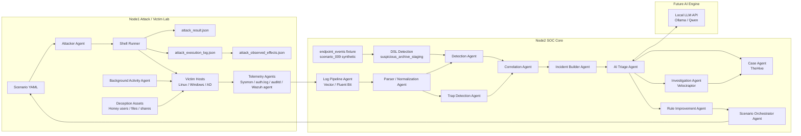

# SOC Lab System Diagram

## Purpose
This document fixes the system view of the AI SOC Lab so implementation does not drift.
It shows:

- node responsibilities
- agent responsibilities
- data flow
- API boundaries
- core schemas
- MVP implementation order

---

# 1. Design Principles

- Detection is deterministic.
- AI is used for triage, analysis, reporting, and improvement suggestions.
- Each phase should produce a working artifact.
- Agents are added only when they become necessary.
- The lab should support the loop:

```text
Attack -> Collect -> Detect -> Correlate -> Build Incident -> Triage -> Investigate -> Improve -> Attack Again
```

For the detailed defender-side processing stages, responsibilities, and trust
boundaries from raw telemetry through investigation, see
[Defender Event Processing Flow](defender-event-processing-flow.md).

---

# 2. Node Layout

The lab uses a simple role-based IP convention: Proxmox nodes use
`192.0.2.1X`, defence/SOC hosts use `192.0.2.2X`, victim hosts use
`192.0.2.3X`, and offence hosts use `192.0.2.4X`.

Current confirmed IP plan:

| Role | Host | IP |
|---|---|---|
| Proxmox / hypervisor | `proxmox-node1` | `192.0.2.10` |
| Proxmox / hypervisor | `proxmox-node2` | `192.0.2.11` |
| Defence / SOC | `soc-analyzer` | `192.0.2.20` |
| Defence / SOC | `thehive-vm` | `192.0.2.21` |
| Defence / SOC | `velociraptor-server` | `192.0.2.22` |
| Defence / SOC | `wazuh-server` | `192.0.2.23` |
| Victim | `ubuntu-victim01` | `192.0.2.30` |
| Victim | `windows-victim01` | `192.0.2.31` |
| Offence | `kali-attacker` | `192.0.2.40` |

`windows-victim01` is currently a manually provisioned runtime VM with hostname
`WIN-VICTIM01`, Windows 11 Enterprise Evaluation, and UTC timezone.
Sysmon process-creation telemetry for Event ID 1 has been manually validated,
but the Wazuh agent is not installed. This inventory entry does not mean
that repository automation for provisioning the VM is implemented.

## Node1: Attack / Victim Lab
Current hardware example:
- Ryzen 7 5800H
- 32GB RAM
- 1TB NVMe

Responsibilities:
- adversary simulation
- victim systems
- deception targets
- background activity generation
- telemetry source

Typical VMs:
- kali-attacker
- ubuntu-victim01
- ubuntu-victim02
- windows-victim01
- dc01 (optional when AD phase starts)
- honeypot01 / deception target

## Node2: SOC Core
Current hardware example:
- Ryzen 7 8845HS
- 64GB RAM
- 1TB NVMe

Responsibilities:
- log pipeline
- detection engine
- correlation engine
- incident builder
- AI triage client/server
- case management
- investigation platform
- rule improvement workflows

Typical VMs:
- vector or fluentbit pipeline
- wazuh
- soc-analyzer
- thehive
- velociraptor
- ai-triage / orchestrator

## Node3: Future AI Engine
Future optional node.

Responsibilities:
- local LLM inference
- Ollama / Qwen
- embeddings / rerankers
- heavier report generation

---

# 3. High-Level System Diagram



Boundary:

```text
attacker-side observed effect != defender-side observed artifact
```

The offensive artifacts (`attack_result.json`, `attack_execution_log.json`, and
`attack_observed_effects.json`) are attacker-side audit and alignment inputs.
They do not prove defender telemetry, detections, alerts, incident status, or
response approval.

Current `scenario_009` defender-side coverage is an initial synthetic
`endpoint_events.json` fixture plus a DSL detection expectation for
`suspicious_archive_staging`, with a helper-level observation incident bridge for the
detection hit. Live auditd / Wazuh / SIEM collection and triage /
investigation / action coverage for `scenario_009` remain future work.

---

# 4. Agent Architecture

## 4.1 Telemetry Agent
Purpose:
- collect raw host telemetry
- forward logs to the pipeline

Inputs:
- auth.log
- syslog
- auditd
- Sysmon
- Windows Security Events
- Wazuh agent telemetry

Outputs:
- raw structured events or forwarded raw logs

MVP:
- Linux auth.log collection only

---

## 4.2 Log Pipeline Agent
Purpose:
- receive logs from endpoints
- buffer / route / forward them

Recommended tools:
- Vector
- Fluent Bit

Outputs:
- normalized stream destination
- raw archive destination

MVP:
- single route from Linux host to parser

---

## 4.3 Parser / Normalization Agent
Purpose:
- convert raw logs into a common event schema

Output schema example:

```json
{
  "timestamp": "2026-03-16T10:30:00+09:00",
  "host": "ubuntu-victim01",
  "platform": "linux",
  "log_source": "auth.log",
  "event_type": "ssh_failed_login",
  "user": "root",
  "src_ip": "10.0.0.10",
  "raw_log": "...",
  "fields": {}
}
```

MVP:
- normalize auth.log ssh failed / success / sudo

---

## 4.4 Detection Agent
Purpose:
- evaluate deterministic rules against normalized events

Rule examples:
- ssh_failed_login
- ssh_success_login
- sudo_command
- invalid_user
- user_creation
- authorized_keys_modification

Outputs:
- rule hits

MVP:
- single-event detections only

---

## 4.5 Correlation Agent
Purpose:
- combine multiple rule hits into one incident candidate

Example:
- failed login x3
- success login
- sudo command

Output:
- correlated incident candidate `ssh_compromise_priv_esc`

MVP:
- one Linux correlation rule

---

## 4.6 Incident Builder Agent
Purpose:
- build incident JSON for downstream analysis

Schema example:

```json
{
  "incident_id": "INC-20260316-0001",
  "scenario_name": "ssh_compromise_priv_esc",
  "severity": "high",
  "source_hosts": ["ubuntu-victim01"],
  "source_ips": ["10.0.0.10"],
  "matched_rules": [
    "ssh_failed_login",
    "ssh_success_login",
    "sudo_command"
  ],
  "timeline": [],
  "raw_events": []
}
```

MVP:
- write JSON to local file

---

## 4.7 AI Triage Agent
Purpose:
- analyze incidents like a SOC analyst
- explain severity and attack story
- suggest response actions and rule improvements

Inputs:
- incident JSON
- timeline
- matched rules
- optional raw logs

Outputs:
- incident summary
- attack story
- severity explanation
- recommended response
- false positive considerations
- rule improvement suggestions

Important:
- this agent does **not** decide detection logic

MVP:
- prompt template + markdown report output

---

## 4.8 Case Agent
Purpose:
- create or update cases in TheHive

Inputs:
- triage result
- incident JSON

Outputs:
- case record
- case ID

MVP:
- local mock file first, then TheHive API

---

## 4.9 Investigation Agent
Purpose:
- collect endpoint artifacts via Velociraptor

Artifacts:
- process list
- network connections
- cron
- authorized_keys
- users
- bash history
- Windows process / task / autorun data

MVP:
- Linux artifact collection only

---

## 4.10 Rule Improvement Agent
Purpose:
- compare attack scenario results vs detections
- propose detection gaps and candidate rules

Outputs:
- rule suggestion markdown
- gap analysis notes

MVP:
- offline markdown suggestion only

---

## 4.11 Scenario Agent
Purpose:
- define repeatable attack scenarios in YAML

Example:

```yaml
scenario: scenario_001_ssh_bruteforce
mitre:
  - T1110
  - T1078
  - T1548
steps:
  - hydra ssh brute force
  - successful login
  - sudo command execution
```

MVP:
- one SSH brute force scenario

---

## 4.12 Attacker Agent
Purpose:
- execute scenario steps using real tools

Examples:
- Hydra
- nmap
- custom shell scripts

MVP:
- shell execution wrapper only

Current status:
- local scenario YAML + shell runner model is implemented
- `scenario_009_suspicious_archive_staging` is implemented as the first broader
  Linux scenario runner
- attacker-side structured events and `attack_observed_effects.json` are
  attacker-side evidence only
- Atomic Red Team is a reference / mapping source only; no Atomic adapter is
  implemented
- CALDERA is later optional integration; no CALDERA integration is implemented

---

## 4.13 Deception Agent
Purpose:
- deploy deception assets as the lab matures

Examples:
- honey credential
- honey user
- honey share
- honey file
- honey host

Current status:
- Phase7 deception artifact foundation is complete through schemas, local asset
  generation, trap hit generation, incident bridge, and chain smoke
- deception scenario YAML / runner implementation is intentionally deferred

---

## 4.14 Trap Detection Agent
Purpose:
- detect interaction with deception assets

Examples:
- use of honey credential
- access to honey share
- open of honey file

Current status:
- deterministic deception hit artifacts exist as foundation work
- live deception runner / trap deployment remains future work

---

## 4.15 Background Activity Agent
Purpose:
- generate realistic enterprise noise

Examples:
- normal SSH login
- sudo admin commands
- apt update
- cron execution
- file access
- PowerShell admin tasks
- scheduled task execution

MVP:
- Linux noise generator only

---

## 4.16 Scenario Orchestrator Agent
Purpose:
- coordinate the full purple-team loop

Loop:
1. run scenario
2. collect logs
3. run detections
4. correlate
5. build incident
6. triage
7. investigate
8. propose improvements
9. rerun

MVP:
- simple shell or Python runner

---

# 5. Data Flow by Phase

## Phase0
```text
Attacker -> Victim -> auth.log -> Parser -> Detection
```

## Phase1
```text
Attacker -> Victim -> Parser -> Detection -> Correlation -> Incident JSON
```

## Phase2
```text
Incident JSON -> AI Triage -> Markdown Report
```

## Phase3
```text
Scenario YAML -> Attacker Agent -> Victim -> Detection pipeline
```

## Phase4
```text
Incident JSON -> Case Agent -> TheHive
Incident JSON -> Investigation Agent -> Velociraptor
```

## Phase5
```text
Sysmon / Wazuh / auditd -> Parser -> Detection -> Correlation
```

## Phase6
```text
Scenario Orchestrator -> Full Loop -> Rule Improvement
```

## Phase7
```text
deception_inventory.yaml
  -> generate_deception_assets.py
  -> generated_deception_assets_manifest.json
  -> trap_observations.json
  -> generate_deception_hits.py
  -> deception_hits.json
  -> build_incident_from_deception_hits.py
  -> incident.json
```

Phase7 deception scenario YAML / runner implementation is intentionally
deferred.

## Phase8
```text
Background Activity Agent -> Noise telemetry -> Detection tuning
```

---

# 6. Core Data Contracts

## 6.1 Normalized Event

```json
{
  "timestamp": "string",
  "host": "string",
  "platform": "linux|windows",
  "log_source": "string",
  "event_type": "string",
  "user": "string|null",
  "src_ip": "string|null",
  "process": "string|null",
  "command_line": "string|null",
  "severity": "low|medium|high|critical|null",
  "raw_log": "string",
  "fields": {}
}
```

## 6.2 Detection Hit

```json
{
  "rule_id": "string",
  "rule_name": "string",
  "timestamp": "string",
  "host": "string",
  "event_refs": [],
  "severity": "low|medium|high|critical",
  "reason": "string"
}
```

## 6.3 Incident

```json
{
  "incident_id": "string",
  "scenario_name": "string|null",
  "severity": "low|medium|high|critical",
  "source_hosts": [],
  "source_ips": [],
  "matched_rules": [],
  "timeline": [],
  "raw_events": [],
  "mitre_techniques": [],
  "notes": []
}
```

## 6.4 Triage Report

```json
{
  "incident_id": "string",
  "summary": "string",
  "attack_story": "string",
  "severity_explanation": "string",
  "recommended_response": [],
  "false_positive_analysis": "string",
  "rule_improvement_suggestions": []
}
```

---

# 7. Suggested Internal APIs

## Detection Agent
- `POST /events`
- `POST /events/batch`
- `GET /rules`

## Correlation Agent
- `POST /detections`
- `GET /incidents/pending`

## Incident Builder Agent
- `POST /build-incident`

## AI Triage Agent
- `POST /triage`
- `POST /incident-report`
- `POST /rule-improvement`

## Case Agent
- `POST /cases`
- `PATCH /cases/{id}`

## Investigation Agent
- `POST /collect/linux`
- `POST /collect/windows`

## Deception Agent
- `POST /deception/deploy`
- `POST /deception/revoke`

## Orchestrator Agent
- `POST /run-scenario`
- `POST /run-loop`

MVP note:
- local function calls are enough at first; API exposure can come later

---

# 8. Recommended Repository Mapping

```text
ai-soc-lab/
  docs/
    architecture/
      system-diagram.md
      agent-architecture.md
    roadmap/
      phase0.md
      phase1.md
      phase2.md
      phase3.md
      phase4.md
      phase5.md
      phase6.md
      phase7.md
      phase8.md
  agents/
    telemetry-agent/
    parser-agent/
    detection-agent/
    correlation-agent/
    incident-agent/
    ai-triage-agent/
    case-agent/
    investigation-agent/
    rule-improvement-agent/
    attacker-agent/
    scenario-agent/
    deception-agent/
    trap-detection-agent/
    background-activity-agent/
    orchestrator-agent/
  detection/
    rules/
    correlations/
  lab/
    scenarios/
    background_activity/
    datasets/
  pipeline/
    incident-schemas/
    log-normalization/
  scripts/
  tests/
```

---

# 9. MVP Build Order

## Stage 1
- Telemetry Agent
- Parser Agent
- Detection Agent

## Stage 2
- Correlation Agent
- Incident Builder Agent

## Stage 3
- AI Triage Agent

## Stage 4
- Scenario Agent
- Attacker Agent

## Stage 5
- Case Agent
- Investigation Agent

## Stage 6
- Rule Improvement Agent
- Orchestrator Agent

## Stage 7
- Deception Agent
- Trap Detection Agent

## Stage 8
- Background Activity Agent

---

# 10. Definition of Done Per Phase

## Phase0 done if
- SSH brute force can be reproduced
- auth.log is collected
- at least one rule triggers correctly

## Phase1 done if
- normalized events are generated
- one correlation rule works
- incident.json is produced

## Phase2 done if
- incident.json produces a triage report
- report includes summary, severity, and response recommendation

## Phase3 done if
- one scenario YAML can be executed repeatedly

## Phase4 done if
- incident can become a case
- endpoint evidence can be collected

## Phase5 done if
- endpoint telemetry adds process / file / network visibility

## Phase6 done if
- a single command can run the implemented scenario-to-triage pipeline for
  supported scenarios

## Phase7 foundation slice done if
- artifact foundation exists through schemas, deterministic asset generation,
  deterministic hit generation, incident bridge, and chain smoke
- scenario runner deployment and live trap interaction are later follow-on work

## Phase8 done if
- noise generation changes alert quality and forces rule tuning

---

# 11. Recommended First Deliverables

Create these first:
- `docs/architecture/system-diagram.md`
- `docs/roadmap/phase0.md`
- `schemas/incident_schema.json`
- `detection/rules/ssh_failed_login.yaml`
- `detection/rules/ssh_success_login.yaml`
- `detection/rules/sudo_command.yaml`
- `agents/parser-agent/src/main.py`
- `agents/detection-agent/src/main.py`
- `lab/scenarios/scenario_001_ssh_bruteforce.yaml`

---

# 12. Final Guidance

To avoid drift:
- do not build all agents at once
- keep AI focused on triage and analysis
- keep detection deterministic
- update the relevant phase document whenever architecture changes
- only add deception and realistic noise after the detection core is stable
