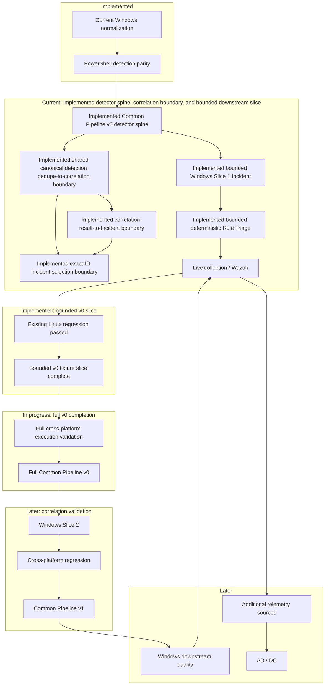

# AI SOC Lab Roadmap

Adversary Simulation × Detection Engineering × AI SOC × Deception

---

# 1. Lab Goal

本ラボの目的は、**攻撃と防御の両方を理解し、SOC業務を自動化・高度化できるエンジニアになること**です。

最終的には以下のループを自動化、または半自動化します。

```text
Attack Simulation
+ Normal Activity
+ Deception
        ↓
Log Collection
        ↓
Detection
        ↓
Correlation
        ↓
Triage
        ↓
Investigation
        ↓
Case
        ↓
Action
        ↓
Execution / Approval
        ↓
Investigation / DFIR / External Integrations
        ↓
Rule Improvement
        ↓
Attack Again
```

このループにより、以下を同時に学習します。

- Red Team
- Blue Team
- SOC運用
- Detection Engineering
- DFIR
- AI SOC
- Deception Engineering

---

# 2. Final Architecture

```text
Scenario Agent / Adversary Simulator / Attacker Agent
        +
Background Activity Agent
        +
Deception Assets
        ↓
Victim Hosts (Linux / Windows / AD)
        ↓
Log Pipeline
        ↓
Parser Agent
        ↓
Detection Agent
        ↓
Correlation Agent
        ↓
Incident Builder Agent
        ↓
Triage Agent
        ↓
Investigation Agent
        ↓
Case Agent
        ↓
Action Agent (Rule / AI Planner)
        ↓
Executor Agent
        ↓
Investigation Workflow / External Integrations
        ↓
Rule Improvement Agent
        ↓
Attack Again
```

> Note:
> 攻撃側はまず Scenario / Attacker ベースで進める。
> 将来的には objective-driven planner、specialist delegation、tool selection、memory / graph を持つ攻撃側へ拡張可能とする。

---

# 3. Agent Overview

ラボを Phase ごとに進めながら、以下のエージェントを作成していく。

| Agent | 役割 | 導入フェーズ |
|---|---|---|
| Telemetry Agent | ログ収集 | Phase0 |
| Log Parser Agent | 正規化 | Phase0 |
| Detection Agent | ログ正規化後のルール評価、アラート生成、初期 feature 付与 | Phase1 |
| Correlation Agent | 複数イベントを incident にまとめる | Phase1 |
| Incident Builder Agent | incident.json 生成 | Phase1 |
| Triage Agent | incident を AI に渡して要約・評価し、初期判断を行う | Phase2 |
| Action Agent | triage / investigation / case から対応方針 / playbook を作る | Phase2拡張 |
| Executor Agent | playbook を実行し approval を扱う | Phase2拡張 |
| Scenario Agent | 攻撃シナリオ定義 | Phase3 |
| Attacker Agent | シナリオを実行し攻撃を再現する | Phase3 |
| Attack Planner Agent | objective を subtask に分解し、tool / executor / specialist を選択する（将来拡張） | Phase3拡張 / 将来 |
| Case Agent | run結果を `case.json` に正規化する | Phase4 |
| Investigation Agent（pre-case） | incident / triage / defender-side telemetry から前後文脈、attack story、evidence gaps、pivots を生成する。`investigation_result.json` を出力する。 | Phase4 |
| Post-action DFIR / Integration Workflow | Action / execution 後に `collection_result.json` と collected outputs を扱い、DFIR evidence review、reviewed finding-based case enrichment、external integration update を行う。pre-case Investigation Agent とは別責務。 | Follow-on |
| Endpoint Telemetry Agent | auditd などの詳細テレメトリ収集と process telemetry 強化 | Phase5 |
| Rule Improvement Agent | ルール改善案、相関改善案の生成 | Phase6 |
| Orchestrator Agent | 全体パイプライン / harness 実行 | Phase6 |
| Deception Agent | honeytoken / decoy 配置と監視 | Phase7 |
| Trap Detection Agent | deception hit 検知 | Phase7 |
| Background Activity Agent | 正常系ノイズ生成 | Phase8 |

重要な考え方:

- **Detect は deterministic**
- **AI は analyst / triage / investigation / planning**
- **Deception は高信頼シグナル生成に使う**
- **Background Activity は realism のために使う**
- **Execution は approval gate と切り分ける**
- **攻撃側も最初は static scenario / manual executor で始め、後で planner / memory に拡張する**

---

# 4. Current State Snapshot

現時点で、以下のパイプラインは到達済みです。

```text
scenario
  ↓
attack
  ↓
normalized events
  ↓
detection hits
  ↓
incident
  ↓
triage
  ↓
pre-case investigation
  └─ investigation_result.json
  ↓
case.json（initial）
  ↓
action planning
  ↓
collection_request.json
  ↓
approval (when required) / execution
  ↓
collection_result.json
  ├─ outcome-only case enrichment（not overwrite: collection summary / evidence refs）
  └─ post-action DFIR / external integration workflow（follow-on）
       ↓
     optional TheHive enrichment / human review
```

現時点で、以下も成立している。

- `run_id` による run traceability
- run isolation
- `process_events.json`
- `process_chain_hits.json`
- `incident.json`
- `triage_result.json`
- `investigation_result.json`
- `action_result.json`
- `case.json`
- `collection_result.json` schema / mock generation
- `case.json` の `dfir_collection_summary` / `dfir_evidence_refs` append-only enrichment
- `action_result.json` の playbook 化
- `executor-agent` による playbook 実行
- `auto_executable` / approval flow
- `decision_log.json` に detection / triage / action / execution の記録
- TheHive integration（case作成 + observable追加）
- Velociraptor integration（DFIR request generation）

このため、Phase6 では **behavior feature ベース設計** と **AI / rule 比較を含む Automated Improvement Loop** を導入した。

現時点で追加で成立しているもの:

- detection で `behavior_features` を付与
- incident への `behavior_features` 伝播
- triage で `derived_features` / `derived_features_extra` を生成
- rule-triage（YAML 外出し）
- assessment rules（YAML 外出し）
- AI triage / rule triage 比較（`triage_diff.json`）
- triage diff から review 用 rule candidate 生成
- process pipeline の end-to-end 実行
  - incident
  - triage
  - investigation
  - rule triage
  - compare
  - case
  - action
  - DFIR request
- atomic detection DSL foundation
- auth bootstrap + Wazuh FIM + DSL correlation による correlation-first incident entry
- scenario_004: authorized_keys persistence installation
- scenario_005: SSH key persistence reuse
- scenario_006: key reuse 後の post-login command execution
- `run_dsl_pipeline.py` の DSL sandbox 化
- `run_process_pipeline.py` の orchestration-focused な整理
- triage comparison harness foundation
- compare / judge schema と generic rubric
- AI current / AI variant / rule triage の champion-challenger 比較
- expected response keyword の 2 層評価（must-have / nice-to-have）
- minimal Rule Improvement Agent
- `rule_candidates.yaml` / `prompt_candidates.yaml` / `promotion_recommendation.yaml`
- scenario_004 / 005 / 006 横断の batch compare runner
- investigation comparison harness MVP
- `workflows/investigation_harness_example.yaml`
- `rubrics/investigation_generic_v1.yaml`
- `scripts/export_investigation_for_harness.py`
- `scenario_006` を用いた investigation compare / judge / metadata
- `process_events.json` / `process_chain_hits.json` / `zeek_enrichment.json` を使った investigation evidence expansion
- evidence-aware investigation contract の導入
  - `evidence_level`
  - `evidence_summary`
  - `unsupported_claims`
  - `missing_pivots`
  - `recommended_pivots`
- investigation exporter の evidence-aware output 対応
- investigation compare / judge の evidence-aware field 対応
- investigation rubric refinement
  - `evidence_quality`
  - `unsupported_claim_control`
  - `missing_pivot_detection`
  - `evidence_specificity`
  - `next_step_fitness`
- scoring refinement により current / variant の差分抽出を改善
- `scenario_006` の investigation harness で `investigation_ai_variant` を best balance として識別可能
- `main_gap` を criterion deficit から推定し、`enriched feature quality` を返せる状態まで到達
- したがって直近の evidence-aware investigation / judge quality 強化の最初の区切りまで完了した
- action comparison harness MVP / compare・judge refinement が成立
- action-agent が scenario_006 で expected actions を coverage し、`title` / typed `target` / `evidence_refs` を出力可能
- action harness で `action_coverage` / `action_grounding` / `approval_fitness` / `playbook_specificity` / `safety_control` が評価可能
- scenario_006 の action harness で score 1.0 に到達
- attacker-agent Phase A dispatcher skeleton が成立
- Action → DFIR collection request 接続が成立し、`request_dfir_collection` / `collect_payload_or_process_evidence` から `collection_request.json` を生成可能
- `collection_result.json` contract / schema / mock generation が成立し、DFIR collection outcome の記録境界を実装
- run-based mock collection は `forensics/mock/Linux.Syslog.SSHLogin.json` を生成し、collected artifact の `output_refs` から参照可能
- case-agent は collection result が存在する場合、`dfir_collection_summary` / `dfir_evidence_refs` を append-only で追加可能
- attacker-agent Phase B / C が進み、`attack_scenario_v1`、attack artifact schemas、`attack_observed_effects.json` runtime generation が成立
- `observed_effects_alignment` が `evaluation_result.json` に additive に統合済み
- scenario_004 / 005 / 006 の observed-effects alignment smoke checks が完了
- structured runner output contract が成立し、`ATTACK_EVENT_JSON:` parser / tests が実装済み
- scenario_006 runner は `ATTACK_EVENT_JSON:` を出力し、`attack_observed_effects.json` は structured runner events を優先利用する
- scenario_006 runner の known-host warning ノイズは抑制済み
- normalized endpoint event contract / schema が成立
- auditd telemetry から `endpoint_events.json` を生成可能
- investigation / investigation harness が optional `endpoint_events.json` を利用可能
- endpoint telemetry から observed_facts / supporting_signals を生成可能
- endpoint telemetry から evidence-grounded enriched_features を生成可能
- endpoint telemetry から missing_pivots / recommended_pivots を生成可能
- investigation endpoint-events harness で以下を確認済み
  - `evidence_specificity = 0.8`
  - `enriched_feature_quality = 0.85 / 0.9`
  - `missing_pivot_detection = 1.0`

残課題:

- candidate_hints / weaknesses の deficit-aware 改善
- process execution / SSH persistence 以外のドメイン展開
- candidate apply / promotion apply の自動化はまだ実施しない
- post-action DFIR の追加 artifact parser / collector output 対応
- executor / DFIR result comparison の扱い整理
- Wazuh / Velociraptor integration の本格化は endpoint / attacker artifact contract 安定後に継続

Next:

- structured runner output は contract / parser / scenario_006 pilot / observed-effects 優先利用 / docs 反映まで完了
- observed-effects alignment signals は Rule Improvement の human-reviewable signal として統合済み
- endpoint telemetry は observed_facts / supporting_signals / enriched_features / pivots / judge 改善まで到達済み
- post-action DFIR schema / run-based workflow MVP と `Linux.Syslog.SSHLogin` / `Linux.ProcessList` / `Linux.BashHistory` parser は完了
- 3 supported artifacts の controlled mock output generation と workflow consumption は完了
- `scripts/run_process_pipeline.py --run-post-action-dfir` による optional / default-off integration は完了
- process pipeline と child Python scripts は repo-local imports を保持し、手動の `PYTHONPATH=.` は不要
- `Linux.ProcessList` は collection 時点の point-in-time snapshot として parse し、process 不在を payload 未実行や host-clean / benign の根拠にしない
- `Linux.BashHistory` は weak / user-controlled / timing-sensitive evidence として parse し、entry は execution を確認せず、不在も non-execution や host-clean / benign の根拠にしない
- BashHistory fact は `shell_history_observation` とし、details に `evidence_strength: weak`、`user_controlled`、`timing_sensitive`、`shell_history_entry_not_confirmed_execution` を保持
- deterministic post-action DFIR result harness MVP は実装済み
  - runner: `scripts/run_post_action_dfir_harness.py`
  - workflow: `workflows/post_action_dfir_harness_example.yaml`
  - rubric: `rubrics/post_action_dfir_generic_v1.yaml`
  - outputs: `judge_input.json` / schema-valid `judge_result.json` / `summary.md` / `metadata.json`
  - criteria: evidence inventory coverage / observed fact grounding / limitation and gap clarity / post-action boundary safety / recommended pivot quality
  - harness support classification は available / parsed の `Linux.ProcessList` と `Linux.BashHistory` を supported として評価
  - evaluation-only であり、pre-case investigation / case / action approval / containment / Rule Improvement promotion state は変更しない
- `scripts/export_rule_improvement_review_input.py` による deterministic handoff は実装済み。schema-valid post-action DFIR result を schema-valid review-only `rule_improvement_review_input.json` に投影し、`human_review_required: true`、`promotion_allowed: false`、candidate hint の `candidate_generation_allowed: false` を維持する。candidate / promotion artifact や既存 state は生成・変更しない
- `scripts/run_process_pipeline.py --export-ri-review-input` optional / default-off integration は実装済み。`--run-post-action-dfir` 併用時は DFIR 後に export し、単独指定時は既存 post-action result を要求する。source 不在時は fail closed し、review input を捏造しない
- human signal classification contract、schema、human-operated `scripts/create_rule_improvement_signal_classification.py` helper は実装済み。helper は review input と human decisions を検証し、signal provenance をコピーして eligibility を固定 mapping から導出する。`candidate_generation_started: false` と `promotion_allowed: false` を維持し、AI integration、candidate generation、promotion は行わない
- optional AI-assisted review draft contract と `schemas/rule_improvement_ai_review_draft.schema.json` は実装済み。suggestion-only artifact は `ai_assistance_only: true`、`human_review_required: true`、`classification_decision_allowed: false`、`candidate_generation_started: false`、`promotion_allowed: false` を強制し、human decision / eligibility / candidate / promotion fields を拒否する
- AI review draft prompt/input contract は設計済み。AI input は normalized summaries / IDs / refs / gaps / limitations / risk notes に最小化し、raw logs、secrets、arbitrary shell history を除外する。output は schema-valid suggestions のみに制限する
- `schemas/rule_improvement_ai_review_draft_prompt_input.schema.json` と minimized / unsafe fixtures は実装済み。schema は source context / signals / observed fact summaries / locked output contract を要求し、raw evidence fields、decision、candidate、promotion、state mutation fields を拒否する
- versioned `prompts/rule-improvement/ai_review_draft_v1.md` と lightweight boundary tests は実装済み。prompt は suggestion-only / untrusted-evidence / caveat preservation / no-decision / no-candidate / no-promotion を明示し、model execution、runtime generator、pipeline integration は未実装
- `tests/fixtures/rule_improvement_ai_review_draft_prompt_eval/` の deterministic fixture pairs と offline tests は実装済み。ProcessList、BashHistory、untrusted instruction、missing evidence の grounding / caveat / boundary safety を model execution なしで検証する
- deterministic `scripts/export_ai_review_draft_prompt_input.py` は実装済み。source/output schema を検証し、grounded IDs / evidence refs / gaps / limitations / caveats を保持した sorted pretty JSON を出力する。evidence refs は参照としてのみ扱い、raw logs / secrets は含めない。prompt/model execution、AI review draft / decisions 生成、classification helper 呼び出し、candidate / promotion、state mutation は行わない
- deterministic `scripts/export_ai_review_draft_prompt_bundle.py` は versioned prompt と normalized prompt input を local JSON bundle に materialize する future model handoff boundary として実装済み。`draft_id` / `source_review_input_id` / `source_review_input_ref` の exact provenance を `prompt_text` に含め、model/network execution は false のままで、pipeline integration、model response、downstream review artifacts、state mutation は追加しない
- deterministic `scripts/import_ai_review_draft_model_output.py` は local model-output acceptance boundary として実装済み。model は実行せず、canonical schema / provenance / locked flags / known signal refs を検証し、unsafe output を修復せず reject する。pipeline、candidate / promotion、state mutation は追加しない
- manual-only `scripts/run_ai_review_draft_lmstudio_model.py` は local/private-lab challenger runner として実装済み。explicit opt-in による loopback / private-LAN LM Studio execution 用で、private LAN は追加 opt-in を要求し、public/cloud endpoint を拒否する。pipeline integration はなく、untrusted output は importer を通す
- manual-only `scripts/run_ai_review_draft_openai_model.py` は stable external runner として実装済み。model execution と external API の個別 opt-in を要求し、OpenAI Responses API と canonical AI review draft schema から投影した OpenAI Structured Outputs request schema を使用する。bundle prompt text と schema 以外は読まず、pipeline / candidate / promotion / state behavior を追加せず、untrusted output は importer を通す
- deterministic mock `scripts/generate_mock_ai_review_draft.py` は baseline として実装済み。artifact shape / downstream review 検証用に固定 conservative rules で suggestion-only draft を生成し、prompt/model/API/network execution、human classification、candidate / promotion、state mutation は行わない
- deterministic `scripts/compare_ai_review_drafts.py` は already-produced AI review drafts の descriptive comparison harness として実装済み。schema validity、schema pass rate、label disagreement、missing signal coverage を比較するが、model 実行、importer 呼び出し、raw logs/evidence refs 読み取り、winner 選定、signal classification、candidate generation、promotion recommendation、state mutation は行わない
- mock vs OpenAI draft の smoke comparison は成功済み。両 candidate は schema-valid、schema pass rate は 1.0、missing signal coverage はなく、1 件の label disagreement を human review 用に surfaced した。これは model 差分を可視化する smoke であり、decision や promotion ではない

- candidate-review downstream handoff is implemented through deterministic local artifacts: `rule_improvement_candidate_generation_input.json`, `rule_improvement_candidate_draft.json`, `rule_improvement_candidate_review_worksheet.md`, `rule_improvement_candidate_review_decisions_template.json`, completed `rule_improvement_candidate_review_decisions.json`, `rule_improvement_candidate_creation_input.json`, proposal-only `rule_improvement_candidate_proposals_v2.json`, `rule_improvement_proposal_review_decisions_template.json`, canonical `rule_improvement_proposal_review_decisions.json`, non-applying `rule_improvement_concrete_candidate_bundle_v1.json`, and optional generator diagnostics. These artifacts preserve IDs/refs/English enums/evidence refs/limitations and explicit human decision provenance while keeping approval, deployment, baseline update, apply, and promotion out of scope
- optional Japanese candidate review worksheet rewrite is implemented as a read-only human aid. Prompt-bundle generation produces `rule_improvement_candidate_review_worksheet_ja_prompt_bundle.json`; the local LM Studio API runner writes only untrusted `rule_improvement_candidate_review_worksheet_ja_model_output.json`; the existing importer/invariant checker is the only path to `rule_improvement_candidate_review_worksheet_ja_rewritten.md`. Canonical JSON artifacts must not be translated, and IDs, refs, enum values, file paths, safety flags, and backtick-enclosed values must be preserved exactly
- the v2 proposal schema is implemented, including enforced `candidate_type` / `allowed_next_artifact_type` mapping. Standalone deterministic `scripts/generate_rule_improvement_candidate_proposals_v2.py` can produce proposal-only v2 artifacts from reviewed candidate-creation input and optional non-proposal diagnostics for skipped unsupported future schema-valid candidate types. Proposal v2 artifacts and diagnostics are not approval to apply, deploy, update baselines, or promote
- the proposal review decisions schema is implemented, along with deterministic template export and importer/validator scripts. Human-completed proposal review decisions can now be canonicalized into `rule_improvement_proposal_review_decisions.json`; `accept_for_conversion` remains conversion-review-only and is not approval to apply, deploy, update baselines, or promote
- the concrete candidate bundle v1 schema is implemented at `schemas/rule_improvement_concrete_candidate_bundle_v1.schema.json`, and standalone deterministic `scripts/convert_rule_improvement_proposals_to_concrete_candidate_bundle.py` converts canonical `rule_improvement_proposal_review_decisions.json` plus source `rule_improvement_candidate_proposals_v2.json` into non-applying `rule_improvement_concrete_candidate_bundle_v1.json`. The converter validates decisions, proposals, and output bundle schemas, checks source proposal SHA and decision/proposal consistency before writing output, converts only `accept_for_conversion` decisions into `converted_candidates`, and records `reject`, `defer`, `split_required`, and `needs_more_evidence` decisions as `skipped_decisions`
- the concrete candidate bundle is not a legacy candidate artifact and is not apply approval, deployment approval, baseline update approval, or promotion approval. `accept_for_conversion` remains conversion-review-only; it is not approval to apply, deploy, update baselines, or promote
- the standalone deterministic Phase 1 legacy-compatible rule/prompt exporter is implemented at `scripts/export_rule_improvement_legacy_rule_prompt_candidates.py`, with focused tests at `tests/test_export_rule_improvement_legacy_rule_prompt_candidates.py`. It reads `rule_improvement_concrete_candidate_bundle_v1.json`, exports only `candidate_type: rule` and `candidate_type: prompt` into `rule_candidates.yaml` and `prompt_candidates.yaml`, validates the concrete candidate bundle input schema plus legacy rule and prompt candidate output schemas, writes outputs only after validation succeeds, can optionally write non-candidate diagnostics for skipped or unsupported candidates, refuses unsafe output paths and output path collisions, and preserves source bundle/candidate/proposal/review backreferences where legacy schemas permit
- deterministic tmp-path integration smoke coverage is implemented at `tests/test_rule_improvement_phase1_legacy_export_chain_smoke.py`. It creates synthetic schema-valid fixtures under `tmp_path` and proves the artifact chain from `rule_improvement_candidate_proposals_v2.json` plus `rule_improvement_proposal_review_decisions.json` through `rule_improvement_concrete_candidate_bundle_v1.json` to `rule_candidates.yaml` / `prompt_candidates.yaml`; rule candidates appear only in rule output, prompt candidates appear only in prompt output, `promotion_review` and non-accept decisions are reported in diagnostics rather than exported, `promotion_recommendation.yaml` is not created, and generated rule/prompt outputs do not contain apply/deploy/promote-like fields. This is a local-development / WSL-friendly artifact-chain smoke test, not an attack/victim-log end-to-end test, and it does not require victim logs, Wazuh, rsyslog, Hydra output, Proxmox, Kali, Ubuntu victim, or existing `data/runs/**` artifacts
- the Phase 1 exporter is non-applying, non-deploying, and non-promoting. `rule_candidates.yaml` and `prompt_candidates.yaml` are candidate artifacts only; they are not apply approval, deployment approval, baseline update approval, prompt update approval, or promotion approval. `promotion_review`, `parser`, `telemetry`, and `correlation` remain out of Phase 1 export. Diagnostics are not candidate artifacts. Generated `data/runs/**` artifacts remain run outputs and should not be committed
- the parser legacy export contract is documented at `docs/design/rule-improvement/rule_improvement_parser_legacy_export_contract.md`. The parser candidate schema is implemented at `schemas/parser_candidates_schema.json`, with focused tests at `tests/test_parser_candidates_schema.py`; standalone deterministic `scripts/export_rule_improvement_parser_candidates.py` exports accepted `candidate_type: parser` concrete candidates into schema-valid candidate-only `parser_candidates.yaml`, can optionally write diagnostics, rejects approval/apply/deploy/promote-like fields, refuses unsafe output paths, and writes only after validation succeeds. Deterministic tmp-path parser export chain smoke coverage is implemented at `tests/test_rule_improvement_parser_export_chain_smoke.py`; it proves the local artifact chain from proposal/review decisions through the concrete bundle to schema-valid `parser_candidates.yaml`, requires no victim logs, Wazuh, rsyslog, Hydra output, Proxmox, Kali, Ubuntu victim, or existing `data/runs/**` artifacts, and remains candidate-only. Parser process-pipeline wiring, parser apply workflow, parser deployment workflow, and automatic parser update are not implemented
- the standalone deterministic promotion recommendation exporter is implemented at `scripts/export_rule_improvement_promotion_recommendation.py`, with focused tests at `tests/test_export_rule_improvement_promotion_recommendation.py`. It reads `rule_improvement_concrete_candidate_bundle_v1.json`, considers only converted `candidate_type: promotion_review` items with `allowed_next_artifact_type: promotion_review_recommendation`, validates bundle input and legacy promotion recommendation output schemas, writes recommendation-only `promotion_recommendation.yaml` only after validation succeeds, can optionally write non-recommendation diagnostics for skipped items, refuses unsafe paths and output collisions, and preserves bundle/candidate/proposal/review backreferences where the legacy schema permits
- deterministic tmp-path promotion recommendation export-chain smoke coverage is implemented at `tests/test_rule_improvement_promotion_recommendation_export_chain_smoke.py`. It creates synthetic schema-valid fixtures under `tmp_path` and proves `rule_improvement_candidate_proposals_v2.json` plus `rule_improvement_proposal_review_decisions.json` can convert into `rule_improvement_concrete_candidate_bundle_v1.json`, preserve schema-safe promotion-review proposal payload fields into concrete bundle payloads, and export schema-valid recommendation-only `promotion_recommendation.yaml`. Non-promotion candidates and non-accept/skipped decisions are not included in the recommendation output, diagnostics report unsupported/skipped items deterministically, and the promotion exporter does not create `rule_candidates.yaml` or `prompt_candidates.yaml`. This is local-development / WSL-friendly and does not require victim logs, Wazuh, rsyslog, Hydra output, Proxmox, Kali, Ubuntu victim, or existing `data/runs/**` artifacts
- proposal v2 supports optional schema-safe `payload` fields for later narrowing exporters. The bundle converter preserves those optional payload fields into concrete candidate bundle payloads, but fails closed if optional payload attempts to override base metadata such as `target`, `source_signal_ref`, `source_label`, `source_fact_ids`, `required_evidence_refs`, `priority`, or `review_status`
- deterministic validation summary reporter is implemented at `scripts/summarize_rule_improvement_export_artifacts.py`, with focused tests at `tests/test_summarize_rule_improvement_export_artifacts.py`. It inspects already-generated RI export artifacts such as the concrete bundle, `rule_candidates.yaml`, `prompt_candidates.yaml`, `promotion_recommendation.yaml`, optional `parser_candidates.yaml`, and export diagnostics, then writes `rule_improvement_export_artifact_validation_summary.json` with presence, schema validation, cross-artifact consistency, diagnostics consistency, safety checks, and provenance/backreference checks. `parser_candidates.yaml` remains optional and is validated only when present; parser diagnostics remain diagnostics only. It is non-mutating validation/reporting only, not human review, and not apply, deployment, baseline update, prompt update, parser update, telemetry update, correlation update, or promotion approval
- the validation summary schema is implemented at `schemas/rule_improvement_export_artifact_validation_summary.schema.json`, with focused schema tests at `tests/test_rule_improvement_export_artifact_validation_summary_schema.py`. The reporter validates `rule_improvement_export_artifact_validation_summary.json` against this schema before writing; schema validation failure is fail-closed and does not write the summary output. This does not change safety semantics, invoke exporters, create rule candidates, prompt candidates, parser candidates, or promotion recommendations, update active agents or production state, or add apply, deployment, baseline update, prompt update, parser update, telemetry update, correlation update, promotion workflow, or automatic promotion behavior
- disabled-by-default process-pipeline wiring is implemented in `scripts/run_process_pipeline.py` behind `--enable-ri-export-validation-summary`, as defined by `docs/design/rule-improvement/rule_improvement_export_validation_summary_pipeline_wiring_contract.md`. When explicitly enabled, it runs after existing RI export steps, calls the summary reporter for the current run directory, writes only `rule_improvement_export_artifact_validation_summary.json`, preserves reporter schema validation before write and fail-closed failure propagation, does not invoke exporters, and does not create `rule_candidates.yaml`, `prompt_candidates.yaml`, `promotion_recommendation.yaml`, or `parser_candidates.yaml`. Default pipeline behavior is unchanged
- the Rule Improvement export MVP is complete for the current candidate-generation boundary: reviewed proposal decisions can be converted into a concrete candidate bundle, narrowed into rule, prompt, promotion-review, and parser export artifacts, and checked by the export artifact validation summary. This MVP remains non-applying, non-deploying, non-mutating, review-oriented, and does not implement baseline updates, prompt updates, parser updates, telemetry updates, correlation updates, a promotion workflow, or automatic promotion. Next major roadmap work can move toward deception, scenario expansion, Windows coverage, SIEM integration, or the still-open Rule Improvement update/promotion workflows as separate PRs
- deterministic tmp-path export validation summary chain smoke coverage is implemented at `tests/test_rule_improvement_export_validation_summary_chain_smoke.py`. It uses synthetic schema-valid fixtures under `tmp_path` and proves the implemented chain from `rule_improvement_candidate_proposals_v2.json` plus `rule_improvement_proposal_review_decisions.json` through `rule_improvement_concrete_candidate_bundle_v1.json`, schema-valid `rule_candidates.yaml` / `prompt_candidates.yaml`, schema-valid recommendation-only `promotion_recommendation.yaml`, optional schema-valid `parser_candidates.yaml`, and `rule_improvement_export_artifact_validation_summary.json`. The smoke verifies the validation summary reporter reads already-generated artifacts, reports `overall_status: pass` with no errors, lists the concrete bundle, rule candidates, prompt candidates, promotion recommendation, and parser candidates as present when generated, passes schema validation, safety checks, and consistency checks, treats diagnostics as diagnostics only, excludes skipped/non-accept candidate IDs from rule/prompt/promotion/parser outputs, and does not rewrite primary export artifacts. It is local-development / WSL-friendly, not an attack/victim-log end-to-end smoke, and requires no victim logs, Wazuh, rsyslog, Hydra output, Proxmox, Kali, Ubuntu victim, or existing `data/runs/**` artifacts
- the validation summary reporter does not invoke exporter scripts and does not create `rule_candidates.yaml`, `prompt_candidates.yaml`, `promotion_recommendation.yaml`, or `parser_candidates.yaml`; those artifacts are created only by their exporters. `promotion_recommendation.yaml` remains recommendation-only, `parser_candidates.yaml` remains candidate-only and optional, and no apply, deployment, baseline update, prompt update, parser update, telemetry update, correlation update, promotion workflow, or automatic promotion is implemented
- `promotion_recommendation.yaml` is recommendation-only. It is not apply approval, deployment approval, baseline update approval, prompt update approval, or promotion approval; the exporter is non-applying, non-deploying, and non-promoting, no active-agent or production state is changed, and later explicit human review plus a separate promotion workflow is required before any state-changing promotion
- still not implemented: parser process-pipeline wiring, telemetry legacy export, correlation legacy export, attack-to-detection-to-RI E2E smoke, apply workflow, deployment workflow, baseline update workflow, prompt update workflow, parser update workflow, telemetry update workflow, correlation update workflow, promotion workflow, or automatic promotion
Current intended AI-assisted Rule Improvement review flow:

```text
rule_improvement_review_input.json
  -> rule_improvement_ai_review_draft_prompt_input.json
  -> rule_improvement_ai_review_draft_prompt_bundle.json
  -> manual model/mock/OpenAI/LM Studio execution
  -> untrusted rule_improvement_ai_review_draft_model_output.json
  -> importer acceptance boundary
  -> canonical rule_improvement_ai_review_draft.json / named draft artifacts
  -> optional compare_ai_review_drafts.py descriptive comparison
  -> human_review_worksheet.md
  -> optional human_review_packet_ja.md
  -> human_decisions_template.json
  -> human-completed decisions JSON
  -> rule_improvement_signal_classification.json
  -> rule_improvement_candidate_generation_input.json
  -> rule_improvement_candidate_draft.json
  -> rule_improvement_candidate_review_worksheet.md
  -> optional rule_improvement_candidate_review_worksheet_ja_prompt_bundle.json
  -> optional LM Studio API runner
  -> untrusted rule_improvement_candidate_review_worksheet_ja_model_output.json
  -> importer invariant check
  -> optional rule_improvement_candidate_review_worksheet_ja_rewritten.md
  -> rule_improvement_candidate_review_decisions_template.json
  -> human-completed candidate review decisions JSON
  -> rule_improvement_candidate_review_decisions.json
  -> rule_improvement_candidate_creation_input.json
  -> optional standalone rule_improvement_candidate_proposals_v2.json
     plus optional generator diagnostics
  -> optional rule_improvement_proposal_review_decisions_template.json
  -> human-completed proposal review decisions JSON
  -> rule_improvement_proposal_review_decisions.json
  -> scripts/convert_rule_improvement_proposals_to_concrete_candidate_bundle.py
  -> rule_improvement_concrete_candidate_bundle_v1.json
  -> optional scripts/export_rule_improvement_legacy_rule_prompt_candidates.py
  -> optional rule_candidates.yaml / prompt_candidates.yaml
  -> optional scripts/export_rule_improvement_promotion_recommendation.py
  -> optional promotion_recommendation.yaml
  -> optional scripts/export_rule_improvement_parser_candidates.py
  -> optional parser_candidates.yaml
  -> optional scripts/summarize_rule_improvement_export_artifacts.py
  -> optional rule_improvement_export_artifact_validation_summary.json
```
- optional / default-off の `--export-ai-review-draft-prompt-input` と `--generate-mock-ai-review-draft` pipeline integration は deterministic local scripts のみを順序どおり実行し、source 不在時は fail closed する。prompt/model execution、decisions、classification、candidate、promotion artifact は生成しない
- deterministic local `scripts/export_ai_review_draft_human_worksheet.py` は schema-valid draft から blank human review fields を持つ Markdown worksheet を生成する。optional / default-off `--export-ai-review-draft-human-worksheet` pipeline integration は既存 draft を要求し、mock generation 併用時はその後に実行する。prompt/model execution、decisions JSON、classification、candidate、promotion、state mutation は追加しない
- deterministic `scripts/export_ri_signal_classification_decisions_template.py` は schema-valid AI draft から exact signal refs と human-edit placeholders を持つ sorted JSON template を生成する。optional / default-off `--export-ri-signal-classification-decisions-template` integration は既存 draft を要求し、combined flow では worksheet export 後に実行するが worksheet 自体には依存しない。completed decisions / classification、eligibility、helper invocation、candidate / promotion、state mutation は生成しない
- `docs/runbooks/ai_assisted_rule_improvement_review_handoff.md` は deterministic/local flow、default-off flags、human handoff、禁止 automation、evidence caveats、smoke checks を記録する
- 次は endpoint / observed-effects signals を自動 candidate へ直行させず、reviewable signal として維持する
- 必要に応じて judge の識別力改善を継続する
  - candidate_hints / weaknesses の deficit-aware 改善
  - scenario 横断での stopping-point review
- supervisor-style correction は review/check として限定導入
- skill-pack は top-level agent ではなく再利用モジュールとして扱う

---

# 4.1 Current Follow-on Priority

Phase6 拡張MVPにより、以下の comparison harness spine は action stage まで成立済みである。

```text
triage_result comparison
  ↓
investigation_result comparison
  ↓
action_result comparison
```

Action output は DFIR request に接続済みであり、Rule Improvement export MVP も current candidate-generation boundary として完了している。

```text
case.json
  ↓
action_result.json
  ↓
collection_request.json
  ↓
collection_result.json / post-action DFIR
  ↓
Rule Improvement review input
  ↓
concrete candidate bundle
  ↓
rule / prompt / promotion-review / parser export artifacts
  ↓
export artifact validation summary
```

scenario family expansion policyは作成済みであり、broader Linux family
mappingと`scenario_009` bounded pathも実施済みである。残るLinux
canonical-source/live integration作業はdeferred follow-onとして保持する。
現在のactive priorityは、Phase5 / Phase6 follow-onとしてのWindows
cross-platform expansionである。Rule Improvement apply/deploy/promotionと
Phase7 scenario YAML/runnerも引き続きdeferredとする。
Phase7のsource of truthは`docs/roadmap/phase7.md`、scenario expansionの
source of truthは`docs/design/scenario_family_expansion_policy.md`とする。

```text
Completed:
  scenario family expansion policy
  broader Linux family mapping / scenario_009 bounded path

Current:
  Windows cross-platform expansion

Deferred / later:
  remaining Linux live integration
  Wazuh / SIEM optional integration
  more practical attacker-agent behavior
  Phase7 deception scenario runner
```

重要な境界:

```text
attacker-side structured event != defender-side detection
observed_effects_alignment signal != automatically promotable rule candidate
RI export artifact != apply / deploy / update / promotion approval
```

# 5. Phase Overview

| Phase | 内容 | 主役エージェント | 状態 |
|-----|-----|-----|-----|
| Phase0 | 現在の基盤安定化 | Telemetry Agent / Parser Agent | 完了済み |
| Phase1 | 検知エンジン構築 | Detection Agent / Correlation Agent / Incident Builder Agent | 完了済み |
| Phase2 | AIトリアージ・アクション計画・実行境界 | Triage Agent / Action Agent / Executor Agent | 完了済み |
| Phase3 | Adversary Simulation と評価 | Scenario Agent / Attacker Agent / Evaluation | 完了済み |
| Phase4 | Case Workflow / Integration Preparation | Case Agent / Investigation Agent | 完了（MVP + TheHive + DFIR request） |
| Phase5 | Endpoint Telemetry / Process-based Detection | Endpoint Telemetry Agent | 完了（MVP + action / approval まで） |
| Phase6 | 自動改善ループ / behavior feature化 / workflow整理 | Rule Improvement Agent / Orchestrator Agent | 拡張MVP完了（comparison harness / action→DFIR request / Rule Improvement export MVP 完了） |
| Phase7 | Agentic Deception Layer | Deception Agent / Trap Detection Agent | artifact-only MVP foundation 完了（scenario YAML / runner deferred） |
| Phase8 | Background Activity / Telemetry Explosion | Background Activity Agent | 後半 |

---

# Phase 0 — Current Lab Stabilization

## Goal

現在のラボを再現可能な状態にする。

```text
attack -> log -> forward -> parse -> detect -> incident
```

## Tasks

- hydra brute force 攻撃再現
- auth.log 取得自動化
- detection rule 整理
- output JSON 化
- lab ディレクトリ整理
- Node1 / Node2 の役割分離
- Proxmox テンプレート整理

## Deliverables

- 再現可能な攻撃シナリオ
- 基本検知ルール
- 正規化イベント出力
- ディレクトリ構成
- ベースVMテンプレート

## Suggested implementation

まだエージェントというよりは、将来のための土台作り。

- `run_attack.sh`
- `collect_logs.sh`
- `parse_auth_log.py`

---

# Phase 1 — Detection Engine

## Goal

単発検知 + 相関検知を作る。

## Main Agents

- **Detection Agent**
- **Correlation Agent**
- **Incident Builder Agent**

## Tasks

### Event normalization

```text
timestamp
host
src_ip
user
event_type
raw_log
rule
severity
```

### 単発検知ルール

- ssh_failed_login
- ssh_success_login
- sudo_command
- invalid_user
- user_creation
- authorized_keys_modification
- cron_persistence

### 相関検知

例:

```text
failed login x3
↓
success login
↓
sudo
```

incident: `ssh_compromise_priv_esc`

## Deliverables

`incident.json`

- incident_id
- scenario_name
- timeline
- severity
- matched_events
- MITRE tags
- atomic detection DSL foundation
- correlation-first incident entry implementation

## Agent responsibilities

### Detection Agent

- ログを正規化されたイベントとして扱う
- ルールに一致したイベントを detection hit 化する
- Wazuh / Python / Sigma-like ルールを将来的に併用できる形にする
- 将来的に初期 feature 付与の入口とする

### Correlation Agent

- 関連イベントを incident にまとめる
- severity を計算する
- phase / stage を付与する

### Incident Builder Agent

- 相関済みイベントから incident.json を生成する
- source_hosts / source_ips / raw_event_refs を付与する

---

# Phase 2 — AI SOC Triage

## Goal

AIをSOCアナリストとして利用する。

AIは detect ではなく **triage** に使う。

## Main Agent

- **Triage Agent**

## AI Input

- incident summary
- timeline
- raw logs
- matched rules
- src_ip
- user
- host
- MITRE tags

## AI Output

- incident summary
- attack story
- severity explanation
- recommended response
- false positive analysis
- detection improvement suggestions

## Deliverables

`reports/`

- incident_report.md
- incident_report.html
- incident_report.json

## Agent responsibilities

### Triage Agent

- incident.json をAI入力形式に変換
- LLM API / local model を呼び出す
- レポートを生成
- TheHive 連携用 summary を生成
- 将来的に derived_features を出力可能にする

---

# Phase 3 — Adversary Simulation

## Goal

攻撃を再現可能なシナリオ化する。

## Tool

- Atomic Red Team
- 必要に応じて Caldera

## Main Agents

- **Scenario Agent**
- **Attacker Agent**

## Scenario Library Example

### Scenario 1

SSH brute force -> privilege escalation

MITRE:

- T1110
- T1078
- T1548

### Scenario 2

Persistence

- authorized_keys modification
- cron persistence

### Scenario 3

Discovery

- nmap scan

### Scenario 4

Windows initial foothold / PowerShell

## Deliverables

`scenarios/`

- scenario_001.yaml
- scenario_002.yaml
- scenario_003.yaml
- attack_runner.py

## Agent responsibilities

### Scenario Agent

- scenario YAML を管理する
- MITRE mapping を保持する
- 前提条件と期待結果を定義する
- 将来的に objective / constraints / success_conditions を扱えるようにする

### Attacker Agent

- scenario YAML を読む
- 手順を順番に実行する
- 成功 / 失敗 / 生成ログを記録する
- 検知結果との比較用メタデータを保存する
- 将来的に manual / Atomic / Caldera / autonomous executor の差し替えに対応する

### Future extension

- objective-driven attack planning
- specialist delegation
- tool / container selection
- offensive memory / knowledge graph

---

# Phase 4 — Case Workflow / Integration Preparation

## Goal

Phase 4 の目的は、attack / detection / triage / evaluation の結果を SOC-style の **case workflow** に接続できる形へ整理することです。

このフェーズでは、以下を段階的に進めます。

- run結果の case record 化
- case schema の定義
- investigation / DFIR workflow への接続準備
- external case management integration の準備

最初のターゲットは **TheHive 連携そのもの** ではなく、**single isolated run から `case.json` を生成する deterministic な Case Agent MVP** です。

## Main Agents

- **Case Agent**
- **Investigation / Integration adapters**（later in Phase 4）

## Main Concept

```text
scenario
  ↓
attack
  ↓
detection / triage
  ↓
evaluation
  ↓
case-agent
  ↓
case.json
  ↓
investigation workflow / external integrations
```

## Phase 4 Scope

- case_schema.json の定義
- case-agent の実装
- run結果から case.json を生成
- status / severity / coverage の標準化
- investigation workflow への接続準備
- TheHive adapter の準備
- Velociraptor adapter の準備

ただし、初期実装のスコープは Case Agent MVP に限定する。

## Phase 4 MVP Scope

- case_schema.json を定義する
- case-agent を実装する
- scenario / attack / triage / evaluation を入力に case.json を生成する
- attack_id / scenario_id の traceability を保持する
- coverage を case record に引き継ぐ
- status / severity を deterministic に導出する

## Initial Inputs

- scenario.json
- attack_result.json
- evaluation_result.json
- triage_result.json（初版では optional）

## Initial Deliverables

- `agents/case-agent/src/main.py`
- `agents/case-agent/src/models.py`
- `agents/case-agent/src/builder.py`
- `agents/case-agent/src/rules.py`
- `schemas/case_schema.json`
- `data/cases/case.json`

### Phase4 実装状況（Current Lab State）

以下は既に実装済み:

- Case Agent MVP（case.json生成）
- schema validation（case_schema.json）
- pytest による builder / rules テスト
- timeline / artifacts / coverage 統合
- TheHive adapter（MVP）
  - case 作成
  - observable 追加（ip / hostname / other）

注意:

- TheHive observable type は UI に存在するものに合わせる必要あり
- observable 追加には case `_id` を使用する

## Done Criteria

- a single isolated run can generate case.json
- generated case.json passes case_schema.json validation
- attack_id and scenario_id are preserved
- coverage information is preserved
- status is automatically derived
- severity is automatically derived
- output is produced without requiring TheHive or Velociraptor

## Future Follow-on Work

### TheHive adapter

- case.json → TheHive payload mapping
- alert / case title
- severity
- tags
- observables
- custom fields

### Velociraptor adapter

- case.json → collection request mapping
- candidate forensic triggers
- evidence linkage

---

# Phase 5 — Endpoint Telemetry / Process-based Detection

## Goal

ログベース検知から **プロセスベース検知へ進化する**。

## Concept

- Detect = deterministic
- AI = triage / analysis
- DFIR = follow-on（Velociraptor）

Phase5では「可視性」を強化する。
**Process visibility の導入** が中心。

## Architecture

```text
scenario
→ attack
→ endpoint telemetry (auditd)
→ normalized process events
→ detection (process chain)
→ correlation
→ incident
→ triage (AI)
→ case.json（process enrichment）
→ action planning
→ playbook
→ execution / approval
→ TheHive
→ Velociraptor (on-demand)
```

## Scope

### Do（Phase5 MVP）

- auditdでprocess execution取得（execve）
- process event正規化（ISO8601 timestamp）
- process chain detection（behavior）
- incident / triage / case のrun単位出力
- caseにprocess timeline / summary追加
- severityをprocessベースで補正
- TheHive に case / observables を連携
- action-agent で playbook を生成
- executor-agent で playbook を実行
- approval gate（auto / manual）導入
- decision_log に detection / triage / action / execution の記録
- Velociraptorで補助調査

### Do NOT

- フルEDR再現
- network / file telemetry 同時実装
- 多数シナリオ追加
- lateral movement の広範囲対応
- fully autonomous containment

## Detection進化

```text
Phase4:
log-based
↓
Phase5:
process-based
behavior-based
run-based
```

## Detection Model

```text
download → chmod → execute
```

- 複数イベントの連鎖
- 時間ウィンドウ相関
- host / user 単位

これは「correlationを内包したdetection」。

## Case Enhancement

```json
{
  "process_summary": {
    "host": "ubuntu-victim01",
    "user": "victim01",
    "download_attempts": 2,
    "executed_payload": "/bin/bash /tmp/payload.sh",
    "detection_type": "suspicious_download_chmod_execute"
  }
}
```

```json
{
  "process_timeline": [
    {
      "timestamp": "...",
      "command_line": "curl ..."
    },
    {
      "timestamp": "...",
      "command_line": "/bin/bash /tmp/payload.sh"
    }
  ]
}
```

## Action / Execution

```text
triage
→ action-agent（planner）
→ playbook
→ executor-agent
→ approval control
```

playbook 例:

```json
{
  "id": "step-1",
  "type": "request_dfir_collection",
  "auto_executable": true,
  "params": {
    "target": "ubuntu-victim01",
    "target_file": "/tmp/payload.sh"
  }
}
```

approval 制御:

- safe → auto
- dangerous → approval required

例:

- DFIR → auto
- alert → auto
- isolation → manual

## Velociraptor Role

- Linux.BashHistory
- Linux.ProcessList

常時ではなく「on-demand」。

## Directory Update

```text
data/runs/<run_id>/
  process_events.json
  interesting_process_events.json
  process_chain_hits.json
  incident.json
  triage_result.json
  case.json
  action_result.json
  collection_request.json
  decision_log.json
```

## Done Criteria

- auditdでexecve取得できる
- process eventがJSON化される
- process chain検知が動く
- caseにprocess timelineが含まれる
- severityがprocessベースで決まる
- TheHive連携できる
- action-agentでplaybook生成できる
- executor-agentで実行できる
- approval stepが分離される
- decision_logに全判断が記録される
- Velociraptorで補助調査できる

Note:
Action planning / execution / approval は Phase5で導入されたが、caseは依然として事実の記録として先行して生成される。

---

# Phase 6 — Automated Improvement Loop

## Goal

```text
attack -> detect -> triage -> pre-case investigation -> case -> action -> collection -> post-action DFIR -> improve -> attack again
```

を run 単位で比較可能にする。

## Main Agents

- **Rule Improvement Agent**
- **Orchestrator Agent**

## Current Status

Phase6 は **拡張MVP 完了**。
process execution / persistence / key reuse シナリオに対して、behavior feature ベース設計、investigation 独立出力、comparison harness、improvement loop の核が実装済み。

当初の最初の区切りは `scenario_005`（persistence reuse）までだったが、検知/相関/ケース生成の一貫性確認のため `scenario_006`（key reuse 後の command execution）まで追加で実施した。

## Tasks

実装済み:

- detection で `behavior_features` を付与
- incident に `behavior_features` を伝播
- triage で `derived_features` / `derived_features_extra` を生成
- investigation で `investigation_result.json` / `enriched_features` を生成
- evidence-aware investigation field を導入
- triage prompt / schema を外出し
- rule-triage を YAML 外出し
- assessment rules を YAML 外出し
- rule validator 導入
- AI triage / rule triage の diff 比較
- triage diff から review 用 rule candidate 生成
- process pipeline を pre-case investigation / case / action / DFIR request まで接続
- `collection_result.json` contract / schema / mock generationを追加
- case-agent への collection summary / evidence refs の append-only enrichment を追加
- minimal attack_result / evaluation_result を run ベースで生成
- scenario_004: SSH brute force → authorized_keys persistence
- scenario_005: SSH key persistence reuse
- scenario_006: key reuse followed by command execution
- atomic detection DSL foundation を追加
- DSL boundary cleanup を実施
- triage comparison harness foundation を追加
- minimal Rule Improvement Agent を dedicated agent として整理
- candidate review report を追加
- batch compare runner を追加
- investigation comparison harness MVP を追加
- investigation evidence-aware compare / judge refinement を実施
- attack artifact schemas / observed-effects runtime generation を導入
- `observed_effects_alignment` を `evaluation_result.json` に additive に統合
- structured runner output contract / parser helper / tests を導入
- scenario_006 runner が `ATTACK_EVENT_JSON:` を出力する pilot を実施
- `attack_observed_effects.json` は structured runner events を優先し、legacy fallback を維持
- `endpoint_events.json` を investigation optional input として利用
- endpoint telemetry 由来の observed_facts / supporting_signals を生成
- endpoint telemetry 由来の enriched_features を生成
- endpoint telemetry 由来の missing_pivots / recommended_pivots を生成
- deterministic judge で endpoint evidence specificity / enriched feature quality / missing pivot detection を評価

継続課題:

- `attacker_observed_defender_missing` を Rule Improvement Agent に渡す reviewable signal contract の整理
- candidate_hints / weaknesses の deficit-aware 改善
- process execution / SSH persistence 以外のドメイン展開
- scenario_006 以降のドメイン拡張方針整理
- post-action DFIR の additional artifact parser / collector output mapping
- action policy / executor / DFIR result comparison は必要に応じて後続で整理
- candidate creation input まで実装済みだが、candidate artifact 生成 / apply / automatic promotion はまだ行わない

## Deliverables

現在の Deliverables:

- `behavior_features`
- `derived_features`
- `derived_features_extra`
- `investigation_result.json`
- `evidence_level`
- `evidence_summary`
- `unsupported_claims`
- `missing_pivots`
- `recommended_pivots`
- `triage_rule.json`
- `triage_diff.json`
- `rule_candidates.yaml`
- `prompt_candidates.yaml`
- `promotion_recommendation.yaml`
- `candidate_review.md`
- `scripts/run_process_pipeline.py`
- `scripts/run_triage_harness.py`
- `scripts/run_triage_harness_batch.py`
- `scripts/export_investigation_for_harness.py`
- process pipeline Makefile targets
- YAML rule files
  - `derived_feature_rules.yaml`
  - `assessment_rules.yaml`
- harness artifacts
  - `compare.json`
  - `judge_result.json`
  - `summary.md`
  - `metadata.json`

## Agent responsibilities

### Rule Improvement Agent

現在は dedicated agent MVP として成立:

- AI / rule 差分を比較する
- judge result を読む
- weakness / main_gap / candidate_hints を抽出する
- feature lifecycle 上の gap を見つける
- review 用 rule / prompt candidate を生成する
- promotion recommendation を生成する
- primary artifact に応じた artifact-aware candidate を生成する

今後の専用 agent 化候補:

- missed detection 分析
- noisy rule 分析
- rule promotion suggestion
- feature lifecycle gap analysis
- action policy candidate generation（future）

### Orchestrator Agent

現在は `run_process_pipeline.py` と Makefile target、各 harness script により MVP として成立:

- run 単位で pipeline を実行する
- triage / rule triage / compare / case / action / DFIR request を結びつける
- run artifacts を保存する
- harness run artifacts を保存する
- batch compare を実行する

今後の専用 agent 化候補:

- scenario batch execution
- rerun scheduling
- cross-run comparison
- workflow definition 実行
- action harness execution

重要:

この段階でも、ルールの自動反映は慎重に行う。
まずは **候補生成とレビュー中心** にする。

---

# Phase 6 Follow-on — Action Comparison Harness

## Goal

Phase6 follow-on の目的は、triage / investigation まで到達した comparison harness spine を action stage へ伸ばすことである。

```text
triage_result comparison
  ↓
investigation_result comparison
  ↓
action_result comparison
```

## Scope

MVP で比較するもの:

- `case.json` を入力とした `action_result.json`
- response strategy
- playbook step
- action type coverage
- target specificity
- approval / auto-executable boundary
- evidence grounding
- safety notes
- missing information

MVP ではまだ比較しないもの:

- executor-agent の実行結果
- `decision_log.json`
- approval workflow の実行結果
- actual containment / collection の成否
- automatic promotion
- candidate auto-apply
- batch validation

## Initial Target

最初の対象は `scenario_006` とする。

理由:

- `ssh_key_login` と `process_exec` の両方を含む
- key handling / command review / payload collection / containment など、action の比較軸が作りやすい
- triage / investigation harness と同じ scenario を使えるため、stage 間の連続性を確認しやすい

## Expected Deliverables

- `workflows/action_harness_example.yaml`
- `rubrics/action_generic_v1.yaml`
- `scripts/run_action_harness.py`
- `scripts/export_action_for_harness.py`
- action stage 用 `compare.json`
- action stage 用 `judge_result.json`
- `summary.md`
- `metadata.json`

## Done Criteria

- action harness の責務が固定されている
- required input / optional input / output contract が固定されている
- compare 対象が `action_result.json` で固定されている
- `scenario_006` で compare / judge / summary / metadata を出力できる
- judge が以下を最低限評価できる
  - `action_coverage`
  - `action_grounding`
  - `approval_fitness`
  - `playbook_specificity`
  - `safety_control`
- executor comparison はまだ対象外と明記されている
- action-specific candidate auto-apply / promotion auto-apply はまだ対象外と明記されている

---

# Phase 7 — Deception Layer

Source of truth:

- `docs/roadmap/phase7.md`
- `docs/design/deception/agentic_deception_mvp_scope.md`

## Goal

local-lab only の agentic deception で high-confidence defender-side signal を生成できる deception 環境を作る。

Deterministic trap observation is the source of truth. AI may summarize,
triage, investigate, or suggest improvements later, but AI is not the source of
truth for whether a deception hit occurred.

## Main Agents

- **Deception Agent**
- **Trap Detection Agent**

## Deception examples

- honey credential
- decoy file
- decoy service
- local canary endpoint
- fake internal operational note

## Deliverables

- future `deception_inventory.yaml`
- future `deception_hits.json`
- future incident bridge
- later canonical detection output integration

No schema, script, test, fixture, scenario, or runner implementation is included
in the first docs-only Phase7 PR.

## Agent responsibilities

### Deception Agent

- honeytoken / decoy を配備する
- 攻撃者意図に応じて deception assets を選定する
- どのdeceptionが有効だったか記録する
- public callback infrastructure を使わず、canary endpoint は local-lab only にする

### Trap Detection Agent

- deception interaction を検知する
- 高信頼 trap alert を出す
- dedicated `deception_hits.json` を出力する
- future incident bridge へ trap hit を渡す

## Safety boundaries

- defensive simulation only
- no real ransomware behavior
- no destructive database operation
- no hack-back
- no live credential theft
- no external attacker-system control
- no public callback infrastructure in the MVP
- deception hits do not bypass approval gates
- deception hits do not automatically trigger containment
- deception hits do not automatically trigger Rule Improvement candidate
  generation or promotion

Attacker-agent untrusted artifact safety is a separate follow-on track. DB
extortion simulation is later work and must remain simulation-only.

---

# Phase 8 — Background Activity / Telemetry Explosion

## Goal

正常系ノイズを使って、より現実的なSOC検知・チューニング環境を作る。

## Main Agent

- **Background Activity Agent**

## Noise / normal activity examples

- 定期SSHログイン
- sudo による管理作業
- apt update
- backup scripts
- cron jobs
- Windows scheduled task
- share access
- PowerShell admin scripts

## Deliverables

`background_activity/`

- linux_activity.yaml
- windows_activity.yaml
- background_activity_results.json

## Agent responsibilities

### Background Activity Agent

- 正常系イベントを発生させる
- ノイズ環境を作る
- false positive 耐性の検証に使う

---

# 6. Roadmap

## 3 Months

- Phase0
- Phase1
- Phase2

成果:

- detection engine
- correlation engine
- incident.json
- AI SOC triage

## 6 Months

- Phase3
- Phase4
- Phase5 (minimum viable)

成果:

- adversary simulation
- TheHive
- Velociraptor
- process telemetry
- process-based detection

## 12 Months

- Phase5 full
- Phase6
- Phase7
- Phase8

成果:

- broader endpoint telemetry
- realistic telemetry testing
- automated purple team loop
- deception validation
- SOC improvement research output

## Current Follow-on

```text
Phase6 extended MVP 完了
  ↓
action comparison harness MVP / refinement 完了
  ↓
Action → DFIR collection request 接続完了
  ↓
DFIR collection result contract / run-based workflow MVP 完了
  ↓
attacker-agent Phase B / C artifact contracts 完了
  ↓
attack_observed_effects runtime / alignment 完了
  ↓
structured runner output contract / observed-effects signal integration 完了
  ↓
Rule Improvement export MVP 完了
```

Current next focus:

```text
Completed:
  scenario family expansion policy
  broader Linux family mapping
  scenario_009 bounded path

Current:
  Windows cross-platform expansion

Deferred / later:
  remaining Linux canonical-source / live integration
  more practical attacker-agent behavior
  Phase7 deception scenario runner
```

### Windows Telemetry MVP / Cross-Platform Expansion

このworkstreamは新しいglobal Phaseではない。Phase5 Endpoint Telemetryと
Phase6 follow-onを、Windowsへcross-platform expansionするものである。
処理境界とv0/v1の責務は
[Defender Event Processing Flow](../architecture/defender-event-processing-flow.md)
をsource of truthとする。

現在完了しているWindows fixture parity baseline:

- Windows telemetry contractとSysmon Event ID 1 fixture contract: design済み
- Sysmon Event ID 1 source fixture schemaとfocused tests: implemented
- sanitized Fixture A/B/Cとfocused source fixture tests: implemented
- source parser、parsed-event schema、Fixture A/B/C `expected_parsed`、
  exact parity tests: implemented
- native Event ID 1 collector adapter、local parity validator、focused tests、
  runbook: implemented
- `windows-victim01`は手動構築済みでSysmon Event ID 1を手動確認済み
- bounded native source-shape/parser parity: 2 recordsでmanual observation済み。
  repository runtime automationやlive normalized pipelineの完了ではない
- normalized mapperとFixture A/B/C static `expected_normalized` exact parity:
  implemented
- existing atomic detection DSLを再利用したdeterministic PowerShell process /
  encoded-command observation rule: implemented
- Fixture A/B/C static `expected_detection` exact parity: implemented
- `endpoint_events.v1` validation、deterministic rule ordering、existing atomic
  evaluator invocation、canonical detection-list structural validationを行う
  Common Pipeline v0 detector spine: implemented。Linux Scenario 009とWindows
  Fixture A/B/Cでfixture parityを確認済み
- canonical detection listを入力前後で検証し、duplicate detection IDと不正
  timestampをfail-closedで拒否し、rule-distinct hitを維持しながら既存dedupeを
  決定論的に再利用した後、既存の`auth → authorized_keys`と`key login →
  process execution` policyを固定順で実行し、correlation outputをfail-closedで
  検証するplatform-neutral shared dedupe-to-correlation execution boundary:
  implemented and fixture-validated。既存policyのidentity / inclusive window
  semanticsをcharacterization testで固定し、Linux Scenario 009とWindows Fixture
  A/B/Cでは期待どおりcorrelation 0件を確認済み
- deterministic dedupe outputと既存correlation contractを再検証し、1 result
  ごとにcorrelation ID由来のschema-valid Incidentを生成するplatform-neutral
  correlation-result-to-Incident execution boundary: implemented and
  focused-test validated。既存2 policy、入力順独立性、fail-closed入出力、Linux
  Scenario 009、Windows Fixture A/B/C parityを検証済み
- validated correlationの正確なsupporting detection IDを優先し、covered
  Detectionのobservation Incidentだけを抑止し、uncovered Detectionを1件ずつ
  observation fallbackへ変換するplatform-neutral Incident selection boundary:
  implemented and focused-test validated。correlation Incident同士はmergeも
  suppressionもしない
- canonical Detection listをentry pointとして、dedupe、既存固定correlation、
  exact-ID selected Incident、deterministic Rule Triage、evidence-aware pre-case
  Investigationを順に呼ぶplatform-neutral in-memory composition: implemented
  and focused-test validated。Linux Scenario 009とWindows Fixture A/B/C
  （各stage 1 / 2 / 0、correlation 0）を確認済み。identityはrun-localであり、
  reprocessing、selection変更、永続storageをまたぐstable identity契約ではない
- canonical detection listを決定順に並べ、既存generic observation-level
  Incident Builderで1 detectionごとに1 Incidentを生成し、既存Incident schema
  で検証するplatform-neutral bridge: implemented。Fixture A/B/Cは1 / 2 / 0
  Incident。live runtime validationではない
- canonical Incident listを検証・決定順に並べ、既存deterministic Rule Triage
  `build_output()`をIncidentごとに1回再利用し、共有Triage schemaとID linkageを
  検証するplatform-neutral boundary: implemented。Fixture A/B/Cは1 / 2 / 0
  Triage。Windows verdict品質またはAI model validationではない
- Incident/Triageの完全な1対1 linkageを実行前に検証し、既存evidence-aware
  `build_investigation_result()`を各組で1回再利用して既存Investigation schema
  を検証するplatform-neutral boundary: implemented。Fixture A/B/Cは1 / 2 / 0
  Investigation。Windows Investigation品質またはAI/live validationではない

この完了範囲はfixture/parser/mapper/detector、shared canonical-detection
dedupe-to-correlation execution boundary、correlation-result-to-Incident
execution boundary、exact-ID Incident selection / observation suppression、
canonical Detectionからselected Incident、Triage、pre-case Investigationまでの
in-memory compositionである。full cross-platform execution validation、Windows
downstream quality、live normalized parityの完了を意味しない。
correlation-to-correlation merge / suppressionは必要性が
確認された場合に検討するoptional future policyであり、Common Pipeline v0の
完了要件ではない。
Fixture A/B/Cはparity fixtureであって、複数のruntime/pipeline scenarioではない。



図のv0/v1は
[Defender Event Processing Flow](../architecture/defender-event-processing-flow.md)
の共通実行契約とDone Criteriaに従う。Windows pipeline全体の完成を待って
共通化するのではなく、PowerShell detectionの次にv0 spineを実装し、その
spineでWindows Slice 1をIncidentへ到達させる。Windows固有の一時的な
Incident pathは先に作らない。detector spine + bounded Slice 1とfull v0
Done Criteriaは区別する。

実装順序:

1. **Implemented — current normalization:** Sysmon Event ID 1
   parser/mapper/`expected_normalized` parityを現在のbaselineとして維持する。
2. **Implemented — atomic detection:** deterministic PowerShell observation
   ruleとFixture A/B/C `expected_detection` parityを維持する。rule metadataの
   `severity`はmalicious verdictまたはIncident severityではない。
3. **Implemented — Common Defender Pipeline v0 detector spine and shared
   correlation execution boundary:** validated `endpoint_events.v1`からexisting
   atomic evaluatorを呼び、canonical detection listを決定論的に返す共通entry
   pointを実装済み。新規artifact / schemaは追加していない。fixture接続の証明
   であり、live validationまたはv0全体の完了ではない。canonical detection
   list専用のplatform-neutral shared dedupe-to-correlation execution boundaryも
   実装済みで、入力前後validation、duplicate IDとtimestampのfail-closed検証、
   rule-aware deterministic merge、既存2 policyの固定順実行、deterministic
   correlation output validationを持つ。既存policy semanticsをcharacterization
   testで固定し、Linux Scenario 009とWindows Fixture A/B/C parityでは
   correlation 0件を維持する。validated correlation resultから1 resultごとに
   correlation ID由来のschema-valid Incidentを生成するplatform-neutral
   in-memory bridgeも実装済みで、deterministic dedupe/correlation再検証、
   supporting detection timeline、evidence linkage、入出力fail-closed検証を持つ。
   exact validated supporting-detection IDによりcorrelation-covered Detectionの
   observation Incidentだけを抑止し、uncovered Detectionをobservation fallback
   とするIncident selection boundaryも実装済み。correlation Incident同士は
   mergeまたはsuppressionしない。
4. **Implemented — bounded Windows Slice 1:** v0 spineのcanonical
   detectionsを既存generic observation-level Incident Builderへ接続済み。
   Fixture A/B/Cは1 / 2 / 0 Incidentで、Windows固有pathは追加していない。
5. **Implemented — repository Linux regression:** 既存Linux
   Incident/Triage/Investigation bridgeとrepository test suiteが維持される
   ことを確認済み。live Linux/Windows runtime parityの主張ではない。
6. **Implemented — bounded Common Defender Pipeline v0 validation:** detector
   spine + bounded Windows Slice 1 Incident境界をfixtureで検証済み。full
   cross-platform pipelineの完了ではない。
7. **In progress — full Common Defender Pipeline v0:** canonical Detectionを
   entry pointとするin-memory compositionとして、dedupe、fixed correlation、
   exact-ID selected Incident、Rule Triage、pre-case Investigationを接続済み。
   identityはrun-localで、reprocessingやselection変更をまたぐstable identity
   または永続aggregate artifactを定義しない。bounded progressとして
   canonical Incident listを既存deterministic Rule Triageへlosslessに接続済み。
   Fixture A/B/Cは1 / 2 / 0 schema-valid Triage。Windows固有path、Windows
   verdict policy、AI model call、永続aggregate artifactは追加していない。
   identity-linked Incident/Triage組から既存evidence-aware pre-case
   Investigationへのlist境界も接続済みで、1 / 2 / 0 schema-valid
   Investigationを生成する。Windows Investigation policy、AI/model、
   aggregate artifactは追加していない。shared multi-event correlation
   execution boundary、correlation-result-to-Incident boundary、exact-ID Incident
   selection / observation suppressionとfull in-memory compositionは実装済みで
   あり、full completionにはfull cross-platform execution validationと下記full
   Done Criteriaの充足が残る。correlation-to-correlation merge / suppressionは
   optional future policyであり、Common Pipeline v0の完了要件ではない。
8. **Next — Windows Slice 2:** 複数process eventのPID/PPIDと時間関係を使う
   異なるCorrelation形状を追加する。
9. **Next — cross-platform regression:** Linux既存scenarioとWindows Slice
   1/2を同じ境界で回帰確認する。
10. **Next — Common Defender Pipeline v1:** 2つ目のvalidation sliceを通した
   後に共通実行spineを固定する。
11. **Next — downstream quality:** Windows Triage/Investigationとharnessの
   evidence qualityを調整する。
12. **Later — runtime integration:** live collectionとWazuh Windows
   retrieval/conversion integrationを追加する。v0の前提にはしない。
   provider-neutral retrieval境界は
   [SIEM Query Contract](../design/siem/siem_query_contract.md)に従う。
13. **Later — multiple telemetry sources:** Security 4624/4625、Sysmon Event
    ID 3などをsource-specific parser/mapper経由で追加する。
14. **Later — AD/DC:** Windows standalone telemetryとdownstream regressionが
    安定した後に進む。

Milestone 3から6はbounded vertical deliveryとして完了している。Milestone
7のcanonical Detection-to-selected-Incident-to-Rule-Triage-to-pre-case-
Investigation compositionはfull v0内のbounded進捗であり、full v0 completion
ではない。shared multi-event correlation
execution boundary、correlation-result-to-Incident execution boundary、exact-ID
Incident selection / observation suppressionは完了済みである。Milestone 7で
残るfull cross-platform execution validationを完了し、full Done Criteriaを
満たした後、異なるmulti-event
Correlation形状を持つ
Slice 2で抽象化を検証し、その後にv1として固定する。

Cross-platform判断:

- source parser、normalized mapper、platform/domain-specific rule contentと
  match条件はsource/domain-specificのまま維持する。
- rule selection、detector invocation、deterministic execution、output
  validationとcanonical detection result handoffは共通実行契約とする。
- `endpoint_events.v1`はLinux/Windows endpoint telemetryの共通境界である。
  現在未移行のSSH/Wazuh FIM artifactや、Zeek/deception固有artifactも、
  canonical detection result境界から共通downstreamへ合流できる。
- Incident、Triage、pre-case Investigation、Case、Actionは共通contractを
  利用し、native auditd/Sysmon shapeへ直接依存させない。
- downstream分岐はscenario IDのハードコードではなく、artifact、feature、
  canonical detection resultを根拠にする。
- attacker-side observed effectをdefender-side telemetry/detection evidenceに
  せず、pre-case `investigation_result.json`とpost-action DFIRも分離する。

#### Common Defender Pipeline Done Criteria

Current status: **Common Pipeline v0 overall is not complete.** Implemented
subset is the detector spine + shared canonical-detection
dedupe-to-correlation execution boundary + correlation-result-to-Incident
execution boundary + exact-ID Incident selection/observation suppression +
bounded Windows Slice 1
detection-to-Incident-to-deterministic-Rule-Triage-to-pre-case-Investigation
slice with repository Linux regression. Selected-Incident downstream
composition is implemented and focused-test validated; full cross-platform
execution validation is not complete. The composition is in-memory and
run-local and does not define stable identity across reprocessing or persistent
storage.
Correlation-to-correlation merge/suppression is an optional future policy and
is not required for Common Pipeline v0 completion.

```text
Shared canonical-detection dedupe-to-correlation execution boundary:
implemented and fixture-validated

Correlation-result-to-Incident execution boundary:
implemented and focused-test validated

Correlation/no-correlation Incident selection policy:
implemented and focused-test validated

Observation-vs-correlation duplicate suppression:
implemented by exact validated supporting-detection ID precedence

Correlation-to-correlation merge or suppression:
not implemented

Canonical Detection → dedupe → correlation → selected Incident → Triage → Investigation composition:
implemented and focused-test validated

Full cross-platform execution validation:
not complete

Full Common Pipeline v0:
not complete
```
correlation-to-correlation merge / suppressionはoptional future policyであり、
Common Pipeline v0の完了要件ではない。

| Full Common Pipeline v0 | Common Pipeline v1 |
|---|---|
| Linux/Windowsの`endpoint_events.v1`を入力にできる | Windows Slice 2のmulti-event Correlationが通る |
| common detector invocation、dedupe/correlation、Incident、Triage、pre-case Investigationのspineがある | Linux/Windows regressionが通る |
| Windows Slice 1がIncidentまで到達する | Incident以降がnative auditd/Sysmon shapeに依存しない |
| Linux既存flowを壊さない | fixture/runtimeとattacker/defender evidence boundaryが維持される |
| platform固有parser/mapper/ruleを無理に一本化しない | common run/harness artifactの再利用が確認できる |
| live Wazuh Windows integrationを前提にしない | live Wazuh integrationがなくても成立する |

Notes:

- Rule Improvement export MVP は完了したが、apply / deploy / update / promotion workflow は未実装のまま別フェーズで扱う。
- observed-effects alignment signal は引き続き human-reviewable signal として扱い、自動 candidate promotion には直行させない。
- Phase7 deception artifact foundation は完了済みであり、scenario YAML / runner implementation は意図的に deferred とする。
- broader Linux scenario planning is tracked in `docs/design/linux_scenario_family_candidates.md`; `scenario_009_suspicious_archive_staging` is the first implementation slice for that family.
- `scenario_009` has fixture coverage through bounded advisory action planning plus recorded Wazuh 4.14.4 environment, `alerts.json` inspection, and temporary raw-archive validation. The alert window had 31 new lines and zero matching documents. The raw-archive run produced 1026 new documents and 55 strong scenario documents, confirming manager receipt, all five operations, and eight known serials. Its retained structured summary omitted exact historical `full_log` values, so the original result remains T3 / Outcome C and `archives.json` remains supporting evidence. Stage 1 bounded-evidence analysis, Stage 2 read-only inspection, and Stage 3 version-matched source verification are followed by the completed Stage 4 record in `wazuh_audit_grouping_controlled_validation.md`. That separate controlled six-record event confirmed exact grouped-payload identity: after newline removal and single-space joining, the completed local records matched one manager `full_log` by byte length and SHA-256. Its classification is `EXACT_CONTENT_PRESERVED` and its tier is T1-equivalent controlled evidence. It does not recover or upgrade the historical Scenario 009 evidence. Canonical source selection, parity, normalization, DSL detection, and incident consumption remain pending. The fixture pipeline remains canonical; Velociraptor, continuous ingestion, containment execution, and Rule Improvement apply / deploy / promotion remain separate.
- Atomic Red Team may be used as a future technique mapping / scenario idea reference, but it does not replace local intelligent-soc-lab scenario YAML, shell runners, artifact contracts, safety review, or defender-side evidence requirements.
- CALDERA remains later optional adversary-emulation integration, not a near-term runner replacement.
- 新しい scenario family を増やすときだけ、endpoint mapping / observed-effects mapping / alignment smoke checks を拡張する。

---

# 7. Recommended Tools

| Category | Tool |
|--------|------|
| Attack Simulation | Atomic Red Team / Caldera |
| Detection | Python / Sigma / Wazuh |
| Log Pipeline | Vector / Fluent Bit |
| Case Management | TheHive |
| DFIR | Velociraptor |
| Endpoint Telemetry | auditd / Wazuh / osquery / Sysmon |
| AI | OpenAI / Ollama / local LLM |
| Deception | Honeytoken / Decoy scripts / custom deployment |

---

# 8. Lab Philosophy

- Detect は deterministic
- AI は analyst / triage / investigation / planning
- Deception は confidence booster
- Noise は realism のために必要

AIの役割:

- triage
- analysis
- report
- suggestion
- planning

自動化の役割:

- repeatability
- pipeline execution
- evidence linkage

---

# AI SOC Research Lab
